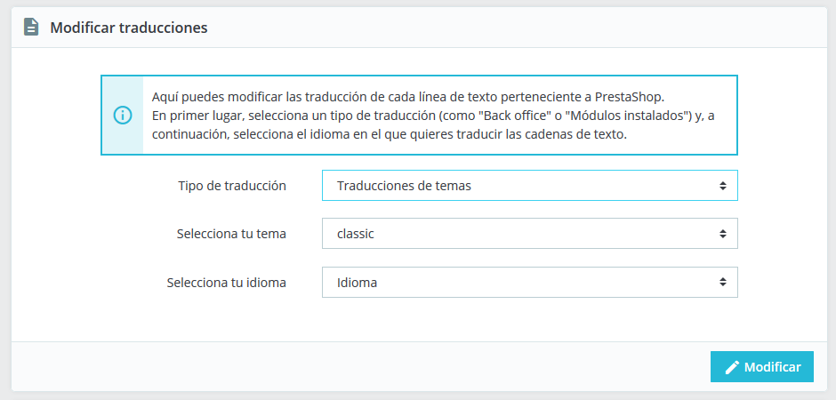
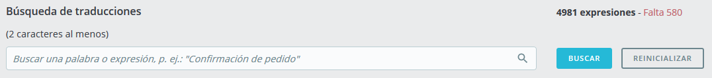
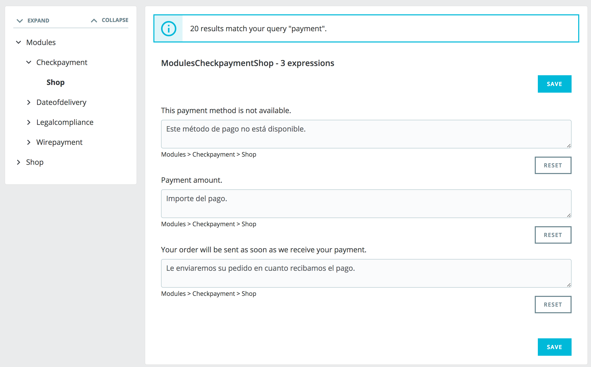
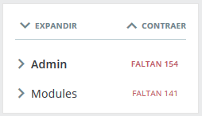
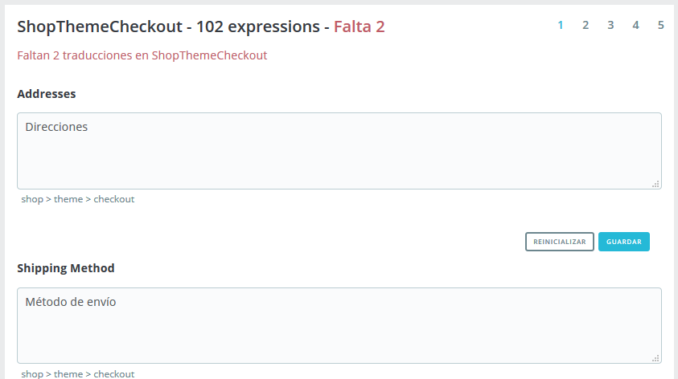
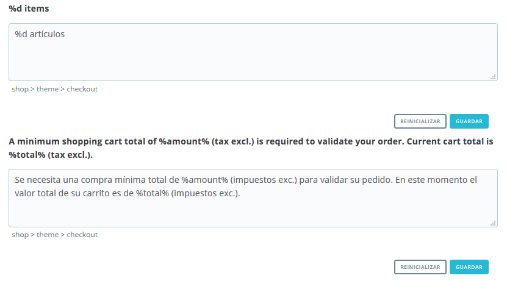
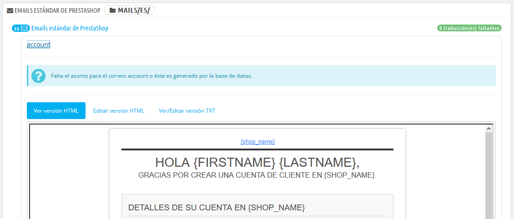
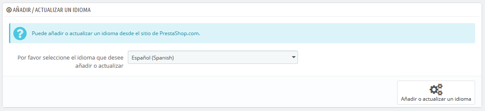
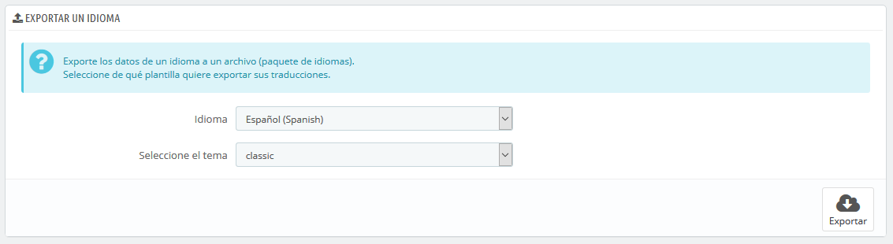
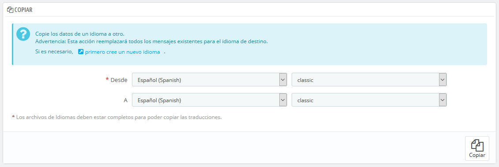

# Traducciones

PrestaShop proporciona una completa herramienta de traducción para tu tienda. Esta te permite añadir y editar las traducciones de tus páginas. De esta manera, tu eres realmente el dueño de tu tienda, y puedes gestionar las cadenas de traducción sin tener que esperar a que los traductores oficiales publiquen correcciones. No obstante, PrestaShop ya viene preparado en muchos idiomas, y tanto el panel de administración como el tema predeterminado ya están traducidos en más de 25 idiomas. Las traducciones en algunos otros idiomas aún no están completas, aunque lo estarán próximamente.

Incluso si no quieres corregir el trabajo de los traductores, es posible que quieras cambiar el estilo que ellos utilizaron (menos formal, menos prolijo, etc.) y personalizar los diferentes textos disponibles en la pataforma, adaptando así tu sitio web a la jerga de tus clientes; por ejemplo, una tienda de ropa hip-hop podría utilizar expresiones diferentes a la de una tienda de relojes de lujo.\
\

El proceso de adaptar un programa a una lengua extranjeras es llamado _internacionalización y localización_, o por sus siglas i18n y L10n.\
&#x20;La internacionalización es el primer paso, donde los desarrolladores eligen un mecanismo para la traducción del software. Todas las cadenas del software son posteriormente convertidas para hacer uso de este mecanismo.\
&#x20;La localización es el segundo paso, donde usuarios bilingües o multilingües traducen las cadenas originales del software a su propio idioma. La localización también puede proporcionar datos y ejemplos locales con el fin de adaptar el software a los usuarios de cada país.\
Puedes aprender más sobre los procesos i18n y L10n en la siguiente página de la Wikipedia: [http://en.wikipedia.org/wiki/Internationalization\_and\_localization](http://en.wikipedia.org/wiki/Internationalization\_and\_localization)

El equipo de PrestaShop ha optado por utilizar su propia herramienta integrada de traducción, de manera que cualquier persona puede personalizar su tienda conforme a sus necesidades.\
La traducción de la comunidad se realiza desde una versión en línea de Prestashop que se encuentra abierta para los que quieran colaborar a ella, y que encontrarás en la siguiente dirección: [https://crowdin.net/project/prestashop-official](https://crowdin.net/project/prestashop-official).

Video - 5 preguntas que debes realizarte antes de traducir tu tienda en línea

[\
](https://www.youtube.com/watch?v=Iw4lAuuA\_pU\&list=PLyZYn1MMU7-xT-L\_zUyGnRBJmAuP6uc-c\&index=27)

## Modificar una traducción 

La herramienta más importante de la página "Traducciones" se encuentra en la sección "Modificar traducciones". Aquí es donde puedes editar una traducción, y personalizar completamente todas y cada una de las cadenas de texto, si así lo deseas.

Selecciona la sección de la traducción que deseas editar:

* **Traducciones del Back Office**. El texto visible para ti y tu equipo que aparece en las páginas del panel de administración de tu tienda.
* **Traducciones de temas**. El texto visible por tus clientes cuando navegan por tu tienda.
* **Traducciones de los módulos instalados**. El contenido de los módulos. Ten en cuenta que los módulos que están disponibles, pero no instalados no aparecerán en la herramienta.
* **Traducciones de las plantillas de los correos electrónicos**. Los términos utilizados en las plantillas de correo electrónico predeterminadas.
* **Otras traducciones**. Esta categoría está destinada a desaparecer en una próxima versión. Contiene expresiones que no han sido identificadas tanto pertenecientes al tema como al panel de administración.\
  \

Si estás buscando una expresión específica en las secciones "Panel de Administración", "Tema" o "Plantillas de los correos electrónicos", pero no puedes encontrarla, podría encontrarse en la sección "Otras traducciones".

Algunas categorías tienen una segunda lista desplegable, la cual lista los temas disponibles. Los temas PrestaShop tienen sus propias cadenas de texto, así como también pueden tener sus propios módulos, plantillas PDF y plantillas de correo electrónico. Esta lista desplegable te permite elegir el tema que deseas editar.

Una vez que hayas hecho tu selección, elige el código del idioma en el que deseas editar esa categoría de traducción y haz clic en el botón "Modificar".

Se abrirá una nueva página donde podrás gestionar las traducciones. Esta página se encuentra organizada en varias secciones.\
\

### Buscar una expresión 

En la parte superior de la página, hay una barra de búsqueda que te ayudará a encontrar una palabra, frase o expresión específica que podrías querer modificar o traducir. A la derecha, se indica el número de expresiones disponibles en esta sección, y cuántas de estas cadenas de texto aún no han sido traducidas, en el idioma seleccionado.

Introduce la expresión a buscar y haz clic en el botón "Buscar" para encontrarla.

Las expresiones coincidentes con tu búsqueda se mostrarán a continuación, junto con una notificación que indicará cuántos resultados fueron encontrados. Puedes modificarlas o traducirlas y hacer clic en el botón "Guardar" para guardar los cambios. Al hacer clic en el botón "Reinicializar" reemplazarás tu traducción personalizada por las traducciones oficiales de PrestaShop: o bien restaurarás la traducción inicial si había una traducción disponible, o vaciarás el campo si no existía una traducción previa disponible.\
\
Puedes navegar a través del árbol de la izquierda para encontrar todas las frases que coinciden con tu búsqueda.

### Consultar traducciones 

La columna de la izquierda está disponible para ayudarte a navegar a través de las diferentes cadenas disponibles en la categoría que quieras traducir o modificar. Ésta se basa en lo que llamamos dominios de traducción: cada expresión dentro de PrestaShop es asignada a un dominio, proporcionando a los traductores un mayor contexto, lo que hace posible saber dónde se muestra esta expresión en PrestaShop, y para qué se utiliza.

Para la sección de back-office y front-office, verás dos dominios principales, siendo el segundo el de módulos. Este segundo dominio destinado a los módulos está disponible de manera independiente del primero, debido a que los módulos tienen contenido que pueden ser mostrados tanto en el panel de administración como en el front-office, por lo que estas expresiones permiten traducir las cadenas que se muestran tanto en el panel de administración como en el front-office.

Al lado de cada dominio, se muestra el número de expresiones que faltan. Esta información, te ayuda a saber dónde debes centrarte si deseas traducir completamente PrestaShop.

Para ver las expresiones de un dominio, haz clic en su nombre: verás todas las expresiones a la derecha.

Estructura de dominios

Aunque al principio puede parecer complicado navegar por los dominios de las traducciones, comprenderás en poco tiempo cómo funciona, y hallarás la manera de abrirte camino a través del árbol del dominio.

Cada sección (panel de administración o tema) se divide en dominios funcionales, que coinciden con cada sección existente en el panel de administración (o tema).

Por ejemplo, para el panel de administración, los siguientes dominios corresponden a sus páginas coincidentes en la interfaz:

* _AdminCatalog, AdminModules, AdminDesign, AdminShipping, AdminPayment, AdminInternational, AdminShopParam_ y _AdminAdvParameters._
* _AdminOrdersCustomers_ contiene las expresiones de las secciones "Pedidos", "Clientes" y "Servicio al cliente" del panel de administración.

Estos dominios pueden tener varios subniveles: _Feature_, _Notification_, y _Help_. Esto significa lo siguiente:

* _Feature_: todo lo específico a un dominio funcional. Si está en la sección “Transporte”, el dominio _Admin.Shipping.Feature_, contendrá todas las expresiones que aparecen en el menú Transporte, que son particulares a estas páginas.
* _Notification_: Información, acciones completadas con éxito, mensajes de advertencia o de error específicos del dominio funcional y de las páginas que éste incluye.
* _Help_: Texto de ayuda y marcadores de posición.

Por otro lado, algunos dominios son más genéricos:

* _AdminNavigation_ contiene todas las cadenas del menú, pie de página y encabezado del panel de administración.\

* _AdminActions_ reúne todas las llamadas a las acciones, botones o enlaces que se encuentran disponibles en el panel de administración, y que son bastante genéricas (“Guardar”, “Añadir”, “Eliminar”, etc.)
* _AdminNotifications_ son todos los mensajes de advertencia, error o éxito que pueden aparecer en el panel de administración. Estos deben ser notificaciones generales aplicables a cualquier parte del software (por ejemplo, "Configuración actualizada").\

* _AdminGlobal_ contiene expresiones que no encajan en los otros dominios pero que siguen estando relacionadas con el panel de administración, debido a que se pueden encontrar en muchas ocurrencias (“Estado”, “Ajustes”, “Activado”, etc.) Y también en diferentes partes del software\
  \

La misma lógica puede aplicarse a las traducciones del tema:

* _ShopTheme_ y sus subniveles _(Catalog, CustomerAccount, Checkout, Actions)_, son las expresiones del tema por defecto y sus secciones principales.\

* _ShopForms_ son específicas de los diversos formularios que puede encontrar en el tema predeterminado.\

* _ShopNotifications_ son los mensajes que aparecen en su tienda, ya sean de error o de éxito.

### Modificar traducciones 

Cuando abres un dominio para ver todas sus cadenas, puedes modificar las traducciones existentes o completar las que faltan.

Al hacer clic en "Guardar", se guardarán las modificaciones realizadas.

Al hacer clic en "Reinicializar" se reemplazará tu traducción personalizada por las traducciones oficiales de PrestaShop: restaura la traducción inicial si hay una traducción disponible, o deja vacío el campo si no hay traducción disponible.

Algunas cadenas utilizan una sintaxis especial con marcadores de posición, tales como `%s`, `%d`, `%1$s`, `%2$d`, etc.

Cuando encuentres una cadena que contenga tales especificadores de formato, significará que PrestaShop la reemplazará por un valor dinámico real antes de mostrar la cadena traducida.\
Por ejemplo, en la cadena "Tu pedido en %s ha sido realizado", `%s` será reemplazado por el nombre de la tienda. Por lo tanto, debes mantener estos especificadores de formato en tu traducción final; por ejemplo, en francés, la traducción sería la siguiente "Votre commande sur %s a bien été enregistrée."

Técnicamente, tener especificadores de formato evita tener que dividir las cadenas en partes.

En caso que una cadena contenga un especificador de formato, debes asegurarte de que el contenido de esa variable será colocado en el flujo correcto de la frase, y evitar la traducción literal.\
Los especificadores de formato numéricos (`%1$s`, `%2$d`, etc.) permiten a los traductores reordenar esta variable dentro de la cadena, manteniendo el significado de cada una de las cadenas separadas por el especificador. De esta manera, un traductor francés podría optar por traducir "Pedido #%1$d de %2$s" en "Commande n°%1$s du %2$s" o bien utilizar "Le %2$s, commande n°%1$s".

### Traducción de módulos 

Cuando desees traducir un módulo específico, selecciona "Traducción de módulos instalados", y a continuación, selecciona el módulo que deseas editar. Se abrirá una nueva página con el contenido de este módulo, y todas sus cadenas disponibles.Dependiendo del módulo que estés viendo, la interfaz podría ser diferente. Algunos módulos están utilizando un sistema de traducción específico para la versión 1.7, mientras que otros siguen utilizando el antiguo sistema de la versión 1.6. Al final esto no cambia nada, ya que podrás traducir tus módulos de la misma manera.

### Plantillas de correo electrónico 

La manera en que se realizan las traducciones de plantillas de correo electrónico es un poco diferente a las de las otras traducciones.

Las cadenas son divididas por grupos, pero ya no se presentan como simples campos de texto. Cada e-mail tiene dos modelos: uno en formato HTML, que presenta estilos y colores, y otro en formato de texto plano, presentando un mensaje en texto bruto. Mientras el texto plano puede ser editado directamente desde los campos de texto, el modelo HTML sólo puede ser editado haciendo clic sobre el botón "Editar esta plantilla de correo electrónico" situado en la parte inferior de la vista previa. Ese clic activa la vista previa dentro de un campo de texto WYSIWYG (lo que ves es lo que obtienes), con un completo editor en la parte superior (basado en TinyMCE: [http://www.tinymce.com/](http://www.tinymce.com)). Además de editar el texto, puedes cambiar el diseño como mejor le parezca, por ejemplo, puedes cambiar los colores para adaptarlos al estilo de tu tienda.\
Ten en cuenta que las plantillas de correo electrónico cuentan con variables, como `{lastname}` o `{shop_name}`, que PrestaShop sustituirá por sus valores reales al enviar el e-mail. Asegúrate por tanto de mantener estas variables en tu traducción.

## Añadir / Actualizar un Idioma 

Las traducciones PrestaShop están disponibles en paquetes, que combina las traducciones de las diferentes categorías dentro de un archivo zip. Muchos paquetes de idiomas están disponibles gratuitamente para que puedas descargarlos e instalarlos directamente desde los servidores de [PrestaShop.com](http://prestashop.com). PrestaShop se encargará de descargar el paquete de idioma, desempaquetarlo y crear las subcarpetas necesarias en la carpeta `/translation` de tu instalación.

A continuación, puedes administrar el nuevo idioma desde la pestaña "Idiomas" del menú "Localización".

## Exportar un idioma 

Puedes crear tu propio paquete de idioma utilizando esta herramienta, ya sea para hacer una copia de seguridad de tu traducción personalizada, o bien para importar esta traducción en otra instalación de PrestaShop – ya sea propia o de otra persona.

Para ello, tan sólo tienes que seleccionar el idioma y el tema de la traducción que deseas exportar, y hacer clic en el botón "Exportar".

Ten en cuenta que el paquete contendrá el tema para que la que realizaste tu traducción.

## Copiar 

Puedes copiar el contenido de un idioma a otro. Esto es especialmente útil cuando se quiere reemplazar los datos de un tema por los de otro tema.

Selecciona el idioma de origen y el tema, a continuación, el idioma de destino y el tema, tras realizar esas acciones haz clic en el botón "Copiar". En la mayoría de casos, el lenguaje debe ser el mismo en las dos listas desplegables.

Si ya existe una carpeta para el idioma en el tema del destino, ésta será reemplazada por los archivos del idioma y tema que está copiando.

Es posible que prefieras primero crear un nuevo idioma para el tema de destino, y posteriormente copiar el idioma de origen a éste.
