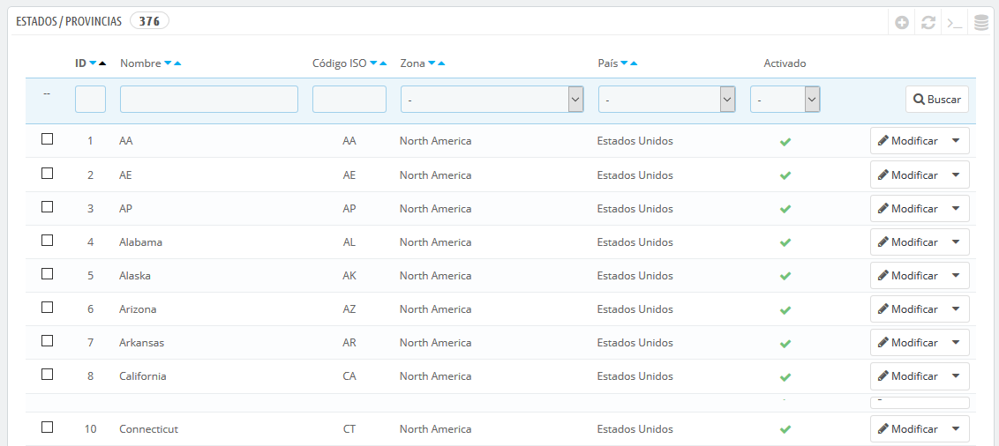
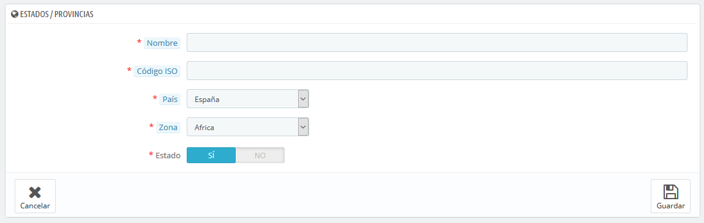

# Estados \(Provincias\)

PrestaShop llama "Estados \(Provincias\)" al primer nivel de división administrativa de un país. En los Estados Unidos, son llamados _estados_; En Italia, se las conoce como _regioni_ \(singular: _regione_\); en Francia, como _régions_; en Reino Unido, _regions_.  
Por defecto, PrestaShop proporciona el siguiente conjunto de estados: los 54 estados y territorios de EE.UU., los 31 _estados_ de México, las 13 provincias y territorios canadienses, las 34 _provinsi_ de Indonesia, las 24 _provincias_ de Argentina, los 47 _todōfuken_ de Japón, y las 110 _province_ de Italia \(singular: _provincia_\).

Tener estados correctamente definidos en tu base de datos ayuda a mejorar representativamente las posibilidades de entrega que ofrecen tus transportistas. Estos estados también pueden ser esenciales para calcular las tasas de impuestos, dependiendo del país. Por tanto, es importante introducir todas las divisiones administrativas de un país, si estas son importantes para tus transportistas. Puedes encontrar una lista de estas divisiones en la siguiente página de la Wikipedia: [http://en.wikipedia.org/wiki/Table\_of\_administrative\_divisions\_by\_country](http://en.wikipedia.org/wiki/Table_of_administrative_divisions_by_country).

El formulario de dirección de PrestaShop sólo lista los estados que se encuentran disponibles para el cliente. Así pues, asegúrate de razonar el contenido que añadas a este listado de estados. Esta es la razón por la cual, por ejemplo, la lista contiene _province_ \(divisiones administrativas de segundo nivel\) en lugar de _regioni_ \(divisiones administrativas de primer nivel\).

## Añadir un nuevo Estado \(Provincia\) 

Vamos a crear un nuevo estado o provincia. Haz clic en el botón "Añadir nuevo estado" para abrir el formulario de creación.

* **Nombre**. El nombre del estado o provincia, que será mostrado en las facturas y el paquete. Este debe estar por tanto en el idioma del país del estado o provincia.
* **Código ISO**. El código ISO-3166-2 del estado: 
  1. Dirígete a la siguiente página de la Wikipedia: [http://es.wikipedia.org/wiki/ISO\_3166-2](http://es.wikipedia.org/wiki/ISO_3166-2),
  2. Haz clic en el código de dos letras del estado \(en la columna "Entrada" de la tabla principal\),
  3. En la página que se abre, busca el código de estado \(debería aparecer en el listado de esta página, o directamente en el texto de los países más pequeños\),
  4. Cuando lo encuentres, elimina el prefijo del país con la finalidad de obtener un código menor a 4 caracteres. Por ejemplo, el código ISO completo para Devon, en el Reino Unido, es "GB-DEV". Sólo tienes que utilizar "DEV" como código ISO – deberás vincular este estado al país correspondiente utilizando la lista desplegable "País" \(revisa el siguiente paso\).
* **País**. Indica el país al que pertenece este estado o provincia.
* **Zona**. Indica su zona geográfica utilizando la lista desplegable. Presta atención de no utilizar una zona errónea, ya que podrías confundir la zona a la que pertenece un país.
* **Estado**. Un estado desactivado no será sugerido como opción cuando un visitante se registre para crear una cuenta nueva.

