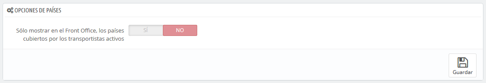
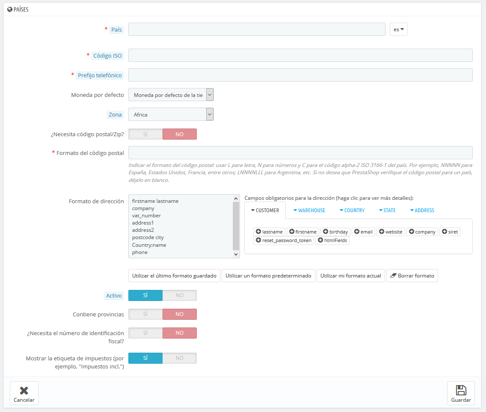

# Países

PrestaShop debe conocer todos los países existentes para que tus clientes indiquen claramente en qué lugar del mundo viven.

Hay alrededor de 200 países en el mundo, aunque PrestaShop tiene 244 registrados. Esto es debido a que algunos países ya incluyen las regiones de ultramar que forman parte del propio país.

Por ejemplo, los departamentos de ultramar franceses antes conocido como DOM (Guadalupe, Martinica, Mayotte, Reunión y la Guayana Francesa) tienen hoy en día el mismo nivel de importancia que una región metropolitana de Francia. Del mismo modo, Alaska y Hawái son estados propios de EE.UU.\
Sin embargo, el envío de un paquete a Guadalupe no significa enviarlo a Francia, sobre todo para los gastos de envío. De hecho, para calcular los precios de los envíos PrestaShop distingue los países de los estados y regiones.

De manera predeterminada, sólo tu propio país está activado. Debes activar los países necesarios para tus clientes, uno por uno. Si no estás seguro de cuales debes activar, revisa tus estadísticas para ver los países de donde proceden la mayoría de tus visitantes.

En la parte inferior del listado de países, la sección "Opciones de Países" sólo muestra en el front-office de tu tienda, los países que cubren los transportistas activados. Te recomendamos que actives esta opción, ya que así evitas que los clientes tengan que desplazarse a través de los nombres de todos los países para encontrar el suyo.

## Añadir un nuevo país 

Normalmente, PrestaShop ya incluye todos los países existentes en su base de datos. Pero en el caso de que uno nuevo sea creado, tendrías que añadirlo.

* **País**. El nombre oficial del país que te gustaría añadir, en todos los idiomas soportados. Comprueba la página Wikipedia del país si no estás seguro de su nombre.
* **Código ISO**. El código ISO-3166 del país, que puedes encontrar en la página oficial de la propia ISO: [http://www.iso.org/iso/country\_codes/iso\_3166\_code\_lists/country\_names\_and\_code\_elements.htm](http://www.iso.org/iso/country\_codes/iso\_3166\_code\_lists/country\_names\_and\_code\_elements.htm).
* **Prefijo telefónico**. El prefijo telefónico internacional del país, que puedes encontrar en esta página de la Wikipedia: [http://es.wikipedia.org/wiki/Anexo:Prefijos\_telef%C3%B3nicos\_internacionales](http://es.wikipedia.org/wiki/Anexo:Prefijos\_telef%C3%B3nicos\_internacionales).
* **Moneda por defecto**. Puedes utilizar la moneda predeterminada de tu tienda (establecida en la página "Localización", bajo el menú "Internacional"), o cualquiera de las otras monedas instaladas. Recuerda que, si es necesario, puedes añadir una nueva moneda a tu tienda utilizando la página "Monedas".
* **Zona**. La subregión del mundo a la que este país está unido. Si es necesario, puedes añadir nuevas zonas utilizando la pestaña "Zonas", bajo el menú "Ubicaciones regionales".
* **¿Necesita este páis código postal/Zip?**. Indica si los usuarios que viven en este país tienen que escribir su código postal o no cuando se registren en tu tienda.
* **Formato del código postal/Zip**. También puedes ofrecer más detalles sobre el formato requerido para el código postal. Si no rellenas este campo, PrestaShop no verificará la validez del código postal cuando se le dé una nueva dirección para este país.\
  &#x20;Utiliza los siguientes códigos para la validación del código postal: "L" para una letra, "N" para un número y "C" para el código ISO del país (el mismo que introduciste anteriormente en el campo Código ISO).\
  Si no conoces el formato que utiliza el código postal del país, puedes encontrarlo con toda seguridad en la siguiente página de la Wikipedia [http://en.wikipedia.org/wiki/List\_of\_postal\_codes](http://en.wikipedia.org/wiki/List\_of\_postal\_codes). ¡No realices un copiar/pegar de la notación que aparece en la Wikipedia, adapta ésta a los códigos permitidos por Prestashop!. Por ejemplo, Wikipedia indica que el formato de código postal para Malta es "AAA 9999\*", por lo que la notación válida para PrestaShop sería "LLL NNNN" (sin el \* final).
* **Formato de la dirección**. Proporciona detalles sobre cómo la dirección se debe mostrar a los clientes. Puedes hacer clic en los diferentes enlaces de ayuda situados al lado izquierdo del campo de texto para añadir más campos. En el uso real, estos campos se sustituyen automáticamente por los datos de la cuenta del usuario.\
  Las modificaciones que realices en este campo tan sólo se guardan tras hacer clic en el botón "Guardar". Si has cometido un error, puedes hacer uso de algunos de los cuatro botones de ayuda situados en la parte inferior del formulario, dependiendo de tu situación.
* **Activo**. Un país desactivado no será sugerido como opción cuando un visitante se registre para crear una cuenta nueva.
* **¿Contiene estados o provincias?**. Indica si el país tiene "estados" o no. Esta opción añade un campo al formulario de creación de direcciones de PrestaShop. Ten en cuenta que los "estados" pueden ser regiones, provincias, departamentos... cualquier cosa que pueda hacer uso de un servicio postal.
* **¿Necesita este país el número de identificación fiscal?**. El número de identificación fiscal es un número de identificación utilizado por las autoridades fiscales del país para la administración de las leyes tributarias. No todos los países necesitan de este número. Consulta con las autoridades fiscales del país.
* **Mostrar la etiqueta de impuestos (por ejemplo, "impuestos incl.")**. **** Elige si el estado fiscal (incluido o excluido), debe mostrarse junto a los precios o no.
* **Tiendas asociadas**. Puedes hacer que el país sólo esté disponible para una selección de tus tiendas, por ejemplo, tiendas cuyo objetivo sea cubrir una determinada zona local.
