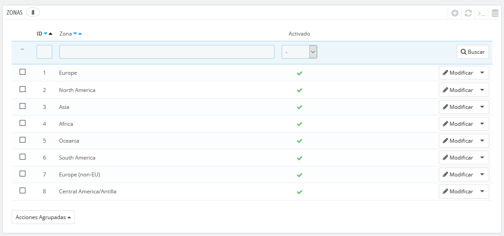
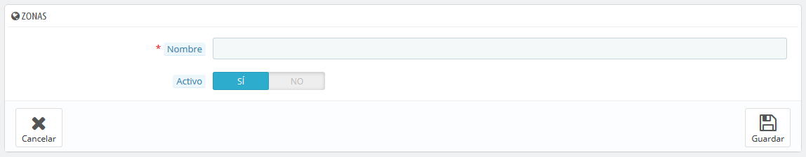

# Zonas

Las zonas en PrestaShop son un listado de las subregiones del mundo \([http://es.wikipedia.org/wiki/Subregi%C3%B3n](http://es.wikipedia.org/wiki/Subregi%C3%B3n)\). Esto ayuda a categorizar los países.

Si lo necesitas, puede crear más zonas: haz clic sobre el botón "Añadir nueva zona" para visualizar el formulario de creación.

Todo lo que necesitas es un nombre y un estado, para indicar por ejemplo que no se realizan entregas en Oceanía.  
Si tienes establecido el modo multitienda, puedes también asociar una zona con una selección de tiendas.

