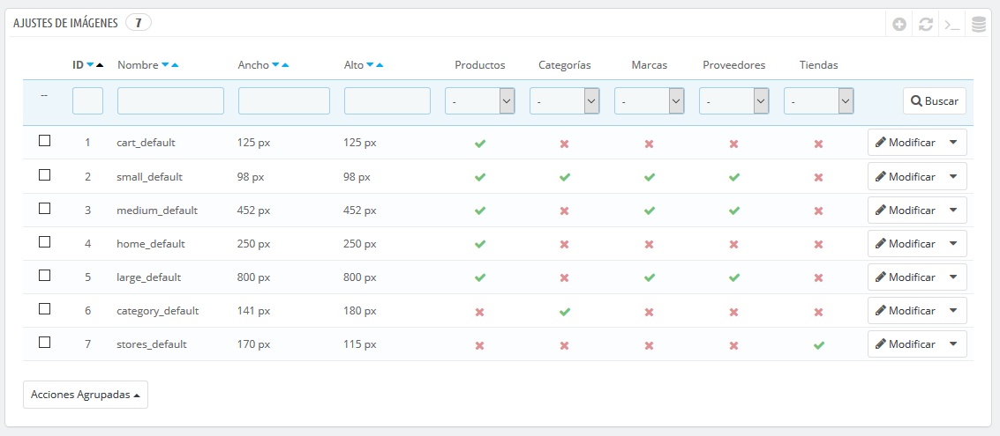
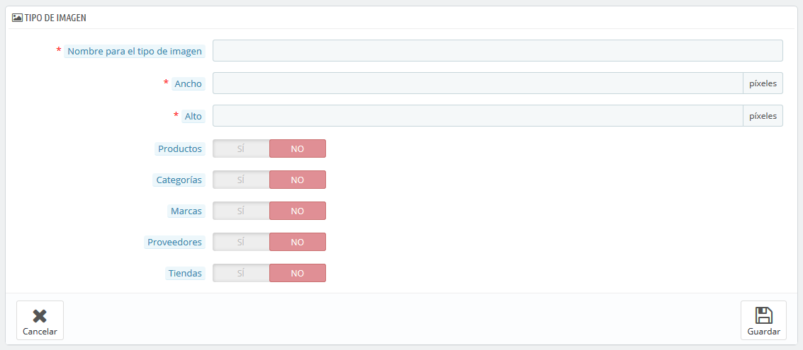
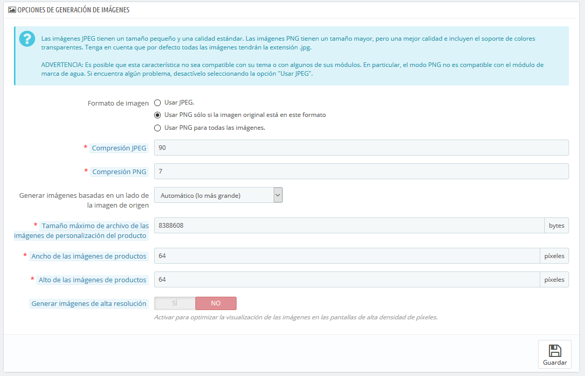
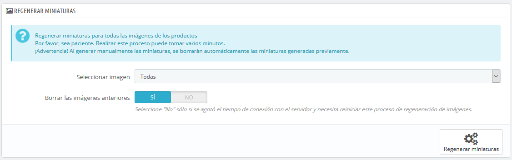

# Ajustes de imágenes

La página "Ajustes de imágenes" te permite configurar los diversos tamaños de imagen que tus clientes verán en tu tienda.

Cuando subes una imagen, PrestaShop genera automáticamente varios tamaños de esta imagen, incluyendo miniaturas y una versión móvil (dependiendo de para que se aplicará esta imagen). Por lo tanto, es suficiente con subir una versión "master" de tu imagen, que sea lo suficientemente grande para que pueda ser redimensionada a todos los tamaños de imagen utilizados por Prestashop.

Si quieres asegurarte de que tu imagen se ajusta correctamente a estos tamaños, debes cargar una imagen que se ajuste proporcionalmente a los diversos tamaños. Si la imagen subida no tiene la misma proporción de anchura y altura que la configuración preestablecida, estarás tomando el riesgo de ver un espacio en blanco en la imagen redimensionada.

Puedes habilitar distintos tamaños de imagen para tipos específicos de contenido, a través del listado de tamaños.

Cuando añades un nuevo tema a tu tienda, el tema añadirá los tamaños de imagen que necesitas. Por defecto, la página muestra los tamaños de imagen del tema predeterminado.

## Añadir un nuevo tamaño de imagen 

Puedes añadir fácilmente un nuevo tamaño de imagen, e incluso establecer a qué tipo de contenido se debe aplicar.

Haz clic en el botón "Añadir nuevo tipo de imagen", a continuación:

1. Introduce el nombre del tamaño, la anchura y la altura.
2. Selecciona a qué tipo de contenido debe aplicarse este tamaño.
3. Guarda los datos introducidos.

## Preferencias de imágenes 

* **Formato de imagen**. Tienes la posibilidad de elegir entre dos de los principales formatos de archivos: JPEG y PNG. Ambos formatos son soportados por los navegadores modernos. El formato JPEG tiene un buen ratio de compresión, pero puede presentar artefactos visibles. El algoritmo de compresión del formato PNG no es tan bueno como el del formato JPEG's, pero tiene la ventaja de presentar pocos artefactos visibles, sin embargo, los navegadores más antiguos no pueden reconocer este formato.\
  La elección entre uno y otro se reduce a una cuestión de gusto. Dicho esto, JPEG sigue siendo la opción recomendada. Si prefieres evitar la pérdida de información debida al cambio de formato, elige la segunda opción, "Usar PNG sólo si la imagen original está en este formato".
* **Compresión JPEG**. No establezcas está por debajo de 80, o peor aún 75, ya que aumentarás el riesgo de visualizar artefactos de compresión.
* **Compresión PNG**. No establezcas está por encima de 6, o peor aún de 7, ya que aumentarás el riesgo de visualizar artefactos de compresión.
* **Generar imágenes basadas en un lado de** **la imagen original**. Esta opción te permite posicionar la imagen del producto en un espacio predefinido:\

  * Elige "Alto" para que la imagen ocupe toda la altura del marco (la achura será redimensionada para mantener las mismas proporciones originales).
  * Elige "Ancho" para que la imagen ocupe toda el ancho del marco (la altura será redimensionada para mantener las mismas proporciones originales).
  * Elige "Automático" para que la imagen ocupe el mayor espacio posible, manteniendo al mismo tiempo sus proporciones.
* **Tamaño máximo del archivo de imágenes personalizadas**. Tus clientes pueden subir fotos para personalizar productos. Por defecto, PrestaShop establece el tamaño al valor máximo permitido por PHP – el cual permite que se carguen archivos de gran tamaño: por ejemplo, 8,388,608 bytes son 8 Mb. Puedes ampliar este valor si es necesario, pero asegúrate de que tu instalación de PHP es capaz de asumir la carga de archivos de este tamaño.
* **Ancho de las imágenes de productos**. De manera predeterminada, los clientes pueden cargar imágenes de 64 píxeles de ancho.
* **Alto de las imágenes de productos**. De manera predeterminada, los clientes pueden cargar imágenes de 64 píxeles de alto.
* **Generar imágenes de alta resolución**. Las pantallas más recientes con alta densidad de píxeles (Retina y tecnologías similares) requieren imágenes de alta resolución. Puedes activar esta opción para asegurarte de que sus imágenes se mostrarán correctamente en este tipo de pantallas. Ésta generará un nuevo archivo para cada una de tus imágenes, con una resolución dos veces superior. Esta opción duplicará el número de archivos de imagen, así que útilizala con precaución si tienes espacio de almacenamiento limitado.

## Regenerar imágenes en miniatura 

Puede ser que no estés satisfecho con el tamaño de las imágenes en miniatura de tu tienda. Esta sección hace posible regenerar todas ellas – o solamente las de un tipo específico de contenido:

1. Modifica el tamaño de las imágenes establecido en la tabla situada en la parte superior de la página de preferencias "Imágenes".
2. Selecciona que contenido de imágenes debe ser regenerado.
3. Indica si las miniaturas anteriores deben mantenerse o no.
4. Haz clic en "Regenerar miniaturas".\
   \

Las miniaturas subidas manualmente serán eliminadas y reemplazadas por las miniaturas generadas automáticamente.
