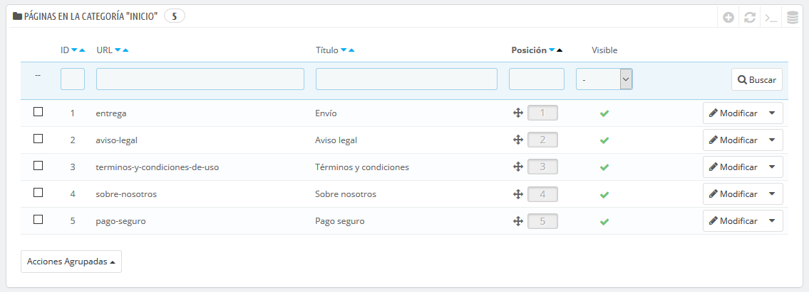
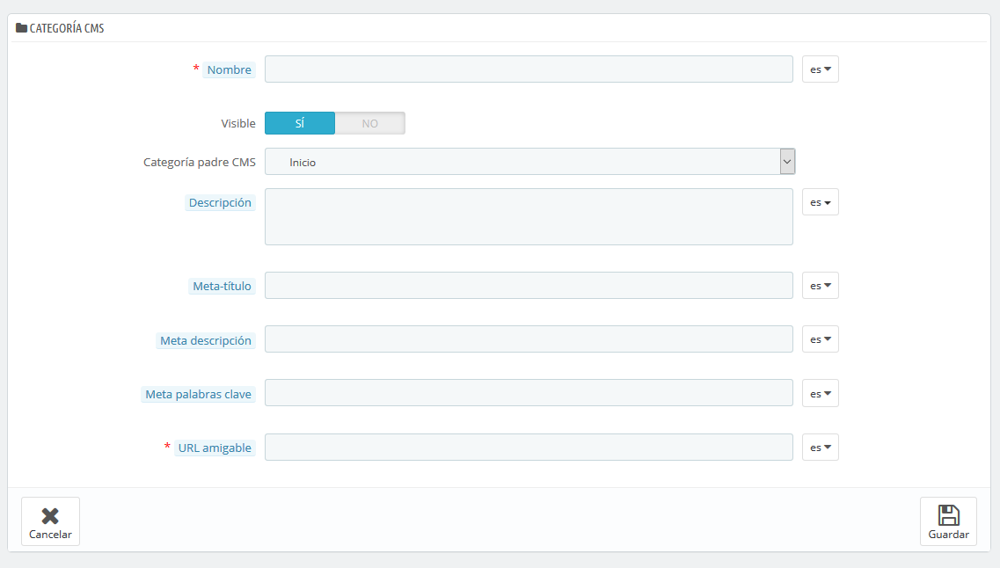
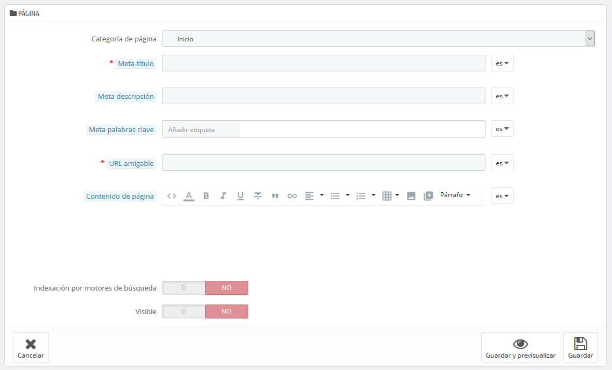

# Paginas - Gestionar el Contenido Estatico

PrestaShop te permite crear páginas con contenido estático tan fácilmente como creas las páginas de productos. Puedes añadir páginas estáticas en el menú superior de tu tienda, utilizando el módulo "Menú principal" \(que puedes configurar desde la página "Módulos y Servicios"\), o en cualquier lugar con el módulo "Link Widget" \(Widget de enlaces\).

Si has estado utilizando versiones anteriores de PrestaShop, las páginas y el contenido estático son las páginas a las que nosotros solíamos denominar como CMS \(Content Management System\).

Esta página te presenta todas las páginas de contenido que fueron creadas previamente en tu tienda, para la categoría de página seleccionada actualmente \(de manera predeterminada, la página principal es la única categoría\).

¡No olvides traducir cada página creada para cada uno de los idiomas soportados por tu tienda!. Como siempre, haz clic en el selector de idioma correspondiente a cada campo para cambiar el idioma.

## Crear una nueva Categoría de Página 

Haz clic en el botón "Añadir una nueva categoría de página" para crear una categoría de página – ésta será, una subcategoría de la categoría padre, "Inicio". Puedes crear tantas categorías como necesites.

El formulario de creación es bastante sencillo de completar:

* **Nombre**. El nombre debe ser corto e identificativo.
* **Visible**. Determina si la categoría y sus páginas serán visibles a nivel público, o permanecerán ocultas.
* **Categoría padre**. La categoría bajo la cual se encontrará esta categoría. Por defecto, "Inicio". Puede tener un número ilimitado de subcategorías.
* **Descripción**. Rellena este campo en todos los idiomas, ya que algunos temas pueden mostrar esta información a los clientes.
* **Meta título**. El nombre de la categoría. Este nombre será utilizado por los motores de búsqueda.
* **Meta descripción**. Se utiliza para describir el contenido de esta categoría en los motores de búsqueda.
* **Meta palabras clave**. Utilizado por los motores de búsqueda para conocer el tipo de información que contendrá la categoría.
* **URL amigable**. Facilita que los motores de búsqueda indexen su contenido, y que los visitantes sepan de antemano lo que van a encontrar en esta categoría. Este campo es rellenado automáticamente al introducir el nombre de la categoría, pero puedes editarlo manualmente si lo crees necesario.

Al guardar la categoría, PrestaShop te lleva de regreso a la página de las tablas, pero esta vez utilizando la nueva categoría que has creado como base. Por lo tanto, no verás ninguna subcategoría o subpágina creada en este momento.  
Para regresar a la categoría raíz, haz clic en "Inicio" en la parte superior izquierda. A continuación, puedes editar cada página de la categoría raíz y moverla a la categoría recién creada si lo deseas, o crear una nueva página perteneciente a tu nueva categoría.

Para crear subcategorías, simplemente cambia la opción "Categoría padre" de "Inicio" a la categoría padre para la que estás creando esta subcategoría.

## Crear una nueva Página 

Haz clic en el botón "Añadir una nueva página" para acceder al formulario de creación:

* **Categoría de la página**. La categoría por defecto es la página principal de tu tienda. Si deseas tener esta página en otra categoría, primeramente, debes haberla creado.
* **Meta título**. El nombre de la página, que se mostrará en el navegador.
* **Meta descripción**. Se utiliza para describir el contenido de esta página en los motores de búsqueda.
* **Meta palabras clave**. Utilizado por los motores de búsqueda para conocer el tipo de información que contendrá la página.
* **URL amigable**. Facilita que los motores de búsqueda indexen su contenido, y que los visitantes sepan de antemano lo que van a encontrar en esta página. Este campo es rellenado automáticamente al introducir el nombre de la página, pero puedes editarlo manualmente si lo crees necesario.
* **Contenido de página**. Este es el contenido principal de la página. En este editor WYSIWYG, puedes escribir el texto que consideres necesario, e incluso añadir imágenes o videos en la misma utilizando "Insertar imagen" o "Insertar medio embebido".
* **Indexación por motores de búsqueda**. Indica si los motores de búsqueda deben registrar esta página o no.
* **Visible**. Puedes elegir si la página será accesible a nivel público, o si deseas guardarla de momento como borrador y no hacerla pública todavía.

Una vez completados todos los campos, haz clic en "Guardar". Si la página la creaste visible, puedes ver el resultado directamente en tu tienda en línea.

