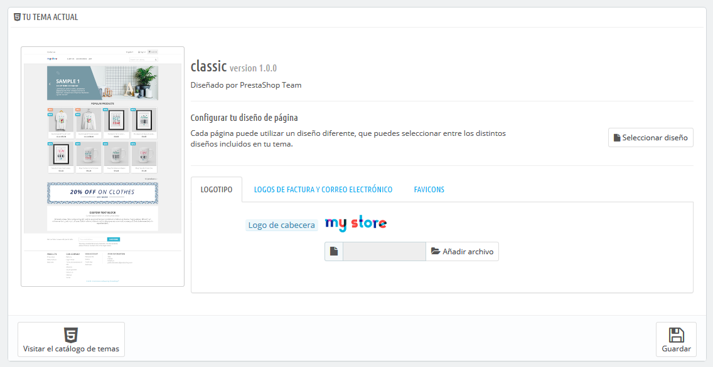
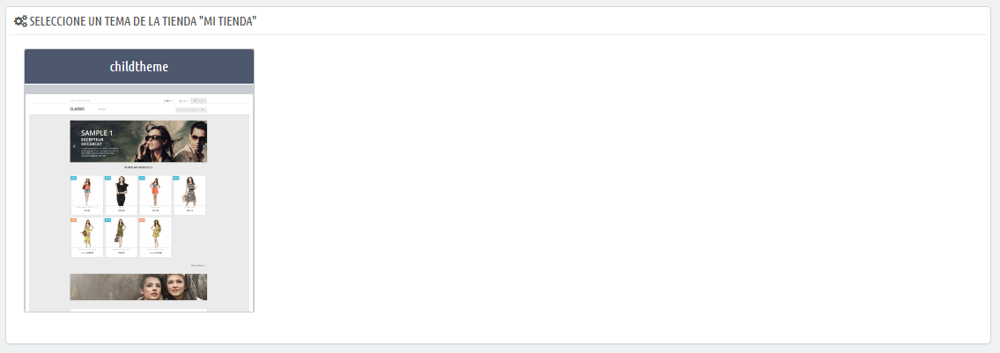
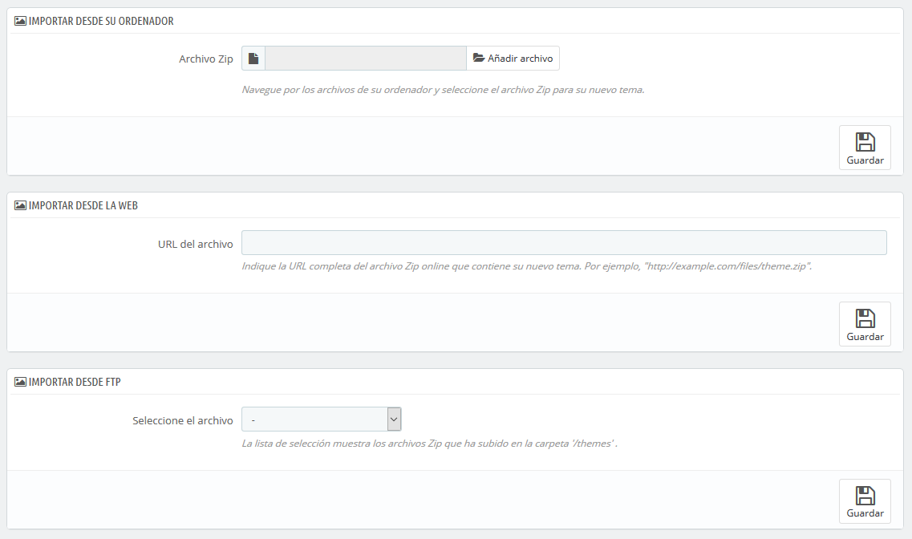
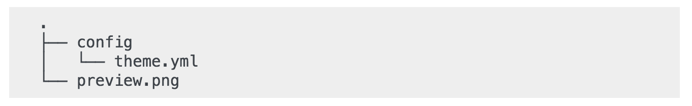
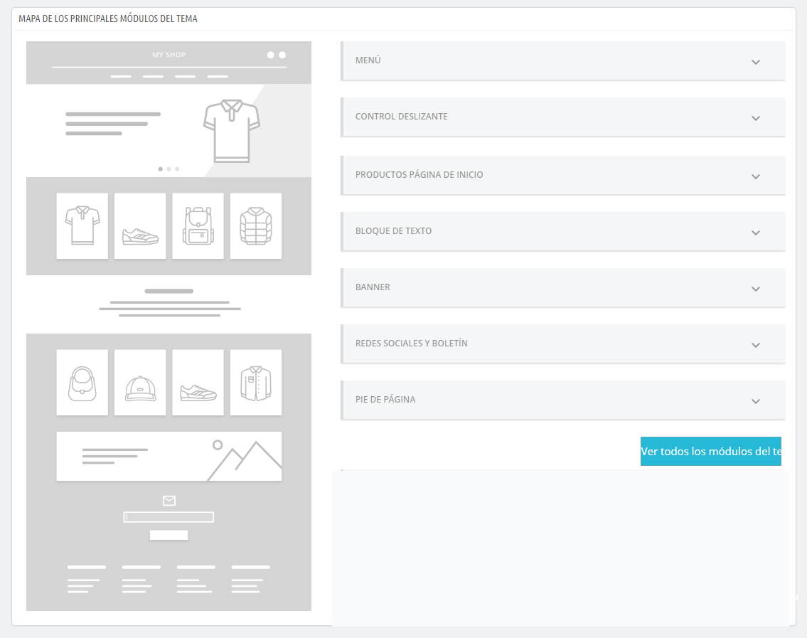
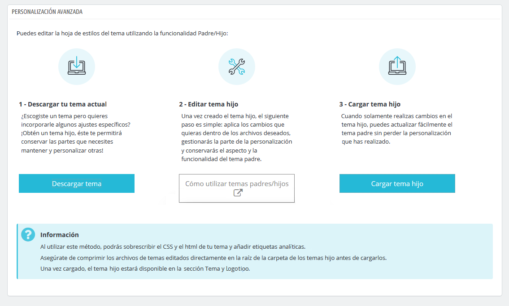

# Tema y Logotipo

Su título lo dice todo: la página "Tema y Logotipo" te permite administrar de manera eficiente los temas de tu tienda, y a esta página es donde debes dirigirte si deseas actualizar el logotipo de tu tienda para adaptarlo a tu negocio. Desde la versión 1.7.4, dos nuevas pestañas refuerzan esta parte de la oficina administrativa: "Configuración de la página de inicio" y "Personalización avanzada".  

* [Tu tema actual](tema-y-logotipo.md#tu-tema-actual)
  * [Configurar los diseños de página](tema-y-logotipo.md#configurar-los-disenos-de-pagina)
  * [Logotipos](tema-y-logotipo.md#logotipos)
* [Seleccionar un tema para la tienda "nombre"](tema-y-logotipo.md#seleccionar-un-tema-para-la-tienda-nombre)
* [Añadir un tema](tema-y-logotipo.md#anadir-un-tema)
* [Exportar un tema](tema-y-logotipo.md#exportar-un-tema)
* [¡En vivo, desde PrestaShop Addons!](tema-y-logotipo.md#en-vivo-desde-prestashop-addons)
* [Tema Padre / Hijo](tema-y-logotipo.md#tema-padre-hijo)
  * [Crear un tema hijo](tema-y-logotipo.md#crear-un-tema-hijo)
* [Configuración de la Página de Inicio](tema-y-logotipo.md#configuracion-de-la-pagina-de-inicio)
* [Personalización Avanzada](tema-y-logotipo.md#personalizacion-avanzada)

## Tu tema actual

La primera sección de la página sirve como recordatorio de cuál es el tema que estás utilizando actualmente, con sus detalles más informativos:

* Nombre y versión del tema.
* Nombre del autor del tema.
*  Miniatura para el tema.

Esta sección también te da acceso a un puñado de herramientas, que te ayudarán a personalizar rápidamente el tema actual: logotipo de la cabecera, logotipo facturas y email, favicon, el icono de la tienda, e incluso el separador para la barra de navegación pueden modificarse fácilmente desde aquí.

### Configurar los diseños de página

Dependiendo de las opciones de tu tema, puedes personalizar el tipo de diseño de página: si debe tener columnas o no, cuántas, con diferentes tamaños, etc.

Al hacer clic en "Elegir diseño", verás una nueva página con todos los tipos de páginas disponibles en tu sitio web \(categoría, producto, carrito, ...\). Para cada página, puedes cambiar el diseño predeterminado.

Para el tema predeterminado de PrestaShop, "Classic", las opciones disponibles son:

* Ancho total - sin columnas laterales, ideal para páginas libres de distracciones como páginas de productos.
* Tres Columnas - Una columna central grande y dos columnas laterales.
* Dos Columnas, columna izquierda pequeña - Dos columnas con una pequeña columna izquierda.
* Dos Columnas, columna derecha pequeña - Dos columnas con una columna derecha pequeña.

Haz clic en "Guardar" para guardar los cambios realizados.

En caso de que desees revertir las modificaciones y volver a la configuración predeterminada, simplemente haz clic en el botón "Restablecer valores predeterminados" en la página "Tema y Logotipo".

### Logotipos

Cambiar el logotipo de tu tienda es a menudo uno de los primeros pasos que hay que realizar a la hora de personalizar una tienda. Desde aquí, puedes cambiar el logotipo principal de tu tienda, pero también puedes personalizarlo desde las tres pestañas diferentes disponibles en esta página:

* **El logotipo de cabecera**. El logotipo que aparecerá en todas las páginas de tu tienda.
* **Logotipos de Factura y Correo Electrónico**. Los logotipos que respectivamente aparecerán en las facturas de tu tienda, y en tus notificaciones de correo electrónico.
* **Favicons**. El favicon de tu tienda. Esta es la pequeña imagen que se muestra a la izquierda de la barra de direcciones del navegador web y en las pestañas del navegador.

El tema predeterminado utiliza un logotipo "Classic" y el propio logotipo de PrestaShop como favicon. ¡Recomendamos encarecidamente que cambies todas las instancias del logotipo y utilices el tuyo!

En el modo multitienda, puedes aplicar estos cambios a todas tus tiendas o a un grupo de ellas, utilizando el menú multitienda.

  
Justo debajo de la sección del logotipo, a la derecha, encontrarás el botón "Visite el catálogo de temas" que abre una nueva página que te dirige a PrestaShop Addons, donde puedes encontrar más temas disponibles para tu tienda.

## Seleccionar un tema para la tienda "nombre"

Esta sección tan sólo se muestra en pantalla si tienes al menos dos temas instalados. Estos se presentan junto con los otros temas disponibles en la instalación de PrestaShop, estando por defecto uno de ellos ya habilitado.

Esta sección simplemente te muestra las miniaturas de los temas disponibles, junto con sus nombres.

Establece el cursor del ratón sobre la miniatura para mostrar un menú con dos opciones:

* **Utilizar este tema**. Reemplazará tu tema actual por este tema.
* **Eliminar este tema**. Se eliminarán los archivos del tema de tu servidor.

En el modo multitienda, no se puede aplicar un tema a todas tus tiendas o a un grupo de tiendas; debes seleccionar una única tienda en el menú multitienda, y a continuación, elegir un tema.

## Añadir un tema

Puedes importar un tema e instalarlo \(y sus módulos adjuntos\) gracias al botón "Añadir nuevo tema". Al hacer clic en éste, se abrirá una nueva pantalla.

Esta pantalla te presenta 3 métodos que puedes utilizar para instalar un nuevo tema: desde tu ordenador, a partir de un sitio web público, o desde tu propio servidor FTP. Un último botón te lleva al formulario de creación de temas, presentado en la siguiente sección.

Sea cual sea el método, el proceso sigue siendo el mismo: indicar la ubicación del archivo Zip del tema, y a continuación, hacer clic en "Guardar". Lo única cosa que cambia es el origen desde el que subimos el archivo Zip:

* **Importar desde su ordenador**. Utiliza el explorador de archivos para encontrar el archivo.
* **Importar desde una web pública**. Indica la dirección URL pública directa del archivo.
* **Importar desde su servidor FTP**. Utilizando un cliente FTP, carga el archivo en la carpeta: `/themes/` .

Haz clic en "Guardar" para validar tu elección: el tema está ahora instalado.

Haz clic en "Guardar" una última vez. Una página de confirmación final te presenta todos los cambios aplicados a tu instalación de PrestaShop. Haz clic en "Finalizar" para terminar el proceso.

## Exportar un tema 

Esta sección está disponible tan sólo cuando hay al menos un tema instalado en tu sitio PrestaShop.

Exportar un tema es muy útil y deberías de hacerlo cuando desees crear una copia de seguridad de éste, o cuando quieras crear un archivo del tema para enviárselo a un amigo o subirlo al marketplace PrestaShop Addons \([http://addons.prestashop.com/](http://addons.prestashop.com/)\). Esta opción no sólo genera un archivo Zip completo de tu tema, sino que también añade mucha información en un archivo XML, que te será de utilidad tanto al subir el tema a Prestashop Addons, como cuando quieras utilizarlo en otro sitio PrestaShop.

La opción de exportación sólo funciona para el tema actual. Haz clic en "Exportar tema actual" para exportar el tema utilizado por tu tienda.

Tu tema se comprimirá en un archivo .zip y el mensaje de confirmación te indicará dónde encontrarlo en tu carpeta de temas. Para mayor seguridad, guarda el archivo en tu disco duro.

A partir de aquí, puedes compartir fácilmente este tema, y si se trata de una creación tuya propia, puedes comenzar a venderlo utilizando el mercado de PrestaShop Addons:  [http://addons.prestashop.com/](http://addons.prestashop.com/).

## ¡En vivo, desde PrestaShop Addons!

Si estás buscando un nuevo tema, ¡PrestaShop Addons es el sitio a donde debes dirigirte!. Gracias a esta sección, puedes navegar a través de los temas más populares para inspirarte. Si deseas ver más temas, haz clic en "Descubre todos los temas" para dirigirte a la selección completa de temas de PrestaShop, disponibles en nuestro mercado oficial, PrestaShop Addons.

Al hacer clic en "Descubrir" para un tema determinado, una nueva página de PrestaShop Addons se abre, con más detalles sobre este tema específico.

También puedes utilizar la barra de búsqueda en la parte inferior de la página para encontrar el tema que mejor se adapte a tu tienda.

## Tema Padre / Hijo

Esta es una característica introducida en PrestaShop 1.7, y solamente es útil si deseas modificar ligeramente un tema \(por ejemplo, para añadir un bloque\), pero quieres asegurarte de que puedes actualizarlo fácilmente. De hecho, si modificas un tema directamente desde su carpeta, corres el riesgo de que cuando se actualice el tema, tus cambios podrían ser incompatibles con la actualización.  

Gracias al tema hijo, puedes personalizar el tema principal y, al mismo tiempo, puedes beneficiarte de sus actualizaciones.

El uso de un tema hijo puede ser un poco técnico. Para ver con detalle cómo puedes utilizar un tema hijo, consulta la documentación destinada a desarrolladores: [http://developers.prestashop.com/themes/smarty/parent-child-feature.html](http://developers.prestashop.com/themes/smarty/parent-child-feature.html)

### Crear un tema hijo 

En primer lugar, necesitas tener el tema que deseas utilizar como padre en la carpeta `/themes` de tu tienda.

A continuación, puedes crear una nueva carpeta con un tema minimalista, que contenga sólo los siguientes archivos, que puedes copiar directamente desde el tema padre:

Una vez que tengas esto, especifica en el archivo de tu tema hijo `theme.yml` qué tema debe ser utilizado como padre \(en el siguiente ejemplo, elegimos el tema predeterminado de PrestaShop, Classic\). El valor debe ser el nombre técnico del tema \(es decir: el nombre de la carpeta del tema\).

Añade la siguiente información al archivo `theme.yml`:

Ahora puedes utilizar este tema en el back office de tu tienda y editarlo como desees.

¿Estás creando temas tan buenos que otros comerciantes podrían pagar dinero por ello?. Puedes venderlos en Addons, el marketplace oficial de temas y módulos de PrestaShop: [http://addons.prestashop.com/](http://addons.prestashop.com/).

## Configuración de la Página de Inicio

Esta es una de las últimas funcionalidades incorporadas de la que estamos más orgullosos de presentar: ¡la cartografía de la página de inicio! Como cada parte del back-office está controlada por un módulo dedicado, cada pequeña modificación que necesites realizar en la página de inicio te hace recurrir una y otra vez a la página "Módulos" para encontrar el módulo específico y acceder a su página de configuración... no es demasiado intuitivo, ¿verdad? De ahora en adelante, gracias a la doble vista cartográfica disponible de los principales módulos del tema, ¡la personalización del tema es más rápida y los comerciantes son más felices!.

En la parte izquierda, encontrarás una ilustración simplificada de la página de inicio, diseñada para identificar de manera interactiva la parte que quieras modificar de un simple vistazo. En la parte derecha se muestran bajo diferentes pestañas desplegables la selección de módulos disponibles para configurar.  

Nuestra página de inicio está dividida en 7 categorías diferentes: menú, control deslizante, productos página de inicio, bloque de texto, banner, redes sociales y boletín y pie de página. Cada categoría se presenta en una pestaña desplegable que muestra las funcionalidades pertenecientes al núcleo y los módulos nativos que contienen el área seleccionada. Las funcionalidades pueden ser instaladas, configuradas o deshabilitadas. Ten en cuenta que al hacer clic en el botón "Configurar", el navegador es redireccionado a la página de configuración de funcionalidades.

## Personalización Avanzada 

Esta sección está destinada a comerciantes y desarrolladores técnicos que desean personalizar su tema utilizando la funcionalidad padre/hijo introducida en PrestaShop 1.7.  

Al hacer clic en "Descargar tema", podrás obtener un archivo zip del tema actual. El siguiente paso permite editar el tema con los ajustes deseados, simplemente realiza los ajustes específicos a los archivos deseados para personalizarlo. Finalmente, súbalo. ¡Ya está, el proceso ha sido completado!

