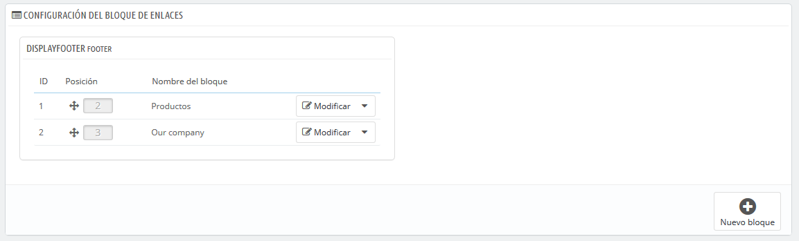
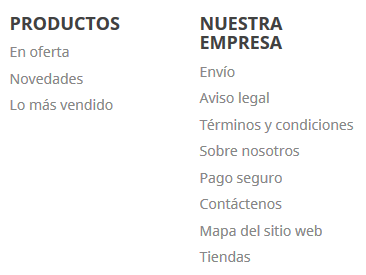

# Widget de enlaces

Esta página está ligada al módulo "Listado de enlaces", que te permite gestionar los diversos enlaces y bloques de enlaces disponibles en su tienda. Ésta trabaja con bloques que están conectados a hooks \(ganchos\), y proporciona enlaces a tus páginas estáticas \(desde la sección "Páginas"\).

Esta página está estrechamente relacionada con los hooks \(ganchos\), por lo que se recomienda manejar con soltura los hooks \(ganchos\) antes de intentar realizar cualquier modificación 

De manera predeterminada, y si estás utilizando el tema predeterminado Classic, tienes un bloque disponible para el pie de página:

Hay dos bloques hijo en el bloque de pie de página, "Productos" y "Nuestra empresa", que representan a las primeras dos columnas de enlaces mostrados en el pie de tu tienda. Los nombres de los bloques de enlaces son los títulos de estas dos columnas.

## Gestionar bloques 

Dentro de un bloque padre, varias acciones son posibles

* **Ordenar bloques**. Puedes cambiar la posición de un bloque: simplemente arrastra y suelta su fila.
* **Modificar un bloque**. Si haces clic en "Modificar", se abrirá una nueva pantalla y verás qué enlaces de página están activos para cada bloque \(seleccionado con una marca\) y dónde está enganchado.
* **Eliminar un bloque**. El botón de acción a la derecha de una fila te permite también eliminar un bloque.

## Crear un nuevo bloque 

Si necesitas un nuevo conjunto de enlaces dentro de tu tienda, haz clic en "Nuevo bloque" para crear un bloque. Se abrirá un formulario de creación que debes rellenar.

* **Nombre del bloque de enlaces**. Este es el título de tu bloque de enlaces, tal como aparecerá en tu tienda. Éste debe ser simple y claro.
* **Gancho \(Hook\)**. Selecciona el gancho que debe ser trasplantado. Se muestran todos los ganchos disponibles.
* **Enlaces de página**. A continuación, se presentan diferentes secciones con todas las páginas disponibles para las que puedes crear enlaces. Selecciona cada página individualmente o selecciona un grupo de páginas marcando la casilla de verificación en la parte superior de la sección \(junto a "Nombre"\). De manera predeterminada, hay tres secciones existentes:  

  * Páginas de contenido - Inicio. Todas las páginas existentes en la categoría de página Inicio.
  * Páginas de producto. Páginas que muestran nuevos productos o productos con descuento.
  * Contenido estático. Las páginas de contenido estático vinculadas a tu tema.

  Si tienes otras categorías de páginas, se mostrarán en consecuencia, con las páginas que contienen.

Cuando hayas terminado con la gestión de tu página, haz clic en "Guardar".

Un nuevo bloque aparecerá en tu tienda.

