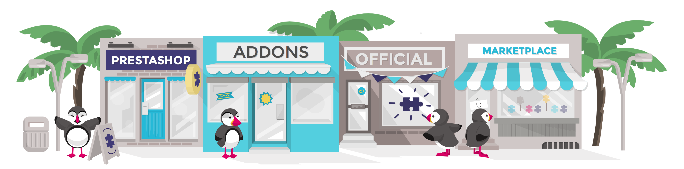

# Personalizar tu tienda

Esta guía te enseñará las diversas opciones y características que forman parte de una instalación estándar de PrestaShop. Para profundizar en PrestaShop deberás examinar y analizar muchas opciones y posibilidades. De esta forma, todo el potencial de PrestaShop se presentará poco a poco ante ti.

Pronto aprenderás que puedes ir más allá de una instalación estándar. De manera predeterminada, tu tienda viene establecida con un tema y un centenar de módulos a tu disposición, pero puede instalar cuantos temas o módulos consideres necesarios para ampliar, mejorar y personalizar tu tienda, haciéndola verdaderamente tuya.

Los diseñadores de temas y desarrolladores de módulos, suben sus creaciones en el sitio web de PrestaShop Addons, en [http://addons.prestashop.com/](http://addons.prestashop.com), el único mercado oficial de PrestaShop, donde los propietarios de tiendas pueden encontrar muchas maneras de ampliar y mejorar su tienda.

Crear una cuenta en Prestashop Addons es gratis, y muchos complementos de calidad son también gratuitos. Explora las diversas categorías, busca por una palabra clave específica, a continuación, compra y descarga el complemento que necesitas e instálalo en tu tienda – ya sea en la carpeta `/modules` o en la carpeta `/themes` de la instalación de PrestaShop.

No tienes que ser un experto en PrestaShop para comenzar a comprar complementos: Benefíciate de más de un millar de módulos, y más de 900 temas existentes ¡ahora mismo!

¡Visita [http://addons.prestashop.com](http://addons.prestashop.com)!\

