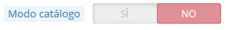
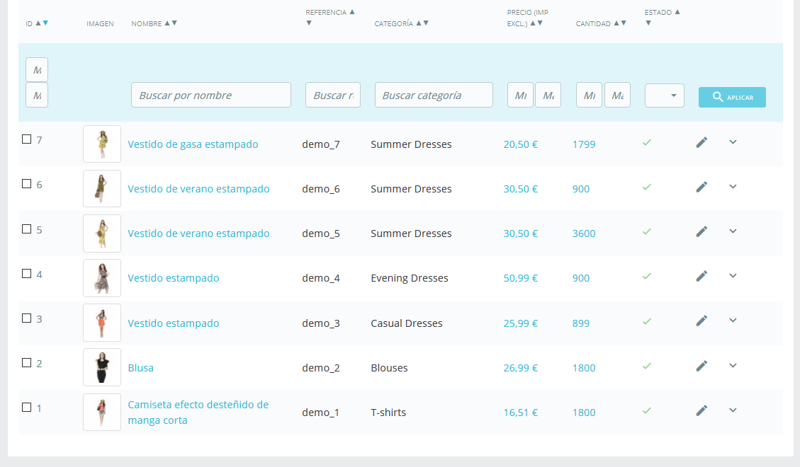
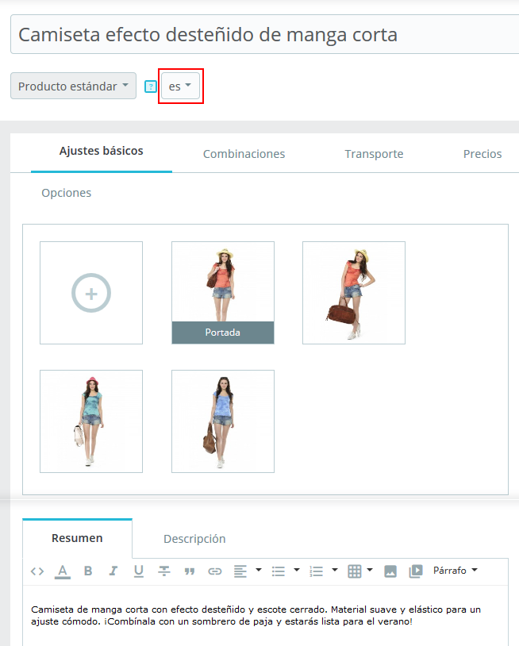

# Primeros pasos con PrestaShop 1.7

## Primeros pasos con PrestaShop 1.7 

Debes invertir gran parte de tu tiempo en asegurarte de que cada apartado de tu futura tienda en línea se encuentra correctamente configurado, asegurado, validado y preparado antes de iniciar la apertura de tu negocio a través de Internet.

Aunque PrestaShop facilita en gran medida la instalación y creación de tu tienda en línea, no es posible que puedas empezar a vender productos a los 5 segundos de haber completado la instalación: debes ser consciente de que vas a tratar con productos, clientes, y (lo más importante) con dinero real que fluirá desde tus clientes a tu cuenta bancaria. Por todo ello, te pedimos que te asegures de que nada falle en el proceso de validación de un pedido, teniendo en todo momento localizados los productos en tu almacén, y que siempre compruebes que el pedido ha sido enviado y entregado a tu cliente sin que se haya producido ningún error, e incluso que ningún imprevisto haya sucedido sin tu conocimiento.

PrestaShop es una herramienta muy completa, y el abanico de posibilidades que tiene puede parecer abrumador. Este capítulo te muestra algunas acciones básicas que debes realizar en tu tienda antes del gran lanzamiento. Muchas otras acciones pueden efectuarse antes de la apertura de tu tienda, pero los pasos descritos aquí son esenciales.

### Desactivar tu tienda 

Consideraremos que todavía estás dentro de la primera hora después de la instalación de PrestaShop, y que estás utilizando PrestaShop en el modo de una tienda individual, predeterminado así por defecto.\

Desactivar tu tienda significa asegurarte de que nadie puede acceder a ella mientras te encuentres realizando modificaciones en ella, ya sea: creando productos, estableciendo precios e impuestos, instalando módulos de pago o un nuevo tema, estableciendo transportistas.... Esta acción es denominada "poner tu tienda en modo mantenimiento".

En el back-office de tu tienda, dirígete a la página "Parámetros de la tienda / Configuración". Las opciones de mantenimiento se encuentran en la segunda pestaña y cuenta con tres simples ajustes:

* **Activar la tienda**. Simplemente establece esta opción a "No", y el front-end de tu tienda mostrará la página de mantenimiento a tus visitantes, la cual se limita a informarles que tu tienda estará pronto de nuevo en línea.
* **IP** **de mantenimiento**. Aquí es donde debes introducir tu propia dirección IP, para que puedas acceder a la página principal de tu tienda y navegar por ella como si en realidad estuviera accesible para todos. Esto es algo que debes hacer cada vez que pongas tu tienda en modo mantenimiento, ya que siempre necesitarás comprobar los cambios realizados en el front-end para asegurarte de que todo está en el lugar previsto.\
  Simplemente haz clic en el botón "Añadir mi IP". Puedes añadir más direcciones IP separando cada una de ellas con comas.
* **Personalizar texto modo mantenimiento**. Novedad en PrestaShop 1.7. Ahora puedes mostrar un mensaje propio personalizado en la página de mantenimiento, para informar a tus visitantes cuando tu tienda volverá a estar de nuevo en línea.\
  \

Si ya has configurado el tema utilizado por tu tienda y añadidos tus productos, puedes establecer tu tienda en modo Catálogo. Esto significa que los clientes podrán navegar por las páginas de tu tienda, pero no se les mostrará ningún precio, y no podrán añadir nada a sus carritos hasta que no desactives el Modo Catálogo.

Puedes activar el Modo Catálogo en la primera opción de configuración disponible en la página "Parámetros de la tienda / Configuración de Productos".\

### Eliminar el contenido predeterminado de la tienda 

La instalación predeterminada incluye un puñado de productos – principalmente ropa de mujer. Su único uso es ayudarte a explorar la organización que tiene una tienda real. Después de haber aprendido los entresijos de las relaciones entre productos, categorías, pedidos y clientes, debes eliminar todos estos elementos para inicializar tu tienda desde cero.

Por lo tanto, debes eliminar todos los datos predeterminados incluidos en la tienda, lo que incluye:

* productos y sus...\

  * categorías
  * atributos
  * características
  * fabricantes
  * proveedores
  * imágenes
  * etiquetas
* pedidos\

  * mensajes de pedidos
* clientes\

  * carritos de compra de los clientes
* transportistas
  * rangos de precios
  * rangos de pesos
* contacto y tiendas (eliminándolas o adaptándolas a las necesidades de tu negocio)
* Páginas (eliminándolas o adaptándolas a las necesidades de tu negocio)

Esto significaría el tener que navegar a través de varias pantallas del back-office y eliminar el contenido de una página tras otra, pero hay una manera mucho más sencilla de realizar este proceso:

1. Dirígete a la página "Módulos > Módulos y Servicios".
2. Utiliza el buscador para encontrar el módulo "pscleaner" o "PrestaShop Cleaner", y haz clic sobre el botón "Instalar" de este módulo.
3. Haz clic en el botón "Configurar".
4. Lee y acepta las advertencias que se te indican, a continuación, haz clic sobre el botón "Borrar catálogo": se eliminarán todos tus productos y sus atributos, fabricantes, etc.
5. Lee y acepta las advertencias que se te indican, a continuación, haz clic sobre el botón "Borrar pedidos y clientes": se eliminarán todos tus clientes y sus pedidos, carritos, etc.
6. Haz clic en el botón "Comprobar y reparar" para afinar las restricciones de integridad de la base de datos de tu tienda.
7. Haz clic en el botón "Limpiar y optimizar" para reorganizar el almacenamiento físico de los datos de la tabla y los índices de datos asociados a ésta, para reducir el espacio almacenado y mejorar la eficiencia de E/S cuando se accede a las tablas.

NO HAY VUELTA ATRÁS. Asegúrate de sólo hacer clic en estos botones tan sólo si tienes la intención de limpiar la base de datos de tu tienda a partir de su contenido predeterminado.

### Configurar la información de tu tienda 

Ahora que tienes una tienda limpia gracias a la reinicialización de datos realizada anteriormente, puedes comenzar a configurar todo a tu gusto, comenzando por tu información personal y tus preferencias.

#### Ajustes básicos de la tienda 

Debes prestar atención a los siguientes ajustes, la mayoría de los cuales son importantes, ya que se muestran en el front-office, y por tanto también, a la vista de tus clientes.

Algunos de estos ajustes requieren modificar la configuración de un módulo, en lugar de realizar cambios en las preferencias de Prestashop

Configurar un módulo es fácil:

1. Dirígete a la página "Módulos instalados" bajo el menú "Módulos".
2. Teclea el nombre del módulo (o parte de éste) en el cuadro de búsqueda de módulos. A medida que escribes, se mostrarán los resultados encontrados.
3. Cuando encuentres el módulo y aparezca en pantalla, haz clic en el botón "Configurar" y sigue las instrucciones.

Debes leer la documentación de cada uno de los módulos aquí presentados, para obtener mayor información.

| Ajuste                                                     | Descripción                                                                                                                                                                                                                                                                                                                                                                                          | Dónde encontrar esto                                                                                                                                                                                                                                                                                                                                                                                                  |
| ---------------------------------------------------------- | ---------------------------------------------------------------------------------------------------------------------------------------------------------------------------------------------------------------------------------------------------------------------------------------------------------------------------------------------------------------------------------------------------- | --------------------------------------------------------------------------------------------------------------------------------------------------------------------------------------------------------------------------------------------------------------------------------------------------------------------------------------------------------------------------------------------------------------------- |
| Nombre de la tienda                                        | Define tu marca, principalmente en los motores de búsqueda (Google, Yahoo!, Bing...).                                                                                                                                                                                                                                                                                                                | Menú "Parámetros de la tienda", página "Contacto", pestaña "Contactos de la tienda", A continuación, en la sección "Detalles de contacto", haz clic en el campo nombre de la tienda.                                                                                                                                                                                                                                  |
| Logo de la tienda                                          | 
Define tu marca visual. El logotipo predeterminado reza como "Classic", que es el nombre del tema predeterminado. Se muestra en la parte superior izquierda de cada página de tu tienda, así como en tus facturas y mensajes de correo electrónico.
                                                                                                                                        | Menú "Diseño", página "Tema y Logotipo", sección "Tu tema actual", a continuación, sustituye las diversas imágenes predeterminadas por tu logotipo.                                                                                                                                                                                                                                                                   |
| Moneda predeterminada de la tienda                         | La moneda predeterminada que deseas establecer para el coste de tus productos.                                                                                                                                                                                                                                                                                                                       | 
Menú "Internacional", página "Localización", sección "Configuración". Si la moneda no está disponible, debes importar el paquete de localización perteneciente al país de la misma: utiliza la herramienta "Importar un paquete de localización" que encontrarás disponible en la misma página.
                                                                                                             |
| 
Información de la empresa /

Datos de contacto
 | Varios bloques que presentan el número de teléfono de tu tienda, tu dirección de contacto y la dirección de correo electrónico utilizada por tu tienda. Éstos son mostrados en diversos lugares del front-office de tu tienda.                                                                                                                                                                       | 
La información procede del menú "Parámetros de la tienda", página "Contacto", pestaña "Contactos de la tienda", sección "Contactos de la tienda".

Para desactivarla, consulta el módulo "Información de contacto".
                                                                                                                                                                                       |
| Carrusel de imágenes                                       | 
El carrusel de imágenes presenta varias imágenes, que se desplazan una tras otra. Es una fuerte firma visual para tu tienda y tus productos.

Por lo general, se coloca en la parte central de la página principal.
                                                                                                                                                                      | Módulo "Carrusel de imágenes".                                                                                                                                                                                                                                                                                                                                                                                        |
| Páginas                                                    | 
El contenido de las páginas estáticas, tales como "Sobre Nosotros", "Entrega", "Aviso Legal", "Términos y Condiciones de Uso", y "Pago seguro". Algunos de ellos tienen un contenido predeterminado, el cual debes adaptar a tu negocio. Algunos otros están vacíos, y debes introducir tu propio texto personalizado.

Se muestra en la sección "Nuestra empresa" en el pie de página.
  | Menú "Diseño", página "Páginas", Posteriormente, crea y edita cada página según las condiciones de tu tienda.                                                                                                                                                                                                                                                                                                         |
| Redes sociales                                             | 
Un bloque que presenta tres enlaces: página Facebook de tu empresa, cuenta Twitter de tu compañía, y el RSS feed para el blog de tu empresa (o sitio "eventos actuales").

Por defecto, todos estos enlaces dirigen a la empresa PrestaShop. Es importante que los cambie para que dirijan hacia tus cuentas.

Cuando está activo, se muestra en el pie de página, columna derecha.
 | Módulo "Enlaces de seguimiento a través de las redes sociales".                                                                                                                                                                                                                                                                                                                                                       |
| Compartir en Redes sociales                                | En cada página de producto se presentan, 4 para compartir la URL de la página en las redes sociales: Facebook, Twitter, Google + y Pinterest.                                                                                                                                                                                                                                                        | Módulo "Botones de Compartir en Redes Sociales".                                                                                                                                                                                                                                                                                                                                                                      |
| Menú superior                                              | La parte superior del tema predeterminado, utiliza un menú superior para indicar las categorías existentes de la tienda a las que los visitantes pueden dirigirse, así como enlaces a otros lugares.                                                                                                                                                                                                 | Módulo "Menú principal".                                                                                                                                                                                                                                                                                                                                                                                              |
| Información de seguridad y confianza                       | En la página del producto, un bloque te permite mostrar información para dar confianza y seguridad al cliente. Utilízalo para dar algunos detalles sobre tu política de devolución ("¡Devoluciones gratis!"), tu política de seguridad ("Método de pago seguros"), etc., para que los visitantes sientan que es seguro realizar pedidos en tu tienda.                                                | Módulo "Información de seguridad y confianza para el cliente".                                                                                                                                                                                                                                                                                                                                                        |
| Contenido de la página de inicio                           | El tema predeterminado contiene una gran cantidad de contenido de demostración: textos, imágenes, enlaces, etc. Si tienes la intención de utilizar este tema para tu tienda en lugar de utilizar o comprar otro tema, debes asegurarte en primer lugar de eliminar todo este contenido predeterminado.                                                                                               | 
Módulo "Banner": cambia la imagen en la parte inferior de la página de inicio.

Módulo "Bloques de texto personalizados": muestra tus propios mensajes en la parte inferior de la página de inicio, debajo del banner.

Otros módulos disponibles en "Módulos instalados", sección "Módulos de tema", te ayudarán a definir los diversos ajustes del front-office, ¡asegúrate de comprobarlos todos!
 |
| 
Cumplimiento legal 
                              | Algunos países requieren que proporciones información específica a tus clientes, en relación con tus diversas políticas. El módulo "Cumplimiento normativo legal" está aquí para ayudarte.                                                                                                                                                                                                           | 
Por favor, lee la página "<a href="broken-reference">Cumplimiento de la legislación europea</a>" para saber más sobre los cambios que debes hacer. 
                                                                                                                                                                                                                                                         |

Estos son los ajustes más visibles que deberás configurar y establecer en el front-end de tu tienda – al menos en lo que respecta al tema predeterminado.\
La columna "Dónde encontrar esto", te permite saber en qué interfaz se encuentra ese aspecto de tu tienda que deseas modificar. Esta guía del usuario te mostrará detalladamente cada interfaz.

#### Idiomas de la tienda 

PrestaShop es capaz de trabajar con varios idiomas, tanto en el front-office como en el back-office. Tan pronto como habilites más de un idioma desde el back-office de tu tienda, cada campo de texto del back-office es acompañado por un selector de idioma que indica el idioma actual con el que estás trabajando, y en el que puedes hacer clic para introducir el contenido de ese campo en otro idioma.

La página del producto funciona un poco diferente. No encontrarás un selector de idioma para cada campo de texto, sino un selector de idioma general en la parte superior de la página. Una vez que hayas seleccionado un idioma, puedes modificar todo el contenido en este idioma. ¡Asegúrate de que estás editando el contenido correcto!

De manera predeterminada, PrestaShop es instalado en cuatro idiomas: el seleccionado y utilizado durante la instalación del software, y los que se adjunta al país predeterminado en la instalación (si son diferentes). Para gestionar los idiomas instalados actualmente, dirígete a la página "Localización / Idiomas" bajo el menú "Internacional". Esta página presenta una tabla con los idiomas disponibles.

El idioma o idiomas actualmente activado(s) tiene(n) una marca de verificación de color verde, mientras que los otros presentan una "X" de color rojo. Haz clic en una marca de verificación de color verde para desactivar el idioma seleccionado, haz clic en una "X" roja para volver a activarlo.

Puedes instalar y activar todos los idiomas disponibles si consideras que tu tienda los necesita, pero ten en cuenta que deberías traducir todo el contenido de tu tienda para todos los idiomas disponibles: nombre del producto, descripción, etiquetas; nombre de la categoría; contenido estático (páginas), módulos; etc.

Puedes importar fácilmente muchos más idiomas desde la página "Internacional / Traducciones" ("Añadir/actualizar un idioma), y posteriormente activarlos en la página "Localización / Idiomas".

#### Información de los empleados 

En caso de que haya gente que te ayude con tu tienda (ya sean familiares, amigos, o empleados remunerados), debes asegurarte de crear una cuenta de empleado para cada una de ellos, aunque sólo sea para saber quién es el responsable de cada acción que se realice en la tienda. La otra ventaja es que se les puede dar perfiles y derechos de acceso específicos a las páginas de administración: Por ejemplo, puede que no desees que todos los empleados tengan acceso a tus estadísticas, tus facturas o tus pagos.\
Puedes crear tantos perfiles como consideres necesario.

Para crear una nueva cuenta de empleado, dirígete al menú "Parámetros Avanzados", página "Equipo", y haz clic en el botón "Añadir nuevo empleado". Otorga a este empleado un nombre, como por ejemplo "Martin Doe" o "Responsable de envíos", y haz clic en Guardar.\
Aunque una cuenta puede ser utilizada por tantas personas como sea necesario – te aconsejamos que crees una para cada persona que te esté ayudando.

Ahora que tienes una cuenta adecuada para este empleado, debes darle permisos específicos, adaptados a la actividad o tarea que se realizará en dicha cuenta. Por defecto, un nuevo perfil no puede hacer demasiado. Debes ser tu quien establezca  exactamente las partes de su tienda a las que ese perfil debe tener acceso. Ésta puede ser una tarea tediosa, pero es muy importante que se realice correctamente.\
Para asignar permisos a una cuenta de empleado, debes utilizar la opción "Permisos" en la página de creación de la cuenta: este menú te permite seleccionar el perfil de la cuenta (SuperAdmin, Traductor, etc.)

Puedes editar estos permisos de la siguiente manera: dirígete a la pestaña "Permisos", y selecciona el perfil que deseas modificar. Un gran listado de permisos aparecerá en pantalla: edítalos tal y como deseas. Los cambios que realices serán guardados automáticamente.

### Configurar tus métodos de pago 

Tu tienda está destinada a ganar dinero, y esto sólo puede hacerse realidad si se utiliza al menos un módulo de pago. Varios módulos ya están disponibles en la instalación predeterminada, los cuales puedes configurar (desde la página "Módulos instalados" bajo el menú "Módulos y Servicios", en la categoría "Pagos"), y crear restricciones para ellos (en la página "Preferencias" bajo el menú "Pago"). Algunos módulos de pago requieren la creación de una cuenta en el servicio para el que fueron desarrollados.

También puedes instalar otros módulos de pago, descargándolos desde el marketplace de PrestaShop Addons: [https://addons.prestashop.com/es/481-pago](http://addons.prestashop.com/es/4-pagos-prestashop-modulos)

Cheque y transferencia bancaria son los dos únicos métodos de pago que están habilitados por defecto. Si optas por mantenerlos, será **necesario** configurarlos con tu información personal: orden del cheque y dirección, propietario de la cuenta, datos bancarios (IBAN, BIC, etc.).

Estos métodos de pago se configuran a través de los módulos "Pago por transferencia bancaria" y "Pagos por cheque", que puedes encontrar en la página "Módulos instalados".

### Configurar transportistas y envío 

Los productos vendidos en tu tienda deben ser enviados a tus clientes – a no ser que sólo vendas productos descargables, en cuyo caso el menú "Transporte" te será de poca utilidad.

Puedes enviar tus propios productos por correo, o realizar un contrato con una empresa de transporte, sea cual sea el método que elijas utilizar, debes establecer esta información dentro de PrestaShop.

Consulta el capítulo "Gestionar envíos" de esta guía para aprender todo lo que hay que saber acerca de este menú.

**La devolución de mercancía no está habilitada de manera predeterminada**. Si quieres ofrecerle a tus clientes la posibilidad de devolver productos a cambio de ofrecerles el reembolso o un cupón de descuento por el valor de la compra que realizaron, puedes hacerlo desde el apartado "Opciones para devolver la mercancía (RMA)" de la página "Devoluciones de mercancía", bajo el menú "Atención al cliente".\
&#x20;Las devoluciones de mercancía se explican en el capítulo "Gestionar Pedidos" de esta guía.

### Elegir un tema para tu tienda 

Tu tienda debe tener un tema propio con el fin de tener un estilo distintivo, que la distinga de las demás tiendas en línea y la haga más reconocible.

Hay muchos temas disponibles para comprar en el marketplace PrestaShop Addons: [https://addons.prestashop.com/es/3-temas-prestashop](https://addons.prestashop.com/es/3-temas-prestashop).

También puedes optar por crear tu propio tema, o que éste sea creado por un desarrollador. Consulta la "Guía en línea del Diseñador" (Designer Guide en inglés).

Una vez instalado el tema, debes explorar éste con detenimiento y aprendértelo de memoria para que puedas ser capaz de ayudar a los clientes en caso de que sea necesario. Lee cuidadosamente su documentación.

Puede que incluso tengas que personalizar algunos aspectos del tema, empezando por el logotipo en sus diferentes variantes (encabezado, correo electrónico, facturas, etc.). Para ello, visita la página "Tema y logotipo" en el menú "Diseño".

### Elegir tus módulos 

La instalación predeterminada de PrestaShop incluye más de un centenar de módulos. Estos son muy variados: análisis y estadísticas, aplicaciones front-office, envíos y logística, plataformas de pago... Debes explorar en su totalidad todos los módulos disponibles, con el fin de saber cuáles deseas activar, y cuáles prefieres mantener desactivados.

También puedes encontrar muchos otros módulos en el marketplace PrestaShop Addons: [https://addons.prestashop.com/es/2-modulos](https://addons.prestashop.com/es/2-modulos)

Cada vez que actives y configures un módulo, debes asegurarte de que funciona correctamente con el tema que ha elegido, en caso de que estos tengan funcionalidades que afecten al front-end de tu tienda.

### Crear tus productos y categorías de productos 

Este proceso se describe en detalle en los capítulos "Gestión de Productos" y "Gestión de Categorías".

### Crear el contenido estático de tu tienda 

Si no lo has hecho todavía, tómate el tiempo necesario para escribir el contenido de algunas de las páginas estáticas que ya están disponibles en tu instalación predeterminada de PrestaShop, o crea una nueva que consideres que necesitas.

Deberás revisar hasta tres veces el contenido de estas páginas estáticas, ya que pueden tener un gran impacto en el cumplimiento normativo legal de tu tienda, entre otras cosas.

Algunas de las páginas predeterminas son "Sobre nosotros", "Entrega", "Aviso legal", "Términos y condiciones de uso", y "Pago seguro". Algunas de ellas tienen un contenido predeterminado que debes actualizar; algunas otras están vacías, y debes introducir en ellas tu propio texto personalizado adaptado.\
Para editar estas páginas, dirígete al menú "Diseño", haz clic en la página "Páginas", y a continuación selecciona la página que quieras editar, o añade una nueva.

Puedes crear tantas páginas como sean necesarias.

### Construir el menú superior de tu tienda 

Ahora que ya tienes las categorías de productos y las páginas estáticas, debes organizarlas de una manera lógica y convincente en el menú superior.

Esto se realiza mediante el módulo "Menú principal": dirígete a la página "Módulos instalados" de la página "Módulos", teclea "menú" en el cuadro de búsqueda de módulos, y deberías encontrar el módulo correspondiente. Actívalo si éste se encuentra desactivado y configúralo: elimina las páginas o categorías que consideres innecesarias, añade otras páginas, y desplaza el contenido hasta que te encuentres satisfecho con la jerarquía del menú de tu tienda.

### Activar tu tienda 

Ahora que todo está listo y preparado, puedes abrir tu tienda de cara al público.

Dirígete a la página "Parámetros de la tienda / Configuración", y cambia las dos opciones siguientes en la pestaña "Mantenimiento":

* **Activar la tienda**: Vuelve a establecer esta opción a "Sí".
* **IP de mantenimiento**: Elimina tu IP de la lista. Esto es opcional: tu tienda seguirá funcionando si dejas este campo tal y como está.

¡Tu tienda estará ahora completamente lista para recibir a sus primeros visitantes... y tus primeros pedidos!
