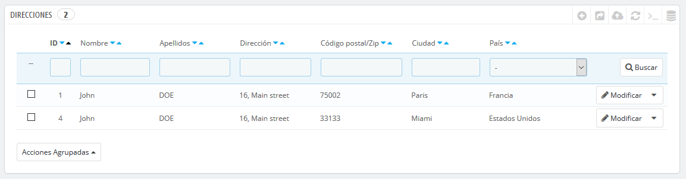

# Direcciones de clientes

Al hacer clic en la página "Direcciones", tendrás acceso al listado de domicilios de tus clientes \(casa, trabajo, etc.\). Puedes editar estas direcciones, utilizando el botón "Modificar", o eliminarlas definitivamente.

Bajo la tabla de direcciones se encuentra el botón "Establece los campos obligatorios para esta sección". Esto abre un formulario desde el que puedes indicar si un campo de la base de datos es necesario o no marcando las casillas adecuadas: de esta manera, puedes hacer que los campos "empresa" o "número de teléfono" sean obligatorios cumplimentarlos cuando un cliente esté registrando una nueva dirección en tu tienda.

## Añadir una nueva dirección 

Tienes la posibilidad de crear nuevas direcciones para un cliente utilizando el botón "Añadir nueva dirección". Al hacer clic en este botón se abre un nuevo formulario en pantalla.

Algunos campos, requieren una atención especial:

* **Correo electrónico del cliente**. Este campo es esencial: si estás añadiendo una dirección para un cliente existente, DEBES identificar a este cliente utilizando su dirección de correo electrónico. De lo contrario, PrestaShop no sabrá a quién asignar esta dirección.
* **Número de identificación fiscal**. El documento nacional de identidad de esta persona, o número de identificación fiscal. Este campo es opcional.
* **Alias de dirección**. Una descripción corta, con el fin de ayudar al cliente a elegir la dirección correcta: "Inicio", "oficina", "Tía Beth", etc.
* **Empresa**. El nombre de la empresa del cliente, si es necesario.
* **Número de IVA**. El número de identificación del IVA para el cliente \(o la empresa del cliente\).
* **Otro**. Alguna información adicional que pueda ser de utilidad para el envío.

