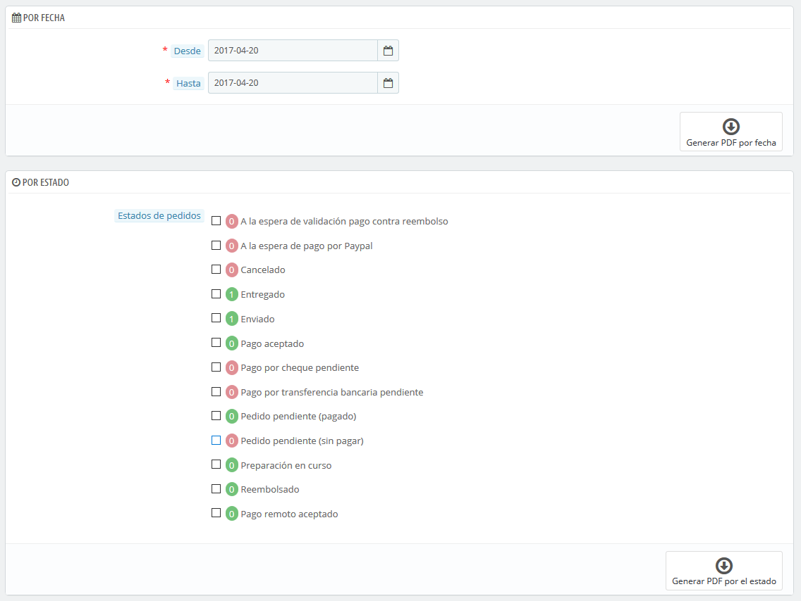
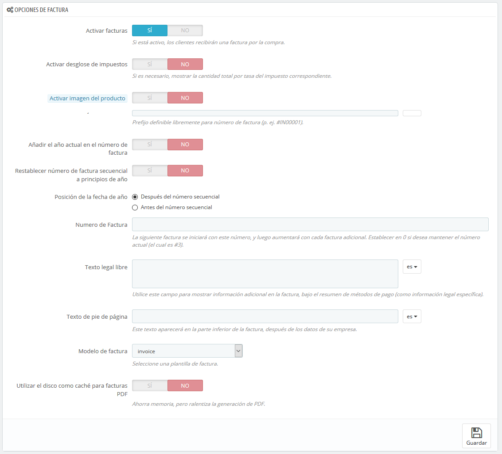

# Facturas

Cada vez que un pedido de tu tienda es validado, una factura se envía al cliente. Esta página te permite configurar y descargar una selección de facturas.

## Generar factura en archivos PDF 

Puedes descargar las facturas de cada pedido desde el menú Pedidos. La página "Facturas" bajo el menú "Pedidos" te permite descargar una selección de facturas de pedidos anteriores en formato PDF, todas al mismo tiempo \(en el mismo archivo PDF\).

Puedes obtener un archivo PDF conteniendo varias facturas en función de dos criterios principales:

* **Por fecha**. Muy útil cuando necesites imprimir todas las facturas de un mes o un trimestre determinado. Selecciona la fecha de inicio y fin, y haz clic en el botón "Generar PDF por fecha".
* **Por estado del pedido**. Indispensable cuando necesites imprimir con precisión pedidos que han sido cancelados, reembolsados o se encuentran pendientes de envío. PrestaShop te indica el número de facturas vinculadas a cada estado entre paréntesis.

En ambos casos, las facturas se generan en un solo archivo PDF, cada uno con sus propias páginas. No se puede obtener un único archivo PDF para cada factura del período o estados determinados utilizando esta página.

Si deseas personalizar el aspecto de las facturas de tu tienda, debes cambiar sus archivos de plantilla.

Los archivos de la plantilla PDF se encuentran en la carpeta `/pdf`. Abre el archivo `invoice.tpl` y edítalo a tu gusto: éste es un archivo HTML con etiquetas Smarty.

Cuando tus clientes te soliciten sus facturas, puedes indicarles que tienen acceso a ellas desde la sección "Historial de pedidos" de sus cuentas de usuario.

## Opciones de factura 

Puede elegir si deseas o no poner las facturas a disposición de tus clientes tan pronto como se haga el pedido, así como el prefijo para todas las facturas y el número de factura que deseas que aparezca en la versión impresa de la factura. Esta funcionalidad puede ayudarte a simplificar la gestión de tu cuenta.

* **Activar facturas**. Si desactivas esta opción, tu cliente no recibirá una factura después de su compra. Tendrás que encargarte personalmente de enviar la factura, si algún cliente te la solicita.
* **Activar desglose de impuestos**. _Novedad en PrestaShop 1.6_. Cuando se activa esta opción, la factura lista todas las diferentes tasas de impuestos que fueron aplicadas al pedido, en lugar de tan sólo mostrar un porcentaje.
* **Activar imagen del producto**. _Novedad en PrestaShop 1.6_.1. Cuando se activa esta opción, se añadirá en la factura la imagen del producto junto al nombre del producto.
* **Prefijo de la factura**. De manera predeterminada, se utilizan prefijos adaptados a cada idioma para sus facturas: "IN" en inglés, "FA" en francés \(de "_factura_"\), "CU" en español \(por "cuenta"\), etc. Es posible que prefieras utilizar prefijos para cada idioma: "EN", "FR", "SP", etc. Por supuesto, también puedes optar por tener un prefijo único para cada idioma, o no utilizar ningún prefijo para ninguna de ellas. PrestaShop generará entonces los números de las facturas de acuerdo a tu configuración establecida: "\# IN000001", "\# FR000002", etc.
* **Añadir el año actual en el número de factura**. Al activar esta opción, además del número de factura y el prefijo, también aparecerá el año en el número de factura.
* **Restablecer el número progresivo de la factura al comienzo del año**. Al comienzo de un nuevo año, el número de la factura se restablece para comenzar de nuevo a 0.
* **Posición de la fecha de año**. Elige dónde mostrar la fecha del año en el número de factura, antes o después del número progresivo.
* **Número de factura**. Si tu empresa ya tiene pedidos y facturas antes de empezar a utilizar PrestaShop, puedes utilizar esta opción para iniciar tu sistema de facturación en un determinado número.
* **Texto legal libre.** _Novedad en PrestaShop 1.6.1.0_. Este campo te permite añadir contenido adicional a la factura, en caso de que la legislación local de tu país requiera que muestres información adicional. En la factura, ésta aparecerá debajo del resumen de los métodos de pago. Por supuesto, puedes utilizar este texto libre para mostrar cualquier texto que consideres necesario.
* **Texto al pie de página**. Puedes utilizar esta opción para tener un texto personalizado en la parte inferior de todas las facturas. El texto aparecerá en la factura debajo del nombre de la tienda.
* **Modelo de factura**. En función del tema, es posible que puedas utilizar más de un estilo de factura. Prueba esta opción con un pedido falso para elegir la que más te guste. Si sabes cómo codificar en HTML, puedes añadir tus propios modelos de factura o editar los ya existentes: éstas se encuentran en la carpeta `/pdf/` de tu instalación de PrestaShop.
* **Utilizar el disco como caché para facturas PDF**. Puedes optar por almacenar las facturas generadas en el disco del servidor en lugar de en la memoria caché del servidor. Esto preserva la memoria, pero enlentece la generación de archivos PDF. Utiliza esta opción con conocimiento de causa.

No olvides guardar los cambios realizados.

