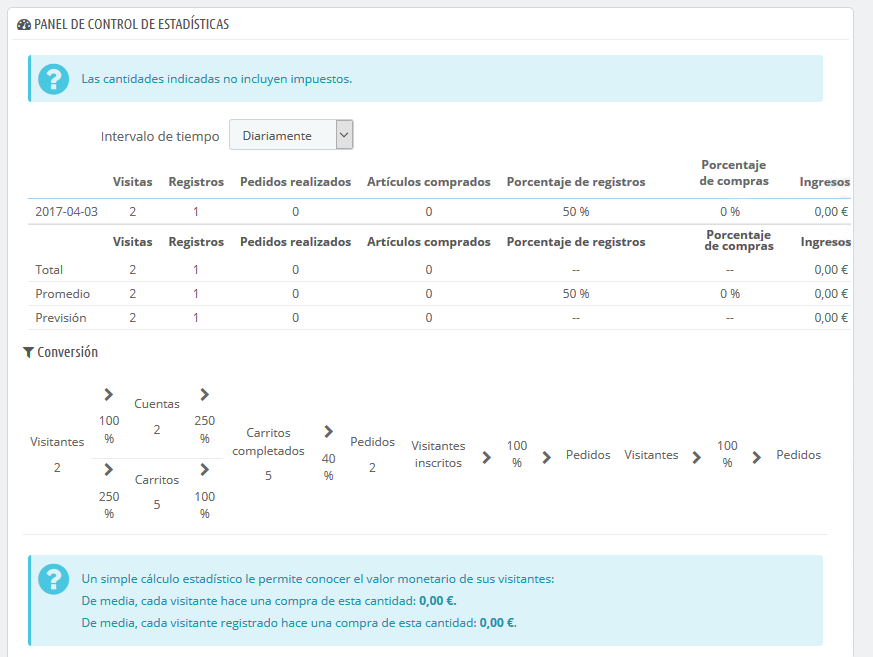
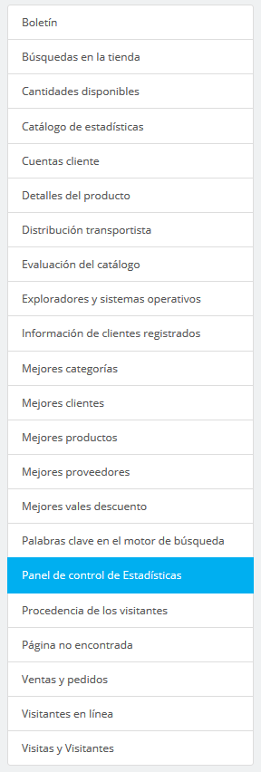

# Comprender las estadísticas

Esta sección presenta en detalle la utilidad de las diferentes estadísticas disponibles. Al hacer clic en cada una de las categorías que se encuentran a tu disposición en la barra lateral izquierda de la página "Estadísticas", se recargará la parte principal de la página mostrándote sus números más recientes.\
Para la mayoría de las estadísticas, se proporciona una explicación para que puedas comprender la información que se te presenta, y puedas utilizar estos datos en la mejora de tu tienda y en tu tasa de conversión.

Video - 4 sencillos pasos para optimizar el rendimiento de tu tienda en línea

## Interfaz principal 

La página muestra el cuadro de mando de las estadísticas, una visión general de los principales números recogidos por el sistema de estadísticas de PrestaShop desde que puso en marcha tu tienda en línea.

En la parte superior de la página hay una barra que te permite elegir el periodo de tiempo de las estadísticas que se muestran actualmente. Tres conjuntos de opciones están disponibles:

* Día, mes o año actual.
* Día, mes o año anterior.
* Selección precisa de un período de tiempo (desde y hasta).

Haz clic en "Guardar" para mostrar las estadísticas del período de tu elección.

El cuadro de mando contiene 8 secciones:

* **Las principales estadísticas**. Este es el verdadero corazón de tus estadísticas. En una sola tabla, PrestaShop te ofrece una visión general de los números más importantes que se han recogido para el período de tiempo seleccionado: visitantes, nuevas inscripciones, nuevos pedidos, número de artículos comprados, porcentaje de registros por visitas, porcentaje de pedidos por visitas, cantidad de cupones de descuentos utilizados, volumen de ventas.\
  Puedes cambiar el nivel de detalle utilizando el selector desplegable, situado en la parte superior derecha de la sección. Los periodos de tiempo disponibles son: día, semana, mes, y año.\
  Las tres líneas en la parte inferior de la tabla no se ven afectadas por el período seleccionado: total, media y previsiones te ofrecen una estimación estadística de los parámetros vistos anteriormente.
* **Conversión**. Esta sección te da una idea del valor que tiene tu tienda para los visitantes y clientes registrados, en base al número de pedidos que realizan. Es un buen indicador para conocer si tu tienda está o no funcionando.\
  Nota: la diferencia entre un "carrito" y un "carrito completado" es que un carrito es un carrito de un visitante, con productos y no mucho más, mientras que un carrito completo es un carrito con productos Y una dirección de envío Y un transportista seleccionado - en resumen, el carrito ha realizado _casi completamente_ el proceso de pago, y lo único que le queda realmente por hacer es pagar.
* **Distribución por métodos de pago**. Esta sección presenta los métodos de pago que están siendo más utilizados para pagar por parte de tus clientes. En base a estar cifras, debes adaptar tu tienda con la finalidad de tener en cuenta los métodos más populares, e incluso destacar el método más utilizado por tus clientes.\
  Utilizando el selector desplegable "Zona", puedes limitar los números a una zona geográfica específica, y así ver qué método funciona mejor o peor en cada región.
* **Distribución por categorías**. Esta sección proporciona información específica de cada categoría. Para cada categoría, ésta te presenta números que te serán de utilidad: productos, ventas, porcentaje de productos dentro de todo tu catálogo, porcentaje de las ventas de toda la tienda, precio medio de los productos. Si notas que una categoría es mucho más exitosa que otras, es posible que desees poner todos tus esfuerzos en promocionarla. Por otro lado, también podrías intentar mejorar los números de las categorías menos exitosas creando para ellas cupones de descuento o realizando otras acciones promocionales.\
  Utilizando el selector desplegable "Zona", puedes limitar los números a una zona geográfica específica, y así ver qué categorías funcionan mejor o peor en cada región.
* **Distribución por idiomas**. Tus clientes pueden elegir su idioma preferido cuando se registran en tu tienda, y tu puedes ver la distribución de los idiomas desde esta sección. Asegúrate de tener todos tus productos traducidos correctamente por lo menos para los dos idiomas más utilizados por tus clientes.
* **Distribución por zonas**. Puedes filtrar las otras secciones por zona geográfica, y esta sección te proporcionará una visión general por zonas del número de clientes registrados y ventas realizadas (y sus respectivos porcentajes).\

* **Distribución por monedas**. Si aceptas más de una moneda, esta sección te ayuda a saber cuál es la más utilizada por los clientes a la hora de pagar.\
  Utilizando el selector desplegable "Zona", puedes limitar los números a una zona geográfica específica, y así conocer qué divisa es la más utilizada en cada región.
* **Distribución por atributos**. Esta es más una estadística interna, que te permite saber qué atributo y grupos de atributos son los más utilizados en tus productos.

## Navegando por las estadísticas 

La mayoría de las estadísticas se pueden descargar en archivos CSV, haciendo clic en el botón "Exportar CSV".

* **Cantidades disponibles**. Esta sección te ofrece una estimación del valor que tiene tu stock actual.
* **Mejores categorías**. Esta sección presenta las categorías más exitosas de tu tienda. Puedes conocer la cantidad de productos que han sido vendidos en cada categoría, los ingresos generados, y el número de páginas visitadas. Comprueba regularmente los resultados de las diferentes categorías para mejorar la cohesión de tu tienda.
* **Mejores clientes**. Esta sección muestra los mejores clientes de tu tienda. Se muestran sus direcciones de correo electrónico, así como el número de veces que han visitado tu tienda, y cuánto dinero han gastado hasta ahora. No pierdas detalle de esta página, cuida a tus mejores clientes. Haciendo clic en los botones de la parte superior de las columnas, puedes elegir cómo deseas ordenar estos datos.
* **Mejores proveedores**. Esta sección te ofrece las estadísticas de tus proveedores proporcionándote las cantidades vendidas y los ingresos generados.
* **Mejores cupones de descuento**. Esta sección muestra los cupones, reglas de compra y reglas del catálogo más populares que has creado y distribuido, ya sea personalmente o a través de una campaña promocional. La tabla también muestra el volumen de ventas y el número de cupones de descuento utilizados.
* **Mejores productos**. Esta sección muestra los productos más exitosos de tu tienda. Puedes ver el volumen de negocios realizado, el número de ventas promedias diarias, el número de veces que las páginas fueron vistas, y la cantidad de unidades disponibles en stock. Mediante esta tabla, puedes identificar tus productos más destacados y decidir si debes aumentar o disminuir el precio de los mismos o realizar algún descuento en un producto específico.
* **Navegadores y Sistemas Operativos**. Esta sección te muestra los navegadores web que tus visitantes y clientes utilizan para navegar por tu tienda. Debes comprobar que tu tienda se ve y funciona correctamente en todos estos navegadores, o por lo menos en los tres más utilizados por tus clientes y visitantes. En esta sección, también se te informa si los visitantes están navegando a través de dispositivos móviles (como teléfonos inteligentes o tablets). Si este número es significativo, deberías pensar en utilizar un tema responsable y compatible con dispositivos móviles.\
  Por último, también puedes ver qué sistemas operativos utilizan tus clientes y visitantes. Asegúrate de que tu tienda es totalmente compatible con todas las plataformas que ellos utilicen.
* **Distribución por transportista**. Esta página muestra los transportistas más utilizados por tus clientes. Puedes realizar un filtrado por estados del pedido. Si compruebas que un transportista no es utilizado con frecuencia, a pesar de ser rápido y eficiente, podrías destacarlo durante el proceso de pago, para aumentar la satisfacción de los clientes.
* **Evaluación del catálogo**. Esta sección ofrece una visión general del rendimiento de tu catálogo. Puedes conocer si un producto está activo, o si sus descripciones están disponibles en todos los idiomas existentes en tu tienda. También puedes ver si todos tus productos cuentan imágenes, y las unidades que tienes disponibles de cada uno de ellos. Para mostrar los resultados se utiliza un icono de color. Puedes definir los criterios de estos iconos de color, utilizando la tabla situada en la parte superior de esta página, a continuación, guarda la configuración utilizando el botón disponible para ello.
* **Catálogo de estadísticas**. Esta sección contiene información práctica sobre los productos que se venden en tu tienda, y tu catálogo en general. Las cifras pueden ser filtradas por categoría utilizando el selector desplegable situado en la parte superior derecha de la sección. Puedes actuar sobre el rendimiento de tu catálogo teniendo en cuenta los siguientes indicadores:\

  * **Productos disponibles**.La cantidad de productos en esta categoría (por defecto, todas las categorías).
  * **Precio promedio (precio base)**. Promedio de precios de los productos de la categoría seleccionada.
  * **Páginas de productos vistas**. Número de páginas que fueron visitadas por tus clientes potenciales. Compara estos datos entre las diferentes categorías para ver cuál tiene la mayor cantidad de productos visitados, o por el contrario cuáles de ellos no atraen a tus clientes. Utiliza esta información para realizar mejoras a tu catálogo.
  * **Productos comprados**. La cantidad de productos comprados en cada categoría.
  * **Número promedio de páginas visitadas**. El número global de visitas para los productos de la categoría seleccionada.
  * **Número promedio de compras**. El número global de productos vendidos de la categoría seleccionada.
  * **Imágenes disponibles**. Indica cuántas imágenes están vinculadas a los productos de la categoría seleccionada. Una forma rápida y fácil de saber si algunos de tus productos carecen de imágenes: si hay menos imágenes que productos.
  * **Número promedio de imágenes**. Número de imágenes divididas por el número de productos de la categoría seleccionada.
  * **Productos nunca vistos**. Algunos de tus productos, quizás nunca hayan sido visitados por tus clientes. Revisa sus páginas para tratar de entender por qué razón ocurre esto.
  * **Productos nunca comprados**. Algunos de tus productos, quizás nunca hayan sido comprados por tus clientes. Este es un asunto serio, y debes tratar de entender por qué razón ocurre esto.
  * **Tasa de conversión\***. Indica la relación entre el número de visitantes y el número de compras. Es importante que este valor sea lo más alto posible.
  * Una tabla en la parte inferior de la página te muestra los productos de esta categoría que nunca han sido comprados. Considera si debes abaratar los precios de estos productos o realizar una descripción más atractiva.
* **Cuentas cliente**. Esta página muestra una gráfica con el número de cuentas creadas por los clientes en tu tienda. Con esta información, puedes medir el impacto de tus campañas de marketing.\
  Puedes ver el número de visitantes que se han inscrito, pero que en realidad nunca han comprado nada, así como el número de clientes que han creado una cuenta y compraron un artículo inmediatamente después de registrarse.
* **Boletín de noticias**. Esta página muestra las estadísticas de suscripción al boletín de noticias. Puedes utilizar esta base de datos para mantener informados a tus clientes. Los boletines de noticias por lo general ayudan a aumentar el tráfico de tu tienda. Si deseas mejorar los datos de suscripción, considera la opción de añadir cupones de descuento/reglas de carrito a cada boletín que realices. Puedes ver todas las direcciones de correo electrónico de los clientes y visitantes inscritos a través del módulo "Suscripción a nuestro boletín de noticias", en la página "Módulos y Servicios".
* **Páginas no encontradas**. Esta página muestra las páginas de tu catálogo a las que tus visitantes han tratado de acceder, pero que por alguna razón no se pudieron encontrar (dando como resultado una página de error "HTTP 404"). Ésta es de utilidad para encontrar posibles problemas técnicos que puedan estar afectando a tus ventas.
* **Detalles del producto**. Esta página muestra todos los productos de tu tienda por el número de referencia, nombre, y disponibilidad de stock. Puedes ordenar los resultados seleccionando la categoría de productos que deseas ver en el menú desplegable. Haz clic en un producto para acceder a tus estadísticas. A continuación, puedes ver una gráfica con dos conjuntos de datos: las ventas realizadas y el número de visitas realizadas a la página del producto. La tasa de conversión del producto también será mostrada.
* **Información de clientes registrados**. Esta sección está dividida en 5 gráficas de tipo tarta.\

  * **Distribución por género**. Puedes ver cómo tus clientes se distribuyen entre los distintos títulos sociales que has establecido – por defecto, Sr., Sra. , pero puede haber muchos otros, como Dr. o Mr. Por lo tanto, no siempre puedes confiar en esta gráfica para ver la distribución por género... a menos que hayas reducido los títulos sociales a los dos géneros que existen.
  * **Rango de edades**. Puedes ver cómo se distribuyen tus clientes de acuerdo a la edad que tienen. Si ves que el rango de edad de tus clientes no es el que imaginaba que sería, deberás cambiar tus técnicas de marketing.
  * **Distribución por países**. Puedes consultar rápidamente los países en los que tus clientes están viviendo. Esto puede ayudarte a conocer hacía que zonas geográficas debes dirigir tus técnicas y campañas de marketing.
  * **Distribución por monedas**. Puedes ver cuáles son las monedas más utilizadas por tus clientes para comprar artículos en tu tienda, y en qué proporciones se dan.
  * **Distribución por idiomas**. Puedes ver en qué idiomas es consultada con más frecuencia tu tienda, y así decidir si debe o no mejorar las traducciones de tu tienda en un idioma determinado.
* **Ventas y pedidos**. Estas dos gráficas presentan la evolución de las ventas y pedidos de tu tienda. Éstas pueden ser filtradas por países, utilizando el menú desplegable situado en la parte superior derecha.\

  * La primera gráfica indica el número total de pedidos realizados, así como el número total de productos pedidos. A través de esta gráfica, puedes analizar en qué periodos de tiempo vendiste el mayor número de productos en términos de cantidad de pedidos.
  * La segunda gráfica te ayuda a visualizar tus ventas de forma gráfica. Con esta gráfica puedes analizar los periodos de tiempo en los que tuviste las mayores ventas. Esto te permite, por ejemplo, saber cuándo debes comenzar a crear tus campañas de marketing.
* **Palabras claves en los motores de búsqueda**. Esta página te indica las palabras más utilizadas que escribieron tus visitantes en los motores de búsqueda para llegar a tu tienda. Esto te permite saber qué términos hacen a tu tienda fácilmente identificable. Por el contrario, puedes ver qué palabras clave están ausentes en esta lista y que por lo tanto no son efectivas.
* **Búsqueda en la tienda**. Esta sección presenta dos indicadores.\

  * El primero de ellos, es una gráfica que muestra la distribución de las palabras clave tecleadas en la barra de búsqueda de tu tienda. Esto te permite conocer los productos que tus visitantes están realmente buscando – y por lo tanto, debes asegurarte de tener suficiente stock para esos productos.
  * El segundo de ellos, es una tabla que resume las búsquedas de tus visitantes. Puedes ver qué palabras claves utilizaron en la búsqueda, con qué frecuencia fueron estas tecleadas, y cuántos resultados fueron mostrados. Es importante que para todas las búsquedas que realicen tus clientes se obtengan resultados. Para mejorar las ventas de tu tienda, asegúrate de añadir los productos que los clientes están demandando (analizando las búsquedas que estos realizan) y añade etiquetas adicionales en los productos para que sean fácilmente identificables.
* **Panel de control de estadísticas**. Esta es la página principal del menú "Estadísticas". Ésta te ofrece una visión general de los números más importantes que se han recogido para el período de tiempo seleccionado.
* **Visitantes en línea**. Esta sección muestra el número de visitantes que se encuentran actualmente en tu tienda. Puedes ver sus nombres y las páginas que están visualizando. Los datos se actualizan en vivo, mientras tus visitantes navegan por tu tienda. La opción "Guardar las páginas vistas por cada cliente" en el módulo "Explotación de datos para las estadísticas" (StatsData), debe activarse para ver las páginas que tus visitantes están viendo actualmente.\

* **Procedencia de los visitantes**. Esta página utiliza una gráfica de tipo tarta que muestra los 10 sitios y motores de búsqueda que han enviado a tus visitantes hacia tu tienda. Por lo general, los motores de búsqueda juegan un papel muy importante. Si creas una campaña de marketing mediante la publicación de artículos en otros sitios, puedes ver el impacto que está teniendo en tu tienda a través de esta página. Bajo la gráfica se muestran los nombres de los sitios que te han proporcionado mayor audiencia, con el número de visitantes enviados desde cada una de ellas  en la columna de la derecha.
* **Visitas y visitantes**. Esta página proporciona estadísticas sobre los visitantes de tu tienda y el número de veces que estos la visitan. Cuanto mayor sea el número, más popular será tu tienda. La gráfica te ayuda a conocer el comportamiento de tus visitantes. Básicamente podrás ver el número de visitas que tu tienda ha tenido, y podrás comparar este dato con el número de visitantes (PrestaShop puede reconocer cuando la misma persona visita tu tienda varias veces, de ahí que el número de visitas será mucho más alto que el número de visitantes). Si la diferencia entre estos dos números es alta, significa que tienes una base de clientes leales.
