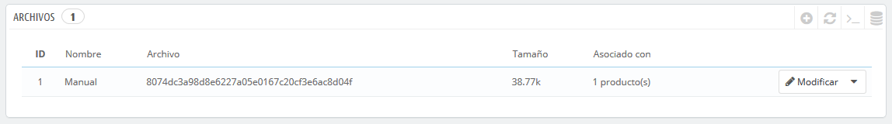

# Gestionar Archivos

PrestaShop te permite poner algunos archivos a disposición de tus clientes antes de su compra.

Los archivos ya no son denominados "Archivos Adjuntos" en PrestaShop 1.7

Los "Archivos" en PrestaShop 1.7 solían ser denominados "Archivos Adjuntos" en versiones anteriores de PrestaShop. Excepto por el nombre, ¡todo funciona igual!

Por ejemplo, supongamos que vendes artículos electrónicos, y te gustaría instar a tus clientes a leer un documento sobre el funcionamiento de un producto. Puedes subir un documento para este propósito.  
También puedes simplemente poner el manual del producto en formato PDF para que el cliente lo descargue en la página del producto.

Cada producto puede tener archivos, que pueden ser establecidos individualmente en la pestaña "Opciones" de la página "Productos" bajo el menú "Catálogo", en la sección "Archivos adjuntos". Esta página da acceso a todos los archivos adjuntos de la tienda: si necesitas poner a disposición del cliente este mismo archivo adjunto para otros productos, sólo tienes que subirlo una vez.

También puedes subir archivos por tu cuenta, antes de asociarlos a los productos. Esto se realiza desde la página "Archivos", bajo el menú "Catálogo".

El proceso para registrar un nuevo archivo a tu tienda es muy sencillo:

1. Haz clic en "Añadir nuevo archivo". Un formulario aparecerá en pantalla.
2. **Título**. Establece un nombre para el archivo, en todos los idiomas necesarios. Será visualizado por tus clientes.
3. **Descripción**. Proporciona una descripción breve, en todos los idiomas necesarios.
4. Haz clic en "Añadir" para seleccionar un archivo en tu ordenador para cargar.
5. Haz clic en "Guardar".

A continuación, serás redireccionado al listado de archivos, donde aparecerá el archivo recien subido. Este archivo estará disponible para todos los productos, a través de la pestaña "Archivos adjuntos".

Ahora, la pestaña "Adjuntos" aparecerá en tu tienda en línea y tus clientes podrán descargar ese archivo si es necesario.

