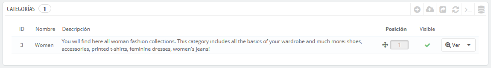
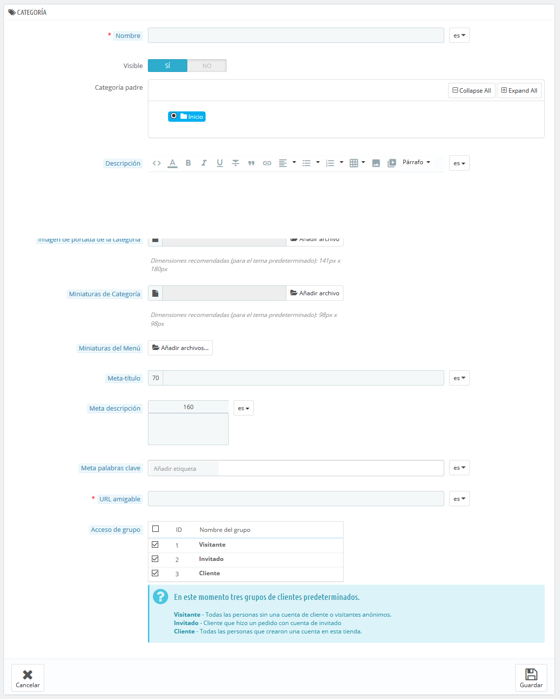

# Gestionar las categorias

Las categorías son esenciales, ya que permiten agrupar productos equivalentes. Esto ayuda a los clientes a navegar fácilmente a través del catálogo de productos de tu tienda, y restringir la búsqueda a un tipo específico de producto.

Debes crear una nueva categoría en el momento en que tengas al menos dos productos con atributos o características equivalentes. Los productos dentro de una misma categoría deben ser comparables, e incluso intercambiables. Mantén esta idea en mente al añadir nuevos productos y al crear nuevas categorías.

Las categorías determinan cómo las personas navegarán a través de tu tienda y cómo accederán a tus productos. Deberías concentrarte en el árbol de categorías de tu tienda y en cómo las categorías estarán organizadas, incluso antes de comenzar a crear páginas de productos.

Las categorías son gestionadas desde la página "Categorías" del menú "Catálogo". Esta página muestra una tabla con las categorías existentes en la actualidad, mostrando la información principal de cada una de ellas.  
Para visualizar las subcategorías, haz clic en la categoría padre o selecciona "Ver" en el menú de acciones.



Utilizando el icono verde de verificación de la columna "Visible" de la tabla, puedes indicar que desea ocultar la categoría correspondiente, convirtiéndose en este caso el icono en una "x" de color rojo.  


Todas las categorías son en realidad subcategorías de la categoría "Inicio".  
Para editar la categoría "Inicio" \(o cualquier categoría actualmente seleccionada\), haz clic en la flecha situada junto al botón "Ver" y luego en "Modificar".

Para crear una nueva categoría \(o una subcategoría de una categoría existente\), haz clic en el botón "Añadir nueva categoría" desde cualquier nivel de categorías.



¡Traduce las categorías de tu tienda!

Asegúrate de traducir cada campo en todos los idiomas soportados por tu tienda. Para ello, haz clic en el botón que muestra la lista desplegable de códigos de idioma, y selecciona el idioma en el que deseas editar el texto.

En primer lugar, debes introducir la información general:

* **Nombre**. Establece un nombre a la categoría. Asegúrate que éste sea corto y descriptivo: tus clientes confiarán en dicho nombre para guiarse a través de tu tienda.
* **Visible**. Indica si esta categoría será "mostrada" \(es decir, si estará o no estará disponible para tus clientes\). Por ejemplo, podrías posponer el mostrar una categoría a tus clientes si consideras que ésta no cuenta todavía con suficientes productos introducidos.
* **Categoría padre**. _No aparece cuando se crea una categoría raíz._ Si deseas crear una subcategoría perteneciente a una categoría que no sea la página de inicio, selecciona la categoría bajo la cual aparecerá. La forma en la que se crea una categoría raíz o una subcategoría es la misma. La única diferencia es que cuando se hace clic en "Añadir nueva categoría" desde un subnivel de categorías, PrestaShop entiende que deseas crear una subcategoría de esa categoría, y por lo tanto, determina la opción "Categoría padre" en consecuencia.
* **Descripción**. Debes rellenar este campo, no solamente porque te será de utilidad a ti y a tus empleados, sino porque también algunos temas hacen uso de ella, mostrándose ésta a tus clientes.
* **Imagen de portada de la categoría**. Haz clic en "Añadir archivo" para subir una imagen desde tu ordenador, que represente a esta categoría. Ésta aparecerá en la página de categorías.
* **Miniatura de categoría**. Muestra una pequeña imagen en la página de la categoría padre, si el tema lo permite.
* **Miniatura de menú**. La miniatura aparece en el menú como una pequeña imagen que representa la categoría, si el tema lo permite.
* **Meta título**. El título que aparecerá en los motores de búsqueda cuando se realiza una solicitud por parte de un cliente.
* **Meta descripción**. Una presentación de tu categoría en unas pocas líneas, destinada a captar el interés de un cliente. Esta descripción aparecerá en la página de resultados de los motores de búsqueda.
* **Meta palabras clave**. Palabras clave que definan a esta categoría, con el fin de ser referenciadas por los motores de búsqueda. Puedes introducir varias palabras separadas por comas, así como expresiones que deben ser indicadas entre comillas.
* **URL Amigable**. Te permite reescribir las direcciones de tus categorías como deseas. Por ejemplo, en lugar de tener una dirección como [http://www.ejemplo.com/categoria.php?id\_categoria=3](http://www.example.com/category.php?id_category=3), puedes tener [http://www.ejemplo.com/123-nombre-de-la-categoria](http://www.example.com/123-name-of-the-category). En este caso, todo lo que tendrías que hacer es indicar en el campo "URL amigable" las palabras que deseas que aparezcan en lugar de "nombre-de-la-categoría", separadas por guiones.
* **Acceso de grupo**. Restringe el acceso a la categoría y tus productos a ciertos compradores. Para visualizar estas categorías, los compradores deben pertenecer a un grupo de usuarios. Echa un vistazo a la pestaña "Grupos" de la página "Ajustes sobre clientes", del menú "Parámetros de la tienda", para obtener más información.
* **Categoría raíz**. _Sólo aparece cuando se crea una categoría raíz_. Es posible que desees utilizar esta nueva categoría como la nueva categoría raíz, en lugar de "Inicio". Si es así, marca esta opción para aplicar el cambio.

  La categoría raíz es muy útil en el modo multitienda. Imagínate que tienes 3 tiendas con diferentes \(o parcialmente diferentes\) productos y categorías: es posible que desees utilizar una categoría raíz diferente para cada tienda.

  La categoría raíz refleja la categoría "inicio" de cada tienda, así que, si no quieres tener los mismos productos en la categoría de la página principal de cada tienda, necesitas crear diferentes categorías raíz.  
  De esta forma, es más fácil asignar categorías para cada tienda, y así poder tener diferentes productos en la categoría inicio de cada una de ellas.

Una vez que hayas terminado de configurar la categoría, guárdala, y ya estará preparada para llenarla de productos.

Una nueva categoría no aparecerá automáticamente en el menú de tu tienda. Para visualizarla, debes editar el menú principal de la tienda con el módulo "Menú principal" \(cuando se utiliza el tema predeterminado\), o con el módulo personalizado que puedas estar utilizando para administrar el menú de la tienda.

## Examinar y editar de categorías <a id="Gestionarlascategorias-Examinaryeditardecategor&#xED;as"></a>

El botón "Modificar" en la barra de botones, permite editar la categoría padre de las subcategorías actualmente mostradas. Esto significa que cuando estés viendo las subcategorías principales, al hacer clic en el botón "Modificar" podrás editar la categoría "Inicio".

Al hacer clic en cualquier categoría de la tabla, se abrirán, y mostrarán todas las subcategorías de tu tienda. Como consecuencia a esta acción, cambiará el contexto de la interfaz: haciendo clic en el botón "Modificar" puedes editar la categoría padre actual, y haciendo clic en "Añadir nueva categoría" se abrirá el formulario de creación de la categoría con la opción "Categoría padre" establecida a la categoría padre actual.

## Importar y exportar categorías <a id="Gestionarlascategorias-Importaryexportarcategor&#xED;as"></a>

Además de los habituales botones "Añadir nueva" y "Modificar", la barra de botones también cuenta con otros tres botones:

* **Exportar.** Permite descargar el listado de todas las categorías, en formato CSV.
* **Importar.** Abre la página "Parámetros avanzados &gt; Importación", con el tipo de datos que se espera establecido en "Categorías". Consulta la sección "Comprender los Parámetros avanzados" para obtener más información sobre la importación de archivos.  
  Necesitarás que el archivo siga este formato:

  ```text
  ID;Name;Description;Position;Displayed;
  3;iPods;Now that you can buy movies from the iTunes Store and sync them to your iPod, the whole world is your theater.;1;1;
  4;Accessories;Wonderful accessories for your iPod;2;1;
  5;Laptops;The latest Intel processor, a bigger hard drive, plenty of memory, and even more new features all fit inside just one liberating inch. The new Mac laptops have the performance, power, and connectivity of a desktop computer. Without the desk part.;3;1;
  ```

  El identificador de la categoría es la ID, no el nombre de la categoría.

* **Actualizar lista**. Recarga el listado de categorías mostrando todos los cambios realizados.

Más opciones de importación están disponibles en la página "Importación" del menú "Parámetros avanzados".

## Añadir productos a una categoría <a id="Gestionarlascategorias-A&#xF1;adirproductosaunacategor&#xED;a"></a>

Para añadir un producto a una categoría, debes abrir la página de edición de productos e ir a la sección "Categorías", en la pestaña "Ajustes básicos". Aquí es donde puedes establecer las categorías a las que pertenece el producto.

La categoría "Inicio" es una categoría especial, donde puedes destacar/promocionar productos de cualquier otra categoría, haciendo que aparezcan en el bloque "Productos destacados". De manera predeterminada, sólo se pueden visualizar 8 productos destacados en la página principal.

El bloque "Productos destacados" está supeditado al módulo "Productos destacados". Si deseas tener más \(o menos\) productos en la página principal, configura este módulo \(desde la página "Módulos" en el menú "Módulos y Servicios"\).

Nota: No tienes que eliminar un producto de su categoría original para que se visualice en la página principal. Un producto puede tener tantas categorías, como sea necesario.

