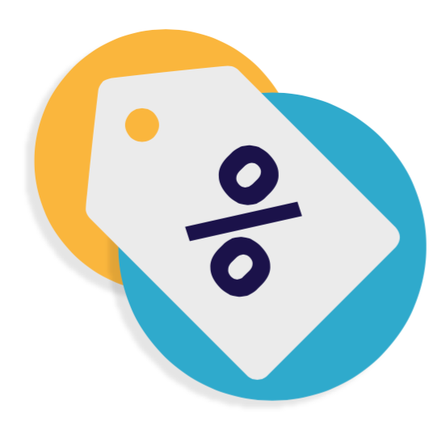

# Gestionar Descuentos

Las rebajas y los cupones de descuento tienen un papel importante en las relaciones diarias con tus clientes.

Normalmente, los clientes tienen en cuenta dos cosas cuando compran:

* Sentirse especiales, únicos.
* Conseguir productos a buenos precios.

Ambas cosas pueden lograrse con descuentos personalizados, y en esto es precisamente donde entran en juego los cupones de descuentos – o más concretamente, las reglas de precios.

Las "Reglas de precios" pueden ser de dos tipos:

* **Reglas del carrito**. Te permite crear códigos de cupón por cliente, pero también mucho más. (Estas son en realidad las sucesoras de lo que en anteriores versiones de PrestaShop se denominaban cupones de descuento).
* **Reglas de precios del catálogo**. Permite asignar descuentos por categoría, marca, proveedor, atributo o característica.\
  Por ejemplo, puedes establecer una regla que diga que los clientes españoles que pertenecen al grupo de "buenos clientes" obtengan un 10% de descuento en la categoría de Electrónica en todos los productos de Sony durante la primera semana de julio.

Este capítulo contiene las siguientes secciones:

* [Reglas del carrito](reglas-carrito.md)
* [Reglas de precios del catalogo](reglas-de-precios.md)
