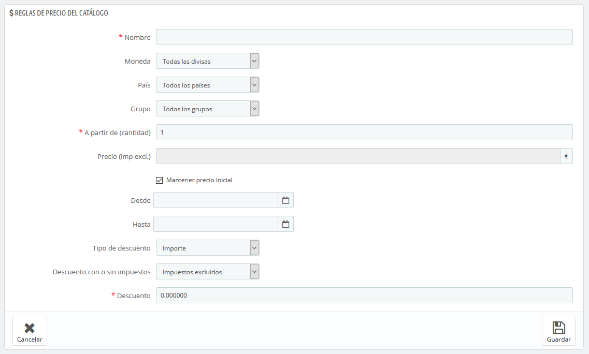
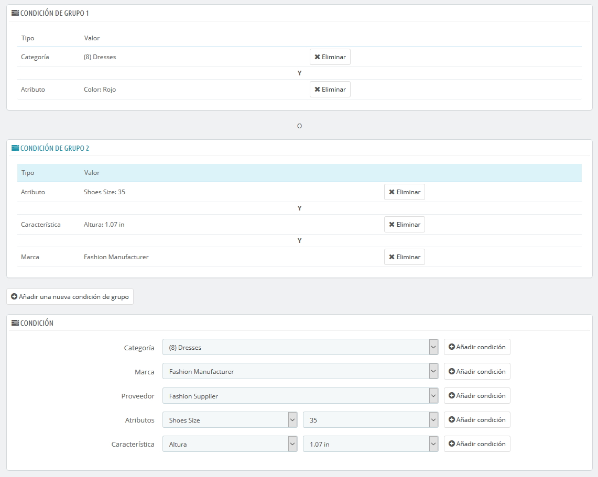

# Reglas de precios del catalogo

Las reglas del catálogo te permiten aplicar descuentos por categoría, fabricante, proveedor, atributo o característica. Como su nombre indica, este tipo de reglas se aplica a una gama de productos; por tanto, éstas no se pueden utilizar para un solo producto. Si necesitas que un descuento se aplique a un solo producto, debes crear una regla de carrito, o crear un precio específico \(en la pestaña "Precios" de la página de edición del producto\).

Por ejemplo, puedes establecer una regla que diga que los clientes españoles que pertenecen al grupo de "buenos clientes" obtengan un 10% de descuento en la categoría de Electrónica en todos los productos de Sony durante la primera semana de julio.

La página "Reglas del catálogo" lista las reglas actuales existentes, las cuales puedes modificar o eliminar haciendo clic sobre los iconos establecidos para ello en la columna "Acciones". Si tienes que deshabilitar una regla, simplemente cambia su fecha de finalización al día anterior.

## Crear una nueva Regla de Precio de Catálogo 

La página de formulario de creación tiene dos secciones, que te permiten construir con precisión nuevas reglas.

### Reglas de precios del catálogo 

El primer formulario es fácil de entender.

Aquí es donde establecerás quiénes deben beneficiarse de esta regla, qué clase de descuento debe aplicarse, y otros detalles.

* **Nombre**. El nombre es público, por lo que debe ser entendible por el cliente.
* **Tienda**. _Opción solamente disponible en Modo Multitienda._ La regla se aplicará a los clientes que compren a través de una tienda específica. Este campo sólo está disponible si tienes al menos dos tiendas activas.
* **Moneda**. La regla se aplicará sólo si el cliente opta por pagar con la moneda especificada.
* **País**. La regla se aplicará a los clientes de un país específico.
* **Grupo**. La regla se aplicará a los clientes que pertenezcan a un grupo específico de clientes.
* **Desde cantidad**. La regla se aplicará sólo si el pedido tiene al menos una cantidad determinada de productos.
* **Precio \(impuestos excl.\)**. El nuevo precio para el producto. Aquí puedes cambiar el precio de los productos que coincidan con las reglas que estás estableciendo. De forma predeterminada, la regla se aplicará al precio base.
* **Desde** y **Hasta**. La regla se aplicará en este marco de tiempo. 
* **Tipo de descuento**. El descuento puede ser de una cantidad de dinero especificada o un porcentaje de la cantidad total del pedido.
* **Descuento con o sin impuestos**. El descuento puede o bien incluir el impuesto, o dejar el impuesto como es.
* **Descuento**. El valor del descuento. En función del "Tipo de descuento" establecido, si introduces "10.0" en este campo podemos estar hablando de "10 dólares de descuento" \(dependiendo de la moneda por defecto\) o "10% de descuento".

Por supuesto, puedes combinar todas estas reglas.

### Condiciones 

En la sección "Condiciones" es en donde establecerás las condiciones de los productos a las que se aplicará la regla de catálogo. Sólo aparece si se hace clic en el botón "Añadir una nueva condición de grupo".

Si no se establece ninguna condición, la regla de precio se aplicará a TODOS los productos del catálogo de tu tienda. ¡Ten cuidado de no olvidar establecer las condiciones!

Las condiciones son construidas en torno a condiciones de grupo, lo cual significa que tus datos de la sección superior "Regla del carrito" pueden ser aplicados a diferentes gamas de productos.  
Las condiciones se agrupan de una manera inclusiva: todas las condiciones de grupo tienen que aplicarse a la regla de catálogo que se desea aplicar. De ahí la condicional "AND".  
Mientras tanto, las condiciones de grupo son exclusivas: sólo un grupo se verá afectado por la regla de catálogo que se desea aplicar. De ahí la condicional "OR".

La condición de grupo está vacía por defecto. Puedes añadir condiciones a la misma utilizando los menús desplegables en la parte inferior de la sección:

* Selecciona una categoría o cualquier otro tipo de selección, y a continuación haz clic en el botón "Añadir condición".
* La condición aparecerá en el grupo de condiciones. Puedes poner muchas condiciones en un grupo de condiciones.
* Una vez que has realizado el grupo, si deseas crear un nuevo conjunto de condiciones, haz clic sobre el botón "Añadir una nueva condición de grupo". Aparecerá un nuevo grupo, que puedes rellenar de la misma manera.

De manera predeterminada, las nuevas condiciones son añadidas tras las condiciones de grupo que creaste anteriormente. Si necesitas añadir condiciones al grupo anterior, haz clic sobre ese grupo para resaltarlo, y a continuación añade sus condiciones.

No se puede eliminar una condición de grupo.

