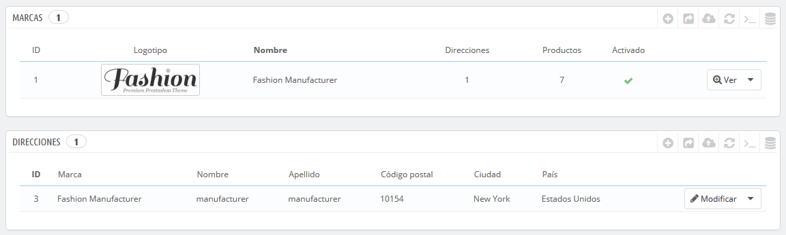
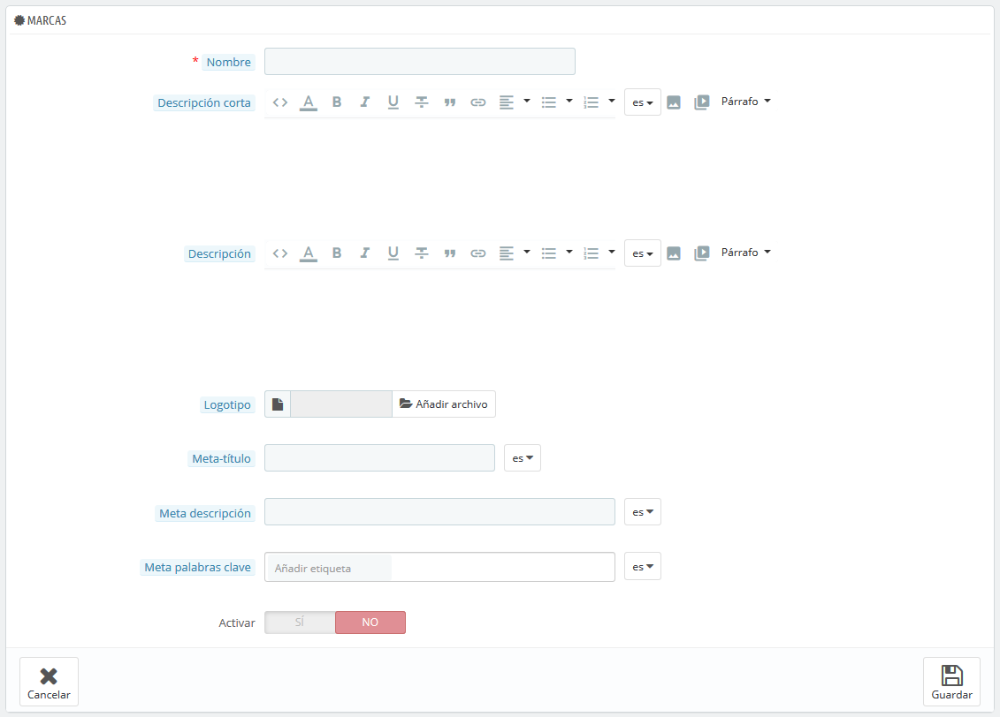
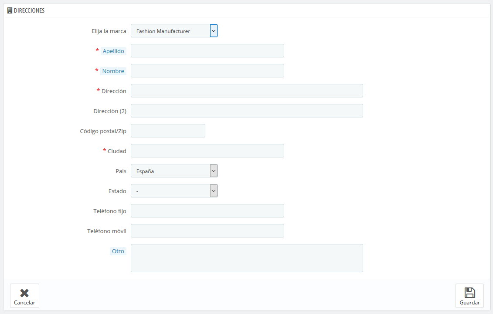

# Gestionar Marcas

A menos que fabriques tu mismo los productos que vendes, deberás registrar las marcas de tus productos en PrestaShop.

Las marcas solían ser llamadas fabricantes en versiones anteriores de PrestaShop

El comportamiento de una marca es exactamente el mismo que el de un fabricante en PrestaShop 1.6: sólo la denominación ha cambiado. Principalmente para facilitar a los clientes navegar a través de su catálogo, ya que es más común estar buscando una marca específica, que un fabricante específico.

Si prefieres utilizar "fabricante" en lugar de "marca", deberás personalizar las traducciones del front-office de PrestaShop.

Si vendes productos propios fabricados por ti mismo, debes por lo menos crear una marca de tu empresa: esto ayuda a tu cliente a encontrar lo que está buscando, y puede aportar una ventaja valiosa de cara a los resultados ofrecidos por los motores de búsqueda.\

En el front-end de tu tienda, los fabricantes son ordenados alfabéticamente. No puedes cambiar este orden establecido.

Las nuevas marcas se encuentran por defecto desactivadas. Debes activarlas con el fin de que aparezcan disponibles en tu tienda en línea – incluso si ellas no contienen ningún producto todavía.

Al introducir la información de las marcas, los visitantes de tu sitio puedan tener un acceso rápido a todos los productos de una marca determinada. Esto facilita a ellos la navegación por tu sitio web. En términos de visibilidad, al rellenar estos campos mejorarás el posicionamiento de tu tienda en los motores de búsqueda.

## Crear una marca 

Haz clic en el botón "Añadir nueva marca". El formulario de creación aparecerá en pantalla.

Rellena todos los campos:

* **Nombre**. Indica el nombre de la marca, con el fin de simplificar las búsquedas de tus visitantes.
* **Descripción corta**. La descripción que aparecerá en los motores de búsqueda cuando un usuario realiza una petición. Limitada a 100 caracteres.
* **Descripción**. Añade una descripción más completa de la marca, la actividad y productos.\
  Puedes detallar sus especialidades y resaltar la calidad de sus productos. La descripción de la marca será mostrada en tu tienda.
* **Logotipo**. Tener un logotipo de la marca es esencial: esto consigue el efecto de que los clientes confíen en tu tienda, casi tanto como ellos confían en el fabricante o en la marca.
* Los campos de SEO (Meta título, Meta descripción y Meta palabras clave): proporcionan la misma funcionalidad que la que ofrecen en las categorías\

  * **Meta título**. El título que aparecerá en los motores de búsqueda cuando un cliente realice una solicitud.
  * **Meta descripción**. Una presentación en pocas líneas de tu sitio web, diseñada para captar el interés de un cliente. Aparecerá en los resultados de búsqueda.
  * **Meta palabras clave**. Palabras clave para que tu sitio web aparezca referenciado en los buscadores. Puedes introducir varias de ellas, separadas por comas, así como expresiones, que deben ser indicadas entre comillas.
* **Activar**. Puedes desactivar una marca, temporalmente. Esto sólo lo eliminará de la lista de marcas del front-end de tu tienda.

Guarda los cambios realizados para volver al listado de marcas. Desde aquí, puedes:

* Hacer clic en el nombre o logotipo de la marca, para obtener un listado de todos los productos asociados a ésta. Si no hay ninguno, entonces debes asignar productos a esta marca, trabajando sobre la base de un producto, desde la página "Productos" bajo el menú "Catálogo".\
  Puedes obtener el mismo resultado haciendo clic en el icono "Ver" situado en el lado derecho de la página actual.
* Desactivar la marca, haciendo clic en el icono de verificación de color verde. Una vez desactivado, el icono de una cruz roja aparecerá en su lugar: si haces clic de nuevo sobre este icono volverá a activar la marca.
* Ver/modificar/eliminar la marca haciendo clic en los botones correspondientes a la derecha de la fila.

## Añadir dirección de la marca 

En la parte inferior de la página "Marcas" se encuentra la sección "Direcciones". Cada marca puede tener su propia dirección registrada en PrestaShop. Esto sirve principalmente como recordatorio: de esta manera, siempre tendrás la dirección de contacto de una marca directamente dentro de PrestaShop.

Haz clic en el botón "Añadir nueva dirección de marca", para abrir el formulario de creación.

Asegúrate de elegir la marca correcta, e intenta rellenar tantos campos como sea posible.
