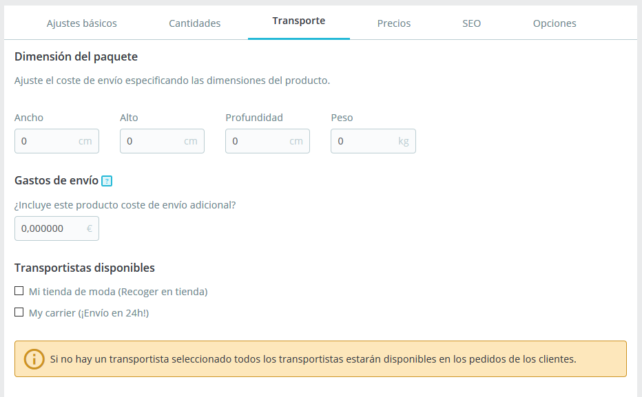

# Gestionar los productos

Puedes gestionar los productos de tu tienda utilizando la página "Productos", bajo el menú "Catálogo".

Secciones incluidas en este capítulo:

* [Introducción a la página de producto](gestionar-productos.md#introduccion-a-la-pagina-de-producto)
* [Crear un producto](gestionar-productos.md#Gestionarlosproductos-Crearunproducto)
* [Crear un producto con combinaciones](gestionar-productos.md#Gestionarlosproductos-Crearunproductoconcombinaciones)
* [Crear un producto virtual](gestionar-productos.md#Gestionarlosproductos-Crearunproductovirtual)
* [Crear un pack o paquete de productos](gestionar-productos.md#Gestionarlosproductos-Crearunpackopaquetedeproductos)

## Introducción a la página de producto

Para crear un nuevo producto, desde la página "Catálogo" haz clic en "Nuevo producto" (o utiliza el atajo de teclado CTRL + P): Abrirás la denominada página de producto, donde puedes crear nuevos productos o editar los existentes.

### Pestañas 

En PrestaShop 1.7, la página del producto está organizada en pestañas:

* **Ajustes básicos**: contiene todo lo que necesitas para crear un producto de manera rápida y fácil. Sin embargo, si necesitas añadir más detalles a tu producto, debes echar un vistazo a las otras pestañas.
* **Cantidades**, **Combinaciones** o **Producto virtual**: define las cantidades del producto y otras opciones relacionadas con el stock. Cuando tu producto tenga combinaciones, la pestaña se renombrará a Combinaciones. Aquí es donde se administran todas tus combinaciones. Por otro lado, si tienes un producto virtual, aquí es donde debes subir el archivo asociado, si lo hay.
* **Transporte**: ofrece detalles que puedan tener un impacto en la entrega del producto.\

* **Precios**: refine tus precios mediante precios específicos o precio por unidad (entre otras opciones de precios disponibles).
* **SEO**: administra la meta descripción o URL del producto para asegurarte de que se encuentran optimizadas para los motores de búsqueda.
* **Opciones**: características adicionales para gestionar la visibilidad de tu producto, referencias específicas, archivos adjuntos o proveedores. También es aquí donde puedes establecer la personalización.

###  

### Nombre del producto 

El primer campo a rellenar es el nombre del producto, que aparecerá en los resultados de los motores de búsqueda y en la URL de la hoja del producto de manera predeterminada. Junto al campo encontrarás un selector de idioma, que te permite seleccionar el idioma en el que deseas editar o crear el producto.

**Debes** dar un nombre al producto en al menos el idioma predeterminado utilizado en tu tienda antes de poder guardarlo. No podrás guardar el producto hasta que no le asignes un nombre.

Asegúrate de traducir cada campo en todos los idiomas disponibles en tu tienda. Para ello, haz clic en el selector de idioma situado junto al campo del tipo de producto, y selecciona el idioma en el que deseas editar el texto del producto.

### Tipo de producto 

Esta segunda opción es esencial: indica si el producto es un pack o paquete de productos (una combinación de al menos dos productos existentes), un producto virtual (archivo descargable, servicio, etc.), o simplemente un producto clásico que se envía por correo. Por ahora, sólo analizaremos el producto clásico, y trataremos los packso paquetes de productos y los productos virtuales en próximas secciones de este capítulo.

### Idioma 

Es posible que hayas activado varios idiomas en tu tienda, para vender en más países. Si deseas realmente atraer con mayor fuerza a clientes de otros países, todo el contenido de tu tienda (descripción del producto, títulos, etc.) deben ser traducidos en esos idiomas.

Para traducir el contenido de tu producto a otro idioma, solamente tienes que seleccionar el idioma con el que quieres trabajar desde el selector de idioma situado junto al campo del tipo de producto. La página del producto se actualizará con el contenido disponible en el idioma seleccionado. Puedes cambiar de un idioma a otro sin tener que guardar tu trabajo entre el cambio de idiomas. Sólo asegúrate de que estás editando el contenido en el idioma correcto.

De manera predeterminada, la página del producto mostrará el contenido en el idioma predeterminado de tu tienda.

Para añadir nuevos idiomas a tu tienda, dirígete a la sección Internacional. Puedes añadir un idioma desde la página "Traducciones", como también añadir un paquete de localización desde la página "Localización". Encontrarás más información en el capítulo [Abriéndote paso al mercado internacional](http://doc.prestashop.com/pages/viewpage.action?pageId=54264371).

### Botones globales  

*
  *
    *
      *
        *
          * **Ventas**. Abre la página "Detalles del producto" del panel de control de estadísticas (menú "Estadísticas"), mostrándote una gráfica de las visitas a la página de este producto, y también sus ventas.
          * **Lista de productos**. _Novedad en PrestaShop 1.7_. Muestra un listado de todos los productos de tu tienda permitiéndote navegar rápidamente de un producto a otro.
          * **Ayuda**. Abre la ayuda contextual en una columna, con la página de la Guía del usuario correspondiente a la página del producto.

En la parte inferior de la página, varias acciones son posibles:

* **Eliminar** (icono papelera). Elimina toda la información introducida del producto actual, incluyendo sus imágenes, combinaciones, características, etc.
* **Vista previa**. Muestra la página del producto tal y como la verán tus clientes en el front-office de tu tienda. Esto es muy útil, ya que funciona incluso si el producto está desactivado.
* **En línea / Fuera de línea**. Aquí es donde puedes activar o desactivar tu producto. De manera predeterminada está desactivado, por lo que tus clientes no podrán visualizarlo en tu tienda.
*   **Duplicar**. Guarda el producto actual, y a continuación crea una copia exacta del producto actual y lo lleva a la página del nuevo producto. Esto es muy útil en casos donde prefieras utilizar los datos del producto actual como una plantilla para otro nuevo producto, y así no tener que volver a escribir todos los datos del nuevo producto manualmente. Por ejemplo, dos productos pueden ser muy diferentes, pero pueden compartir las mismas combinaciones, los mismos transportistas o el mismo proveedor.

    ¡No sobre-dupliques!

    Si necesitas crear diferentes versiones de un mismo producto, a causa de su variedad de colores, capacidad, tamaño, etc., debes crear combinaciones para el producto actual en lugar de duplicarlo X veces. Revisa la opción "Combinaciones" en la pestaña "Ajustes básicos", la cual se explica en la sección "Crear un producto con combinaciones" de este capítulo.\

* **Ir al Catálogo**. Guarda los cambios que hayas realizado en cualquiera de las pestañas del producto actual, y te lleva de nuevo al listado de productos.
* **Añadir nuevo producto.** Guarda los cambios que hayas realizado en cualquiera de las pestañas del producto actual, y abre una nueva página para crear un nuevo producto.
* **Guardar**. Guarda los cambios que hayas realizado en cualquiera de las pestañas del producto actual, y abre una nueva página para crear un nuevo producto. Esto es particularmente útil cuando deseas moverte entre las distintas pestañas disponibles sin perder las modificaciones del producto introducidas en la pestaña actual, o para ver los cambios que has aplicado inmediatamente.

Atajos de teclado

Algunos atajos de teclado se han introducido en PrestaShop 1.7 para ayudarte a ahorrar tiempo cuando necesites crear varios productos consecutivamente. El comportamiento es el mismo que se describe anteriormente, y funciona para las siguientes opciones:

* Ir al Catálogo: CTRL+Q
* Guardar: CTRL+S
* Añadir nuevo producto: CTRL+P
* Duplicar: CTRL+D

## Crear un producto 

La página de producto, ha sido rediseñada en PrestaShop 1.7, facilitando la creación de un producto gracias al aumento del número de pestañas.

### Ajustes básicos 

La pestaña "Ajustes básicos" proporciona las principales opciones necesarias para crear un producto básico: en unos pocos clics podrás crear un nuevo producto. Desde ésta también puedes navegar a través de las otras pestañas disponibles para añadir más detalles a tu producto.

#### Imágenes 

La sección de imágenes se encuentra en la parte superior izquierda de la pestaña "Ajustes básicos". Debes subir todas las imágenes del producto, incluyendo las de todas sus combinaciones (color, tamaño, forma, etc.).

**Para añadir una o más imágenes a tu producto:**

Arrastra y suelta los archivos de imágenes directamente desde la carpeta que las almacena, o haz clic sobre "seleccionar archivos" (o en cualquier parte de la sección de imagen) para buscar y abrir la carpeta que contiene tus imágenes. Puedes seleccionar tantas imágenes como sea necesario manteniendo pulsada la tecla Ctrl. mientras seleccionas archivos, o puedes realizar tu selección de una en una. El tamaño máximo predeterminado para un archivo de imagen es establecido por PrestaShop según la configuración PHP de tu servidor. Este tamaño puede ser establecido en la página "Ajustes de imágenes", bajo el menú "Diseño".

**Imagen de portada**

Las imágenes subidas aparecen como miniaturas. La primera de ellas será utilizada como imagen de portada para el producto. Esa imagen de portada también aparecerá automáticamente en la página del producto de tu tienda.\

Puedes cambiar la imagen de portada del producto, haciendo clic en la miniatura de la imagen: los ajustes para esta imagen seleccionada se mostrarán en pantalla. Desde allí puedes marcar o desmarcar la casilla de verificación "Imagen de portada", para definir si la imagen seleccionada debe ser la de portada o no.\

**Zoom y Título**

Al hacer clic en "Zoom", la imagen aparecerá en su formato real, por si deseas verla más de cerca.

Cada imagen puede tener un título: utiliza éste para describir brevemente la imagen (y el producto). Si tu tienda utiliza varios idiomas, ¡no olvides traducirlo!

**Ordenar imágenes**

Una vez que hayas cargado todas las imágenes de tus productos, puedes modificar su orden arrastrando y soltando cada imagen. También puedes añadir más imágenes haciendo clic en el icono "+".

#### Resumen y Descripción  

Describir tu producto es esencial, tanto para el cliente (contra mayor información, mejor) como para los motores de búsqueda (esto ayudará a que tu tienda aparezca en más solicitudes de búsqueda).

En la parte inferior de la pantalla, se presentan dos campos de descripción que sirven para diferentes propósitos:

* El **campo "Resumen"** permite escribir una breve descripción que aparecerá en los motores de búsqueda y en la descripción de tu producto.\
  De manera predeterminada, este campo está limitado a 400 caracteres: si superas ese límite, PrestaShop mostrará un mensaje de advertencia en color rojo bajo este campo. Puedes cambiar ese límite en la sección "Productos" de la página "Configuración de productos" bajo el menú "Parámetros de la tienda", desde la opción "Tamaño máximo del resumen del producto".
* El campo **"Descripción"** permite escribir una descripción completa de tu producto, que aparecerá directamente en la página del producto. El editor de texto ofrece una amplia gama de opciones para la creación de descripciones visuales atractivas (fuente, tamaño, color de texto, etc.)\
  Aunque este segundo campo no está limitado, puedes pecar de escribir demasiado contenido: esfuérzate en ofrecer la información esencial de manera convincente, para que tu producto salga fortalecido para la venta.

#### Característica 

Debajo de las descripciones del producto, tienes varias opciones disponibles. La opción "Añadir característica" sirve para especificar las características de tus productos (peso, material, país de origen, etc.).

Cuando creas características y valores (por ejemplo: materiales de punto de lana y microfibra), puedes asignárselas a los productos, cuando estas características sean apropiadas para éstos. Lo que significa que no tienes que rellenar todos los campos de las características para cada uno de tus productos, sino que sólo tienes que rellenar los valores necesarios y aplicarlos posteriormente.

Ten en cuenta que, **a diferencia de las combinaciones, estos valores no cambian, y son válidos para los productos en general** (lo que significa, que todas las combinaciones de tus productos compartirán estas mismas características).

**Añadir una característica**

Antes de añadir una característica a un producto, debes crear ésta para su uso general en la tienda. Para ello, dirígete a la página "Atributos y características" del menú "Catálogo".

Las características y la creación de sus valores se explican con detalle en la [sección dedicada de esta guía](http://doc.prestashop.com/pages/viewpage.action?pageId=54264108).

**Asignar un valor a una característica**

Vamos a asumir que ya has establecido todas tus características y sus valores.

Al hacer clic en "Añadir característica", aparece un menú desplegable, listando todas las características de tu tienda. Selecciona la característica que deseas añadir. A continuación, puedes asignar uno de los valores predefinidos (como estableces cuando creas una característica) si hay alguno disponible, o establecer un valor manualmente en el campo "Valor personalizado".

Si no hay valor disponible para una característica, aparece el mensaje "No se encontró ningún resultado".

Si eliges utilizar un valor personalizado, no te olvides de establecerlo para cada idioma que tu tienda soporte. Utiliza el selector de idioma para cambiar de idioma.

Si hay valores predefinidos disponibles, aparecerán en una lista desplegable. Simplemente haz clic en ella y seleccione el valor correcto.

Una vez que hayas establecido todas las características apropiadas y relevantes, guarda los cambios para verlos aplicados inmediatamente en el front-office de tu tienda.

Recuerda: Si una característica no tiene ningún valor establecido a ésta, no será tomada en cuenta para este producto, y no será visible en tu tienda.

#### Marca 

De la misma manera que puedes añadir una característica, puedes añadir una marca. Haz clic en "Añadir una marca" y selecciona una marca en el menú desplegable.

Si la marca que deseas establecer no está disponible en el menú desplegable, dirígete a la página "Marcas y Proveedores" en el menú "Catálogo" para crear una nueva marca.

Un producto sólo puede ser asociado a una marca.

#### Producto relacionado 

El campo "Añadir un producto relacionado" te da la opción de elegir productos relevantes a asociar con este producto, para mostrarlos a tus clientes como sugerencias de compra cuando visitan la página del producto (si el tema lo soporta). Haz clic en "Añadir un producto relacionado", introduce las primeras letras del producto y selecciónalo. El producto es a continuación, añadido debajo de este campo.

Puedes asociar un producto con tantos otros productos como consideres necesario. Haz clic en el icono de la papelera para eliminar la asociación del producto.\
Una asociación sólo se produce en un sentido: El producto asociado, no incluirá una asociación al producto actual, en su página de configuración.

#### Combinaciones 

A menudo se vende el mismo producto en diferentes versiones: el mismo nombre; pero estas versiones pueden diferir en su color, su capacidad, el tamaño de su pantalla, y otros atributos. La mayoría de las veces, estos atributos vienen en conjunto: podrías tener la versión roja del producto disponible con capacidad de 1 GB o 2 GB, o con una pantalla de 12'' o de 15". Esta es la razón por la que PrestaShop llama a estas versiones "combinaciones": formado por diversas variaciones de un producto, que en efecto son simplemente sus atributos combinados de diferentes maneras específicas.

Si necesita crear combinaciones para el producto, selecciona "Producto con combinaciones". La pestaña "Cantidades" de la página del producto se renombrará a "Combinaciones", y te permitirá crear las distintas combinaciones.

No puedes crear combinaciones si aún no tienes los atributos del producto establecidos correctamente en PrestaShop.\
Por otra parte, no debes crear versiones para características que tus clientes nos puedan elegir para comprar.

La creación de atributos se realiza desde la página "Atributos y Características" del menú "Catálogo", y se explica en detalle en este  [capítulo dedicado de la documentación](http://doc.prestashop.com/display/PS17/Gestionar+Atributos+del+Producto).

Para obtener más información sobre las Combinaciones, consulta la [sección dedicada al final de este capítulo](http://doc.prestashop.com/display/PS17/Gestionar+los+productos#Gestionarlosproductos-Crearunproductoconcombinaciones).

#### Cantidad 

Indica cuántas unidades están disponibles para la venta.

Esta opción no se mostrará si estás creando un producto con combinaciones: las cantidades para las combinaciones se gestionan en la pestaña "Combinaciones", ya que cada combinación puede tener un valor de cantidad diferente.

Más opciones relacionadas con la cantidad están disponibles en la pestaña "Cantidades".

#### Precio 

Establece a qué precio deseas vender este producto.

* **Precio – Impuestos excluidos**. Aquí es donde debes establecer el precio. Éste es independiente de cálculos, impuestos y otros precios.
* **Precio – Impuestos incluidos.** Muestra el precio del producto con impuestos incluidos. Puedes editar el valor, y automáticamente se actualizará el campo "Precio - impuestos excluidos ", según la regla tributaria de impuestos que elijas.
* **Regla de impuestos**. El impuesto aplicable al producto. Elige entre las diferentes tasas disponibles. Al cambiar la regla del impuesto, el precio con impuesto incluido cambiará en relación a la regla.

Hay más opciones de precios disponibles en la pestaña "Precios". Tanto si cambias el precio en la pestaña "Configuración básica" como si lo haces desde la pestaña "Precios" el resultado será el mismo, ya que las pestañas están sincronizadas.

Las reglas de impuestos se pueden gestionar en el menú "Internacional", página "Impuestos"

#### Categorías 

La sección "Categorías asociadas" te permite seleccionar en qué categoría debe aparecer el producto. Puedes seleccionar más de una, pero ten en cuenta que es mejor para los clientes si las categorías sólo contienen productos equivalentes y comparables. Por lo tanto, se debe evitar la selección de las categorías raíces, y dar prioridad a las categorías hijas.\
Por ejemplo, la categoría "teléfono" puede incluir una subcategoría de "marcas" (Apple, Samsung, Nokia, etc.) y al igual que ocurre con las "características" (teléfonos inteligentes, teléfonos plegables, etc.), debes establecer las categorías más útiles para tus clientes.

**Asociar categorías existentes**

Para asociar una categoría a un producto, puedes utilizar la barra de búsqueda o expandir el listado de categorías y seleccionar aquella que deseas asociar.

**Utilizar la barra de búsqueda**. Introduce las primeras letras de la categoría y la barra mostrará todas las categorías coincidentes y la ruta para acceder a ella. Selecciona la categoría y haz clic en ella. Ésta se mostrará en la sección "Categorías asociadas".

**Utilizar el listado de categorías**. Al hacer clic en "Expandir", verás el árbol de categorías y desde allí podrás seleccionar las categorías que deseas asociar.

En el listado de categorías asociadas, si posicionas el ratón sobre una categoría específica, verás la ruta que conduce a la categoría. Esto puede ser de utilidad si tienes varias categorías con el mismo nombre (como "Calzado" que pueden estar indistintamente bajo las categorías "Niños" y "Mujer").

**Categoría principal**\
****

El selector "categoría principal" es útil cuando un artículo está incluido en varias categorías. Ésta sirve principalmente para aclarar qué categoría utilizar en caso de que el cliente llegue a tu tienda desde un motor de búsqueda, ya que el nombre de la categoría aparecerá en la URL del producto.\

**Crear una nueva categoría**\
****

Si crees que necesitas añadir una categoría, guarda el estado actual de tu producto antes de hacer clic en el botón "Crear nueva categoría".

Haz clic en "Crear una categoría": las opciones de categoría aparecerán en pantalla. Introduce el nombre de la categoría y selecciona la categoría padre. Al hacer clic en crear, se creará la nueva categoría y se asociará automáticamente con tu producto.

No olvides dirigirte a la página "Categorías" posteriormente para rellenar los detalles de esta nueva categoría. Para obtener más información sobre las categorías, [diríjete a la sección relacionada de la documentación](http://doc.prestashop.com/pages/viewpage.action?pageId=54264082).

&#x20;Una nueva categoría no aparecerá automáticamente en el menú de tu tienda. Para visualizarla, debes editar el menú con el módulo "Menú principal" (cuando se utiliza el tema predeterminado), o cualquier módulo personalizado que puedas estar utilizando para administrar el menú de tu tienda.

En este punto, ya has completado la información esencial para una página de producto básico. Puedes guardarla si lo consideras necesario. Para establecer este producto inmediatamente disponible para la venta, haz clic en "Sin Conexión": su estado cambiará a "En línea" y desde este momento será visible en tu tienda.

Aunque ya has completado la información esencial, debes seguir leyendo este capítulo, ya que hay muchos más detalles que puedes añadir a tu producto para que ¡sea más atractivo para los clientes!.

### **Cantidades** 

Las cantidades de productos se gestionan en una sola pestaña. PrestaShop utilizará esto para determinar cuándo un producto estará pronto fuera de stock o ya no tiene existencias.

#### Producto estándar 

Para un producto estándar solamente existen cuatro campos disponibles:

* **Cantidad.** Indica el número de unidades del producto que están a la venta. Es el mismo valor que el de "Ajustes básicos".
* **Ubicación de stock.** Nosotros sabemos que es simpore útil conocer dónde se encuentra un producto. Así pues, para eso hemos creado este campo.
* **Cantidad mínima para la venta**. Es posible que prefieras que esta variación sólo se venda a granel. Utiliza este campo para establecer el número mínimo de unidades que se venden a granel. Esto significa que tus clientes podrán comprar este producto solamente cuando alcancen esta cantidad mínima.
* **Alertas de stock.** También puedes establecer en esta sección una regla para productos que se encuentren con un bajo nivel de stock. Indica el umbral deseado y marca la casilla de verificación "Envíame un mensaje de correo electrónico cuando la cantidad sea inferior o igual a este nivel" para enviar un mensaje de correo electrónico a todos los usuarios que puedan acceder y modificar la página del stock de productos - los permisos pueden ser modificados desde el menú [Parámetros Avanzados > Equipo](../../configurar-tienda/parametros-avanzados/).

#### Producto con combinaciones  

La forma en que funciona es bastante fácil: La página presenta una tabla de todas las combinaciones existentes para el producto actual (Si no hay combinaciones, la tabla simplemente tiene una sola fila). Establece el stock inicial para todas las combinaciones.

Para obtener mayor información sobre las combinaciones de productos, consulta la [sección dedicada al final de este capítulo](http://doc.prestashop.com/display/PS17/Gestionar+los+productos#Gestionarlosproductos-Crearunproductoconcombinaciones).Los packs de productos y el producto virtual tienen diferentes configuraciones de stock, encontrarás todo lo que necesitas conocer sobre ellos al final de este capítulo.

#### Preferencias de disponibilidad **** 

**Comportamiento fuera de stock**

La opción "Comportamiento cuando no hay existencias", permite establecer el comportamiento de PrestaShop cuando el producto se encuentra fuera de stock:

* Denegar pedidos (el producto no está a la venta)
* Permitir pedidos (en esencia, está haciendo una pre-venta).
* Utilizar comportamiento predeterminado. Esta tercera opción establecida por defecto, utiliza el valor predeterminado global (menú "Parámetros de la tienda", página "Configuración de productos", sección "Inventario de productos", opción "Permitir ventas de productos que están fuera de stock").

**Etiquetas**

* **Etiqueta mostrada cuando se encuentra en stock**. Permite mostrar un mensaje a tus visitantes cuando el producto está en stock, por ejemplo "Artículo disponible". Les asegura que tu tienda puede servirles y enviarles inmediatamente el producto.
* **Etiqueta mostrada cuando no se encuentra en stock (y se permiten pedidos)**. Permite mostrar un mensaje a tus visitantes cuando el producto está fuera de stock, pero admite pedidos de este producto (como se establece con el selector "Cuando está fuera de stock"), por ejemplo "¡Solicítalo por adelantado!" o "Reservar". Les asegura que tu tienda les enviará el producto inmediatamente una vez que esté en stock.\

* **Fecha de disponibilidad**. Permite indicar cuando el producto estará de nuevo en stock.

También puedes configurar los ajustes generales aplicados a todos tus productos: la opción predeterminada es denegar pedidos, pero esto puede modificarse bajo "Configuración de productos" en la sección "Parámetros de la tienda" ("Permitir ordenar fuera de stock" Productos ").

### **Transporte** 

La pestaña "Transporte" te permite especificar algunos detalles de interés sobre el empaquetado de tu producto. No está disponible en el caso de un producto virtual.

*   **Anchura, altura, profundidad y peso del paquete**. Debes tratar de rellenar cada campo, porque saber el tamaño exacto y el peso de un paquete no sólo es útil para ti, sino también para PrestaShop que puede elegir automáticamente un transportista en base a estos valores. Una vez PrestaShop (o el cliente) haya seleccionado un transportista, el precio final del pedido será mostrado al cliente en pantalla.&#x20;

    Estos valores utilizan por defecto las unidades de peso, volumen, distancia y medida, establecidas en la página "Localización" del menú "Internacional".

    Estos valores no tienen por qué estar limitados a números enteros. Si tu producto pesa menos de 1 kg, sólo tienes que utilizar un punto (.) para indicar las fracciones:

    * 123 libras
    * 1.23 libras
    * 0.23 libras (equivalente a 3.68 onzas)
    * etc.\
      \

* **Gastos de envío (gastos de envío adicionales)**. Esto puede resultar muy útil para productos que son particularmente difíciles de empaquetar, o pesan demasiado.
* **Transportistas disponibles**. Puedes elegir que el producto actual solamente sea enviado por una selección de transportistas específicos. Si no se selecciona ningún transportista, entonces todos los transportistas estarán disponibles para el envío del producto.

### **Precios** 

La pestaña de precios permite refinar tu estrategia de precios, ya sea utilizando precios alternativos (precio por unidad) o creando algunas reglas de precios específicas para el producto.

#### Precio al por menor 

El precio de tu producto antes de añadirle impuestos.

* **Precio – impuestos excluidos**. Aquí es donde puedes establecer un precio arbitrario, independiente de los cálculos y los precios regulares. Mantén este campo en "0" para usar el precio predeterminado.
* **Precio – impuestos incluidos.** Muestra el precio del producto con impuestos incluidos. Puedes editar el valor, y automáticamente se actualizará el campo "Precio impuestos excluidos", según la regla tributaria de impuestos que hayas elegido.
* **Precio unitario (impuestos excl.)**. El precio unitario del producto en el momento de la adición. Esto es para fines de valoración.\

* **Regla de impuestos**. El impuesto aplicable al producto. Elige entre las diferentes tasas disponibles. El enlace "Administrar reglas de impuestos", te permite redireccionar el navegador a la página de impuestos, si deseas realizar algunos cambios. [Lea más acerca de las reglas de impuestos en esta sección](http://doc.prestashop.com/display/PS17/Gestionar+Impuestos).
* **Mostrar el indicador "¡En oferta!" en la página del producto y en el catálogo de productos**. Marca esta casilla para mostrar que tu producto está en oferta, tanto en la página del producto como en el catálogo de productos. Un logo que reza "¡En oferta!" aparecerá bajo el producto. Puedes modificar este logo sustituyendo el siguiente archivo: `themes/default/img/onsale_en.gif`
* **Precio de venta final**. Este precio, incluido el descuento realizado, se actualizará a medida que escribes.

Puedes rellenar el campo "Precio - impuestos excluidos" y seleccionar una regla de impuestos a aplicar, y el "Precio - impuestos excluidos" será calculado automáticamente. La operación inversa también es posible.

#### Precio de coste **** 

Introduce el precio que pagó por el producto (cuánto le costó adquirir o fabricar el producto), éste le permitirá compararlo con tu precio de venta con el fin de calcular fácilmente tu beneficio.

El precio de coste debe ser inferior al precio de venta.

#### Precios específicos: Gestionar Descuentos 

Puedes cambiar el precio total del producto en función de la cantidad de productos que compre tu cliente, el grupo de usuario al que pertenezca, el país, etc. Esta acción puede realizarse desde la sección "Precios específicos" de la pestaña "Precios". Haz clic en el botón "Añadir un precio específico" para revelar el formulario de creación:

Esta es una manera muy fácil de crear un precio de descuento para este producto (y todas sus combinaciones).

* **Para**. Esto te permite especificar detalladamente acerca de los diferentes grupos a los que se le aplica este precio, incluyendo el tipo de moneda, países e incluso grupos de clientes (del que hablaremos en otro posterior capítulo).
* **Cliente**. Puedes definir si el precio específico va dirigido a todos los clientes o a determinados clientes de forma específica. Comienza a escribir las primeras letras de los clientes 'nombre o apellido', y selecciona los que quieras.
* **Combinaciones**. Puedes definir si el precio específico es aplicado a todas las combinaciones del producto, o tan sólo a una de ellas. Si deseas aplicarla a más de una combinación pero no a todas ellas, tendrás que crear un precio específico para cada combinación.
* **Disponible desde/hasta**. Aquí puedes definir un rango de fechas entre las cuales el precio de descuento estará disponible. Al hacer clic en cada selector se abrirá un calendario, lo que simplifica el proceso.
* **A partir de \[] unidad/es**. Contiene el valor del número de unidades desde el que el descuento será aplicado. Por defecto está establecido a "1", lo que significa que se aplicará a cualquier cantidad.
* **Precio del producto (impuestos excl.)**. Aquí es donde se puede establecer un precio arbitrario, independientemente de los cálculos y los precios regulares. Mantén este campo en "0" para utilizar el precio por defecto.
* **Mantener precio inicial**. Marca esta casilla de verificación para restablecer el campo "Precio del producto (impuestos excl.)" y evitar su edición.
* **Aplicar un descuento de**. El descuento que se aplicará una vez que el cliente ha elegido una cantidad de producto. Utiliza el selector para ajustar el tipo de descuento (ya sea un importe fijo, o un porcentaje del precio predeterminado).

Una vez que hayas elegido tus valores, haz clic en "Aplicar": el resumen de la configuración de descuento aparecerá a continuación. El descuento será inmediatamente visible en la tienda.\
Si deseas eliminar un valor, haz clic en el icono de la papelera en la tabla.

Si deseas crear descuentos más complejos, consulta el capítulo "[Gestionar Descuentos"](http://doc.prestashop.com/display/PS17/Gestionar+Descuentos) de esta guía.

#### Gestionar prioridades **** 

Un cliente podría estar relacionado y "afectado" por múltiples precios o por varias reglas de descuento, incluso aunque haya creado reglas muy específicas, descuentos por cantidades, grupos personalizados de clientes y tiendas (en el caso que estemos hablando dentro de un contexto multitienda). PrestaShop utiliza un conjunto de prioridades con el fin de aplicar una sola regla de precios a dichos clientes. Es posible que, por ejemplo, desees que el grupo de usuarios sea más importante que la moneda utilizada.\

Puedes cambiar la configuración predeterminada por PrestaShop utilizando la sección "Establecer prioridades".

El orden predeterminado por importancia es:

1. Tienda (cuando hablamos dentro de un contexto multitienda)
2. Moneda.
3. País.
4. Grupo

Una casilla de verificación en la parte inferior te permite aplicar la configuración establecida a todos los productos. Si la casilla de verificación queda desmarcada, los cambios sólo se aplicarán al producto actual.

### **SEO** 

Para optimizar tu listado de productos, así como también aumentar la visibilidad de tu tienda, te sugerimos que rellene cuidadosamente los diversos campos SEO: Meta títulos, meta descripciones, palabras clave y URLs amigables.

"SEO" significa "Search Engine Optimization", en español "Optimización en los Motores de búsqueda". Más información en la Wikipedia: [http://es.wikipedia.org/wiki/Posicionamiento\_en\_buscadores](http://es.wikipedia.org/wiki/Posicionamiento\_en\_buscadores)

¡Aprende las mejores técnicas SEO para el comercio electrónico!. Descarga y lee gratuitamente la "Guía SEO": [http://www.prestashop.com/es/white-paper-seo](http://www.prestashop.com/es/white-paper-seo)

Para acceder a la información SEO del producto, dirígete a la pestaña "SEO".

#### Optimización de motores de búsqueda 

Los campos de esta página permiten mejorar la visibilidad de tu catálogo en los motores de búsqueda.

* **Vista previa**. Con el lanzamiento de PrestaShop 1.7.5, ahora puedes obtener una vista previa en tiempo real del resultado de tu motor de búsqueda con el fin de ayudarte a ver cómo se mostrará tu página.
* **Meta título**. Este es el campo más importante, ya que es el título que aparecerá en todos los buscadores. Debes ser muy factual: debes convencer al usuario que está utilizando el buscador, que haga clic en el enlace correspondiente a tu tienda, y no a cualquier otro enlace de los resultados aparecidos. Asegúrate de que el título es únicamente utilizado por este producto dentro de tu tienda.\

  * Un buen ejemplo: "Levi's 501® Original Jeans - Tidal Blue - Original Fit".
  * Un mal ejemplo: "Artículo #02769869B más vendido".
* **Meta descripción**. Una presentación de tu producto en unas pocas líneas (idealmente, menos de 155 caracteres), destinada a captar el interés del cliente. Este aparecerá en los resultados de algunos buscadores, en función de la petición de búsqueda: algunos motores de búsqueda pueden optar por mostrar las palabras clave encontradas directamente en el contexto del contenido de la página. Asegúrate de que la descripción es exclusiva de este producto dentro de tu sitio.
* **URL amigable**. Este es otro campo extremadamente importante. Te permite reescribir las direcciones web de tus productos tal y como deseas. Por ejemplo, en lugar de tener una dirección como:\
  [http://www.miprestashop.prestashop.com/index.php?id\_product=8\&controller=product](http://www.miprestashop.prestashop.com/index.php?id\_product=8\&controller=product)\
  puedes tener:\
  [http://www.miprestashop.prestashop.com/8-nombre-del-producto.html](http://www.miprestashop.prestashop.com/8-nombre-del-producto.html).\
  Todo lo que necesitas hacer es indicar en el campo "URL amigable" las palabras que deseas ver aparecer en lugar del nombre predeterminado, separadas por guiones.\
  &#x20;El botón "**Reiniciar URL**" produce una URL amigable adecuada basada en el nombre del producto. Una vez generada, puedes editar la URL producida si es necesario.

Las URLs amigables sólo funcionarán si la reescritura URL está activada. Puedes hacer esto desde la página "SEO y URLs" del menú "Trafico y SEO", bajo la sección "Configuración de URLs".

Encontrarás más información de la página de preferencias "SEO y URLs" en el capítulo "[Tráfico](http://doc.prestashop.com/pages/viewpage.action?pageId=54264528)" de esta guía.

#### Página de redirección 

Cuando tu producto está fuera de línea, la página del producto ya no estará disponible en tu tienda. Tendrás que decidir lo que quieres mostrar a tus visitantes en su lugar:

* **No redireccionar (404).** Esto mostrará una página de "error 404 - No encontrada".
* **Redirección permanente (301).** Esto redirigirá permanentemente al visitante a otra página de producto. La URL actual de la página del producto ya no será indexada por los motores de búsqueda: Ésta será reemplazada por la URL de la página del producto de tu elección. Elige la página del producto que deseas mostrar en su lugar. Recuerda, que esta redirección es permanente, ¡así que asegúrate de que no necesita esta URL antes de activar la redirección 301!\

* **Redirección temporal (302).** Esto es una redirección temporal a otra página de producto. Elige la página del producto que deseas mostrar en su lugar. Los motores de búsqueda seguirán indexando la URL de la página del producto, por lo que puedes reutilizarla más tarde fácilmente, en caso de reactivar el producto, por ejemplo.\

### **Opciones** 

La pestaña "Opciones" proporciona ajustes adicionales para gestionar referencias de productos, proveedores, personalización de productos, visibilidad y archivos.\

#### Visibilidad 

Puedes elegir que el producto esté disponible a través de diferentes canales:

* **Toda la tienda**. Los clientes pueden llegar al producto, navegando por el catálogo, buscando el nombre del producto, o directamente a través de su URL.
* **El Catálogo**. Los clientes pueden acceder al producto, navegando por el catálogo o directamente a través de su URL.
* **Los resultados de búsqueda**. Los clientes pueden llegar al producto mediante la búsqueda de su nombre o directamente a través de su URL.
* **Oculto**. Los clientes sólo pueden llegar al producto usando su URL. No lo encontrarán  navegando por el catálogo, ni mediante la búsqueda de su nombre. Esto es ideal para la creación de productos privados, al que sólo unos pocos visitantes de confianza pueden acceder, aunque sea temporalmente (puede cambiar este ajuste en cualquier momento).

**Opciones**. Un conjunto de opciones específicas.

* **Disponible para pedidos**. Si desmarcas esta casilla, los clientes no podrán añadir este producto al carrito. Esto hace que solamente este producto se muestre más bien como en el modo Catálogo (en comparación con la preferencia "Modo catálogo").
* **Mostrar el precio**. Si la opción anterior "disponible para pedidos" está desmarcada, puedes optar por mostrar el precio del producto (aunque los visitantes no podrán comprarlo), o no mostrárselos a sus clientes.
* **Sólo web (no se vende en tienda física)**. Esta opción será de gran valor cuando un producto, sólo se venda a través de internet, no en tiendas físicas – esto previene a nivel informativo a los clientes de que no vayan a tu tienda física con la esperanza de comprar el producto, para así evitar los gastos de envío.

#### Etiquetas 

Las etiquetas son términos y palabras clave que ayudarán a tus clientes a encontrar fácilmente lo que están buscando. Cuando los clientes utilizan la barra de búsqueda para buscar en el catálogo de tu tienda, escribirán algunas palabras clave específicas. Elige las palabras clave más relevantes para tu producto, para asegurarte de que el producto se muestre en los resultados cuando un visitante las utilice para su búsqueda.

Para añadir varias etiquetas, simplemente sepáralas por una coma. Por ejemplo: "plato llano, vajilla, gres" para un plato destinado para la cena.

Todas las etiquetas se pueden ver en la página "Búsqueda", bajo el menú "Parámetros de la tienda". Encontrarás más información sobre la gestión de etiquetas en este [dedicado capítulo](http://doc.prestashop.com/display/PS17/Etiquetas).

Las etiquetas de los productos no son las mismas que las de las páginas: éstas no tienen un impacto directo en el posicionamiento en los motores de búsqueda.

#### Condición y Referencias 

**Condición**. No todas las tiendas venden productos nuevos. Esta opción te permite indicar el estado de uso del producto:

* **Nuevo**. El producto está a estrenar, con su empaquetado original sellado.
* **Usado**. El producto ya se ha vendido al menos una vez, y probablemente fue utilizado por otra persona (de segunda mano). Este puede venir en su embalaje original, pero puede estar sellado con cinta adhesiva.
* **Reacondicionado**. El producto ha sido devuelto por alguna razón ("rasguños, abolladuras u otros daños puramente estéticos que no afectan al funcionamiento del producto"). Más información en la Wikipedia: [http://en.wikipedia.org/wiki/Refurbishment\_%28electronics%29](http://en.wikipedia.org/wiki/Refurbishment\_\(electronics\)).
* **Código de referencia**. Esta es tu propia referencia interna. Este código puede ser un número, o una referencia a la ubicación del producto en tu almacén, a tu proveedor, o a cualquier otra cosa que la haga única.
* **ISBN**. El código ISBN se utiliza internacionalmente para identificar libros y sus diversas ediciones. Si tus productos son libros o tienen derecho a tener un número ISBN, introdúcelo aquí.
* **Código de barra UPC**. Un código de barras de 12 dígitos, más ampliamente utilizado en América del Norte, Reino Unido, Australia y Nueva Zelanda.\

* **EAN-13 o código de barra JAN**. Estos son los números del código de barras de tu producto, que son utilizados en todo el mundo para identificarlos. Puedes utilizar un número EAN13 o JAN.
  * Un código EAN-13 es un número internacional constituido por 13 dígitos para identificar un artículo. Más información en la Wikipedia: [http://es.wikipedia.org/wiki/European\_Article\_Number](http://es.wikipedia.org/wiki/European\_Article\_Number).
  * Un código JAN es específico de Japón, pero es compatible con el internacional EAN. Más información en la Wikipedia: [http://en.wikipedia.org/wiki/Japanese\_Article\_Number](http://en.wikipedia.org/wiki/Japanese\_Article\_Number).

#### Personalización 

PrestaShop permite a tus clientes personalizar el producto que ellos van a comprar.

Ejemplo: Si eres un minorista de joyería, tus clientes podrán tener la posibilidad de grabar tus joyas con un texto o una imagen. Tus clientes pueden enviar el texto y/o la imagen cuando realicen sus pedidos.

La ventaja de esta función es la de ofrecer a tus clientes un servicio personalizado, que sin ninguna duda ellos apreciarán.

Echemos un vistazo a cómo configurar esta funcionalidad. Haz clic en "Añadir un campo de personalización" para indicar qué tipo de contexto (archivo y/o texto) puede ser personalizado. Puedes establecer tantos campos como quieras permitir que tus clientes puedan cargar.

Para cada campo de personalización, debes proporcionar dos datos:

* **Etiqueta**. Rellénalo con la etiqueta publica apropiada: Esto será un indicador para el cliente, así que debes ser muy específico sobre lo que espera.\

* **Tipo**. Indica si deseas que el cliente escriba algún texto o proporcione un archivo.\
  \

Ejemplo 1: El cliente puede personalizar la portada de un libro, proporcionando 3 imágenes. Puedes tener 3 campos de personalización:\

| Etiqueta                                         | Tipo   |
| ------------------------------------------------ | ------ |
| Portada (20.95 x 27.31 cm, color)                | Imagen |
| Contraportada (20.95 x 27.31 cm, blanco y negro) | Imagen |
| Lomo (20.95 x 1.716 cm, color)                   | Imagen |

Ejemplo 2: Si los clientes pueden grabar palabras en un producto, puedes utilizar lo siguiente:\

| Etiqueta                            | Tipo  |
| ----------------------------------- | ----- |
| Primera línea (24 caracteres)       | Texto |
| Segunda línea (24 caracteres)       | Texto |
| Última línea, firma (16 caracteres) | Texto |

Una vez que se hayan rellenado todos los campos de la etiqueta, no olvides guardar los cambios.

**Del lado del cliente**

Una vez que el producto tiene las propiedades personalizables establecidas, la página del producto mostrará un nuevo bloque, denominada: "Personalización del producto".

El cliente debe seleccionar el archivo(s) y/o añadir algún texto y guardarlo antes de añadir el producto al carrito.

La imagen personalizada(s) y el texto(s) aparecerán en el carrito final de la compra.

El resto del proceso de compra es el mismo, no varía y es el habitual.

**Del lado del comerciante**

Una vez que el pedido ha sido validado por el cliente, el comerciante recibe una notificación del pedido en el back-office.

El cliente puede a continuación comprobar el pedido, el cual mostrará la imagen(s) y el texto(s) en la lista de productos, para cada producto. El comerciante entonces simplemente tiene que descargar la imagen(s) (haciendo clic en la imagen del pedido) o copiar/pegar el texto y utilizar esta en su herramienta de personalización.

El resto del proceso de pedido y entrega no varía y es el habitual.

#### Adjuntar un archivo **** 

PrestaShop permite poner a disposición del cliente algunos archivos adjuntos antes de la compra.

Por ejemplo, supongamos que vendes artículos electrónicos, y te gustaría instar a tus clientes a leer un documento sobre el funcionamiento de un producto. Puedes adjuntar un documento para este propósito.\
También puedes simplemente poner el manual del producto en formato PDF para que el cliente lo descargue en la página del producto. El cliente puede acceder al archivo incluso aunque no compre el producto.

**Archivos adjuntos**

Si ya has subido algunos archivos adjuntos, verás aquí la lista de los archivos disponibles para adjuntar al producto. Simplemente selecciona el archivo que deseas adjuntar al producto.

**Adjuntar un nuevo archivo**

Si todavía no has adjuntado ningún archivo, puedes subir un nuevo archivo directamente desde esta página:

1. Haz clic en "Adjuntar un nuevo archivo"
2. Haz clic en "Examinar" para seleccionar un archivo desde tu ordenador para cargar.
3. Introduce un título para tu archivo adjunto (no tiene que ser el mismo que el nombre del archivo original).
4. Introduce una descripción. Esto te ayudará a distinguir entre tus archivos adjuntos, y proporcionará información adicional a tus clientes.
5. Haz clic en "Añadir".
6. El archivo adjunto aparece en la lista "Archivos adjuntos", ya seleccionado para indicar que se adjuntará al producto.
7. Guarda tu producto.\

Aparecerá una nueva pestaña en la página del producto, próximo a "Detalles del producto", donde tus clientes pueden descargar el archivo(s) que acabas de subir.

Si necesitas eliminar un archivo adjunto de esta página de producto, simplemente desmarca la casilla de verificación que aparece en su lado izquierdo en la tabla de "Archivos adjuntos".

Puedes ver todos los archivos adjuntos de tu tienda, añadir alguno más y eliminarlos, visitando la página "Archivos adjuntos" del menú "Catálogo". Esto también hace posible utilizar los  archivos adjuntos que ya se subieron anteriormente para otros productos: si necesitas poner a disposición del cliente este mismo archivo adjunto para otros productos, sólo tienes que subirlo una vez.

#### Proveedores 

Indicar el proveedor del producto no es realmente un dato importante para tus clientes (o dese luego es un dato que para ellos es mucho menos importante que el del fabricante del producto), sin embargo, éste puede llegar a ser esencial para tu propia gestión interna, y no menos importante para gestionar tu stock de existencias: sólo necesitas saber a qué proveedor compraste el producto. El proveedor del producto actual se establece desde la pestaña "Proveedores".

No puedes utilizar esta característica si no tienes al menos un proveedor registrado en tu tienda. Los proveedores se crean en la página "Marcas y proveedores", en el menú "Catálogo".

El proceso de registro de un proveedor se explica con detalle en el siguiente [capítulo de esta guía](http://doc.prestashop.com/display/PS17/Gestionar+Proveedores).

Asociar el producto actual con uno o más proveedores es realmente fácil: simplemente marca la casilla de verificación correspondiente al proveedor y guarda los cambios.

**Referencia(s) del proveedor**

La sección del proveedor también incluye una tabla que te permite establecer la referencia precisa y el precio unitario / moneda para cada combinación de productos, por proveedor. Si el producto tiene más de un proveedor, la tabla mostrará a cada proveedor uno tras otro.\

Hay muchas más opciones relacionadas con los productos, en la página "Configuración de productos" del menú "Parámetros de la tienda":

* Número de días en que el producto se considera 'novedad'.
* Orden predeterminado de la lista de productos.
* Activar la administración avanzada de stock.\

* etc.

Realmente debes comprobar que estos ajustes globales se encuentran establecidos como desea.

## Crear un producto con combinaciones 

Para activar las combinaciones de productos, primero debes seleccionar la opción "Producto con combinaciones" en la pestaña "Ajustes básicos". Verás que la pestaña "Cantidades" se renombra automáticamente a "Combinaciones", y en esta última pestaña es donde podrás administrar tus combinaciones de productos.

No se pueden crear combinaciones para un pack de productos o productos virtuales: esta opción solo está disponible para productos estándar.

No puede crear combinaciones si aún no tienes los atributos del producto establecidos correctamente en PrestaShop.\
Por otra parte, no debes crear combinaciones para características que tus clientes no puedan elegir para comprar.

La creación de atributos se realiza en la página "Atributos y Características" del menú "Catálogo" y se explica en detalle en el capítulo del mismo nombre de esta guía.

La manera en que los atributos de tu producto forman las combinaciones depende de ti, y PrestaShop te ofrece dos métodos para lograrlo.

### Añadir combinaciones 

#### Método manual 

Este método te ayuda a crear combinaciones una tras otra, por lo tanto, éste debe reservarse para productos con pocas combinaciones, o productos con combinaciones muy específicas que no se pueden crear con fiabilidad utilizando el método automático (véase la siguiente sección).

Añadir una nueva variante de tu producto tomará tan solo unos pasos.

1. En la barra de combinación, introduce la combinación de atributos que necesitas crear, con sus valores correspondientes.\

Por ejemplo, si necesitas crear una combinación para una camiseta, tamaño M y color rojo, debes introducir "tamaño m color rojo". A medida que escribes, verás las sugerencias que aparecen debajo de la barra, simplemente selecciona los atributos y los valores que necesitas.

Puedes añadir tantos pares atributo-valor como sea necesario en una combinación\
Sólo puedes agregar un par por atributo a una combinación: es imposible tener al mismo tiempo "Color: Azul" y "Color: Rojo" en tus pares; si fuese necesario, tendrás que crear nuevos atributos, por ejemplo, "Color principal" y "Color secundario".\

Puedes eliminar un par de atributo-valor haciendo clic en la cruz que aparece en su caja gris.\

&#x20;2\. Cuando tengas todos los atributos necesarios, haz clic en el botón "Generar" situado a la derecha.\

&#x20;3\. La combinación aparecerá en una tabla a continuación.\

#### Método automático 

Si tienes demasiadas versiones o variedades del producto,  puedes utilizar el "Generador de combinaciones de productos". Esta herramienta te permite generar automáticamente todas las combinaciones y posibilidades.

En lugar de escribir cada combinación que deseas, puedes utilizar el selector en el lado derecho de la página. Este selector lista todos los atributos y sus valores correspondientes.

Así es como debes hacerlo:

1. Para cada atributo, marca los valores que deseas añadir como combinaciones. Puedes seleccionar varios valores para cada atributo para ahorrar tiempo.
2. Se añadirán automáticamente las combinaciones correspondientes en la barra de la izquierda.
3. Si estás satisfecho con tu selección, haz clic en "Generar": se creará automáticamente tu combinación, con todas las combinaciones posibles.

Para una simple combinación, puedes editar su cantidad directamente en la tabla, editarla (haciendo clic en el icono de lápiz) o eliminarla (con el icono de la papelera).

### Gestionar combinaciones 

#### Combinación predeterminada 

Cuando tienes varias combinaciones disponibles, debes elegir cuál de ellas será la combinación predeterminada. Ésta será la combinación que tus clientes verán cuando visiten la página del producto. Si quieren comprar otra combinación, tendrán que seleccionarla ellos mismos (cambiando el color, el tamaño o cualquier atributo que pueda tener el producto).

#### Editar una combinación 

Puedes gestionar todavía más cada combinación haciendo clic en el icono de edición. Se abrirá una pequeña ventana para que puedas modificar los detalles de esta combinación específica.

* Detalles de la combinación\

  * **Establecer como combinación predeterminada**. Marca esta casilla si deseas que la combinación que estás creando sea realmente la predeterminada para este producto.
  * **Cantidad**. Introduce la cantidad disponible para la venta para esta combinación.
  * **Fecha de disponibilidad**. Si la combinación está fuera de stock, puedes indicar cuándo estará disponible de nuevo.
  * **Cantidad mínima para la venta**. Es posible que prefieras que esta combinación sólo se venda a granel. Utiliza este campo para establecer el número de elementos que se venden a granel. Esto significa que el cliente podrá comprar este producto sólo cuando alcance esta cantidad mínima para esta combinación.
  * **Referencia y referencias específicas (ISBN, EAN-13 y UPC)**. Si es necesario, indica la referencia de la combinación, códigos ISBN EAN-13 y/o UPC de cada campo, como si estuvieras creando un nuevo producto en PrestaShop. Estos números pueden ser utilizados por tu almacén o tu compañía, así que asegúrate de rellenar estos campos, que a menudo son esenciales para tu negocio.
* Precio e impacto\

  * **Precio de coste**. Este campo es útil si el precio original del producto cambia simplemente porque se trata de una combinación.
  * **Impacto en precio/precio por unidad/peso**. Si se supone que la combinación tiene un impacto en el precio/peso/precio unitario del producto, rellena el campo que aparece con el valor de ese impacto (por ejemplo, "-2" si el precio debe ser reducido en 2).
* **Imágenes**. Las imágenes que están vinculadas con el producto original (cargadas utilizando el formulario de la pestaña "Imágenes" a la izquierda del formulario) que serán mostradas. Marca la casilla de verificación pertenecientes a las imágenes que mejor representen a esta combinación.

Una vez que hayas terminado de editar una combinación, puedes:

* dirigirte a la combinación anterior o siguiente para editarla también, haciendo clic en "combinación anterior" o "siguiente combinación"
* regresar al producto haciendo clic en "volver al producto" en la parte superior de esta sección.\

#### Acciones en masa  

Puedes cambiar los detalles para todas o varias combinaciones a la vez.

1. Selecciona las combinaciones que deseas editar. Haz clic en "Seleccionar" para seleccionarlas todas.
2. Haz clic en "Acciones en masa" arriba del listado de combinaciones.
3. Edita los ajustes que deseas modificar. Se modificarán para todas las combinaciones que hayas seleccionado.
4. Haz clic en "Aplicar" para editar las combinaciones

Si deseas eliminar todas las combinaciones que has seleccionado, haga clic en "Eliminar combinaciones".

Cuando hayas configurado todos los detalles de la combinación, guarda los cambios del producto utilizando el botón "Guardar". Su combinación aparecerá en el listado de atributos en la parte inferior de la pantalla.

Crear un producto virtual\
 
---------------------------------------------------------------------------------------------------------------

Tu tienda puede presentar (en parte o exclusivamente) productos virtuales – es decir, los productos que no serán enviados, sino descargados: entradas de conciertos, libros electrónicos, servicios de la vida real...\
PrestaShop hace que sea fácil crear un producto virtual.

El proceso para crear un producto descargable es similar al de crear un producto estándar:

* Dirígete a la página "Productos", bajo el menú "Catálogo".
* Haz clic en el botón "Añadir un nuevo producto".
* Justo bajo el nombre del producto, cambia el tipo de producto a "Producto virtual".

La organización de la página cambiará:

* La pestaña "Cantidades" es renombrada automáticamente a "Producto virtual".
* La pestaña "Transporte" desaparece.

La pestaña "Producto virtual" solo tiene una opción al principio: ésta pregunta si el producto virtual que estás creando tiene un archivo adjunto (por ejemplo, si tu cliente va a pagar para descargar algo).\

* Si no es así, deja esto tal como está: estará vendiendo un servicio, y no necesita ser descargado.
* Si es así, haz clic en la opción "Sí.

Al hacer clic en "Sí", PrestaShop te presenta un nuevo formulario dentro de la pestaña, desde donde puedes cargar el archivo que deseas vender:

*   **Archivo**. Haz clic en el botón "Examinar" para buscar el archivo en el disco duro de tu ordenador. Tan pronto como hayas seleccionado un archivo, se iniciará la carga del mismo.

    El tamaño máximo para la carga de archivos depende de la configuración de tu servidor, y no puede ser incrementado desde PrestaShop.

    Si tienes acceso al archivo `php.ini` en tu servidor, estos son los valores que debes cambiar:

    * `upload_max_filesize = 20M`
    * `post_max_size = 20M`

    Si no tienes acceso al archivo `php.ini` pónte en contacto con el soporte técnico de su hosting.

    * **Nombre del archivo**. El nombre del archivo. Este campo se rellena automáticamente después de que el archivo a cargar haya sido seleccionado. No se recomienda cambiar a otro valor.

    Debes comprimir tu archivo en formato zip, con el fin de evitar la mala interpretación de los navegadores con archivos `.exe` o `.jpg.` Los navegadores descargan automáticamente los archivos zip, sin realizar ninguna pregunta al cliente.

    Si vendes imágenes en alta resolución, la utilización de esta forma no te exime de subir una versión de la imagen en miniatura a través de la pestaña "Imágenes" de la izquierda.
* **Número de descargas permitidas**. Puedes establecer el número de veces que el archivo se puede descargar una vez que el cliente lo haya comprado. Es posible que prefieras limitar esto a 1 ó 5. Si deseas mantenerlo ilimitado, establece el campo de texto a 0.
* **Fecha de expiración**. Los productos virtuales pueden ser de carácter promocional, o perder su valor de venta después de cierta fecha. Si es así, puedes establecer la fecha de expiración a partir de la cual el producto no estará disponible en tu tienda. Déjalo en blanco si no hay fecha de expiración.
* **Número de días**. Puedes establecer el número de días a partir de la cual el enlace de la descarga dejará de estar accesible. Si no hay límite, establece el campo de texto a 0.

Una vez hayas terminado con la pestaña "Producto virtual", puedes editar el resto de pestañas disponibles como si se tratara de un producto estándar.

## Crear un pack o paquete de productos 

Es posible que desees vender un pack o paquete de productos compuesto por varios artículos. Por ejemplo: Un paquete informático compuesto por una computadora, un monitor, y una impresora. PrestaShop hace fácil crear un producto "pack", y añadir otros productos de tu catálogo a este pack.

Los packs permiten simplificar la preparación de pedidos. También permiten a los clientes beneficiarse de precios especiales y ofertas.

No puedes añadir actualmente combinaciones o productos virtuales a un pack.\
Si necesitas tener packs con combinaciones, tendrás que crear productos únicos para cada combinación. Esta es una limitación conocida que será corregida en una próxima versión de PrestaShop.

No puedes añadir un pack existente en un nuevo pack, o importar el contenido de un pack existente dentro de un nuevo pack.

El proceso para crear un pack es similar al utilizado para la creación de un producto normal:

1. Dirígete a la página "Productos", bajo el menú "Catálogo".
2. Haz clic en el botón "Añadir nuevo".
3. En la parte superior, próximo al nombre del producto, cambia el tipo de producto a "Pack de productos".

Esto cambiará dos cosas:

* En "Ajustes básicos" puedes seleccionar los productos que forman parte del pack
* En "Cantidades" puedes seleccionar cómo deben manejarse las existencias.

### Añadir productos a tu pack 

* El primer campo se utiliza para buscar productos que ya están registrados en tu tienda.
* El segundo campo se utiliza para indicar qué cantidad del producto seleccionado debe ser añadido al pack.
* El botón añade el producto al pack.

Puedes añadir al pack tantos productos como desees.

Puedes eliminar un producto del paquete simplemente haciendo clic en el ícono de la papelera cuando te sitúas sobre éste.

### Gestionar cantidades de un pack 

Cuando estás creando un pack de productos, PrestaShop necesita saber cómo gestionar el stock. En la pestaña "Cantidades", en "Cantidad de packs", debes elegir una de las siguientes opciones:

* **Decrementar sólo packs** (comportamiento predeterminado). Cuando un pack se vende, sólo el stock del pack se verá afectado.\

* **Decrementar sólo productos en el pack**. Cuando un pack se vende, sólo afectará a las existencias de cada producto.
* **Decrementar ambos**. Cuando un pack se vende, tanto el stock del pack como el stock de cada producto se verá afectado.
* **Comportamiento predeterminado**. Este es el comportamiento predeterminado que se establece a nivel de tienda en la Configuración de productos. De manera predeterminada, lo tendrás establecido a "Decrementar sólo packs", pero cambiará de acuerdo a tu elección.\

Una vez hayas terminado con la pestaña "Cantidad", puedes editar el contenido de todas las demás pestañas disponibles como si fuera para un producto estándar.

12 consejos esenciales para crear una página de producto eficiente

&#x20;Visualiza este video corto con 12 consejos sobre cómo crear una gran página de producto:

