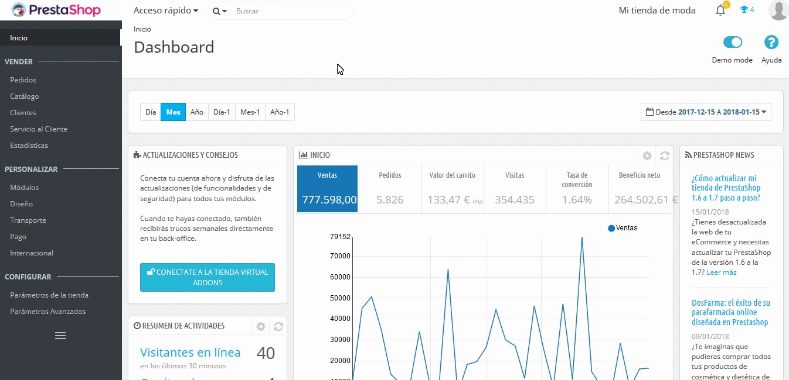

# Gestionar Stock

*  [Visión global del Stock](vision-global-stock.md)
*  [Movimientos de Stock](movimientos-stock.md)

Puedes gestionar el stock de tu tienda desde la página "Stock", bajo el menú "Catálogo". No se requiere realizar ningún paso adicional para activar la gestión de stock.

La página de gestión de stock consta de dos pestañas: "Stock" y "Movimientos".

De manera predeterminada, cuando abres la página de gestión de stock, la pestaña "Stock" es mostrada automáticamente. Desde esta pestaña, puedes tener una visión global del stock de productos existente en tu catálogo, así como también gestionar sus cantidades. La pestaña "Movimientos" proporciona un historial de todos los cambios realizados en las cantidades.

