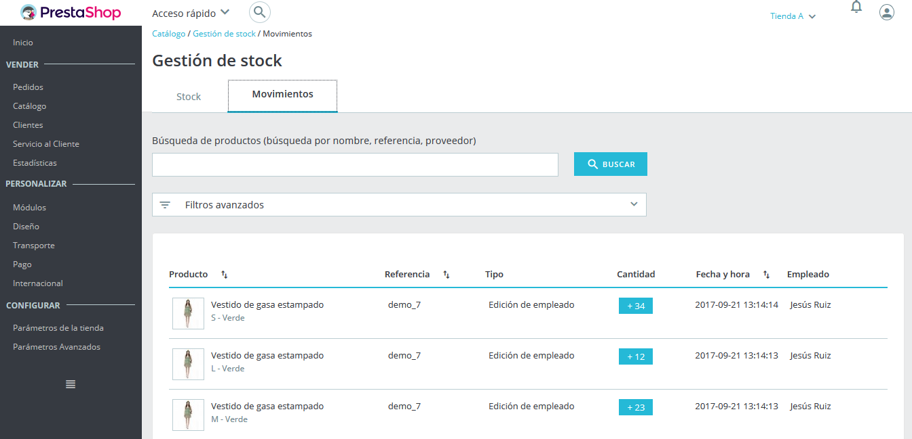
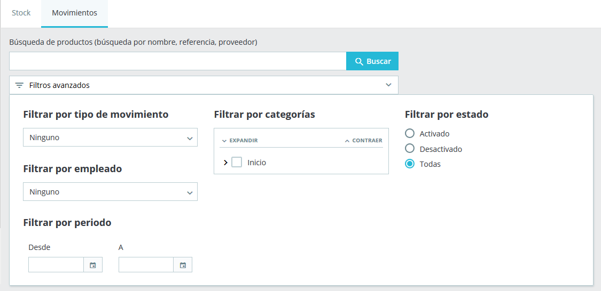

# Movimientos de Stock

La tabla de movimientos de stock proporciona un registro de todos los cambios de stock realizados hasta el momento. Esta tabla sólo tiene un rol informativo, y por lo tanto no puede ser editada.\

## Visión global de los movimientos 

### Estructura 

La estructura es similar a la de la tabla de stock vista anteriormente, pero aquí cada línea corresponde a un cambio en la cantidad física de un producto o combinación. Esta contiene las siguientes columnas:\

* Imagen en miniatura, para ayudarle a reconocer el producto rápidamente de manera visual.
* Nombre del producto y cuando este es una combinación, los valores de sus atributos.
* Referencia del producto. En caso de que una combinación tenga su propia referencia, entonces se usará esta en lugar de la referencia del padre.
* Tipo de movimiento. Representa la razón por la cual la cantidad física de un producto ha cambiado.
* Cantidad añadida o eliminada. Esta delta está formateada con una etiqueta + o - para facilitar el reconocimiento visual.
* Fecha y hora, que muestra la hora exacta del servidor cuando se produjo el cambio.
* Empleado, que es el nombre de la persona responsable del cambio.

\
De manera predeterminada, los movimientos de stock son ordenados por fecha descendente, de modo que los movimientos más recientes se encuentran situados en la parte superior.\

### Tipos de movimiento de stock 

A partir de la versión 1.7.2.0, tres tipos de movimientos pueden ser creados cuando se desencadenan los siguientes eventos:

* Edición manual por parte de un empleado, cuando por ejemplo se modifica la cantidad de un producto dentro de la tabla de stock.
* Pedido de un cliente, cuando un pedido cambia de un estado equivalente de ‘no enviado’ a otro estado equivalente a ‘enviado’ (y viceversa). Por ejemplo, cuando envías un pedido que estaba en preparación, esto creará un movimiento de stock, ya que la cantidad física de los productos enviados literalmente dejan de existir en tu almacén.
* Productos devueltos, cuando repones el stock de un producto después de recibirlo y aceptar la devolución de la mercancía.

En los dos últimos casos, el tipo de movimiento en la tabla se convierte en un hipervínculo que redirecciona al pedido del cliente correspondiente, de este modo tienes un contexto más claro sobre este tipo de movimiento, y no tiene que realizar comprobaciones cruzadas de fecha y hora entre los movimientos de stock y las tablas de pedidos.\

## Opciones de búsqueda y filtro 

### Barra de búsqueda  

Véase más arriba. Esta barra de búsqueda tiene exactamente el mismo comportamiento que el de la pestaña "Stock".\

### Filtros avanzados 

La pestaña ‘Movimientos’, contiene los siguientes filtros avanzados:

* un filtro de tipo de movimiento, que le permite, por ejemplo, buscar movimientos de stock relacionados con pedidos de clientes.
* un filtro de empleado.
* un filtro de rango de fecha, si estás buscando movimientos de stock que ocurrieron durante un periodo específico.
* y un filtro de categoría, como el existente en la pestaña "Stock".
* un filtro de estado.

