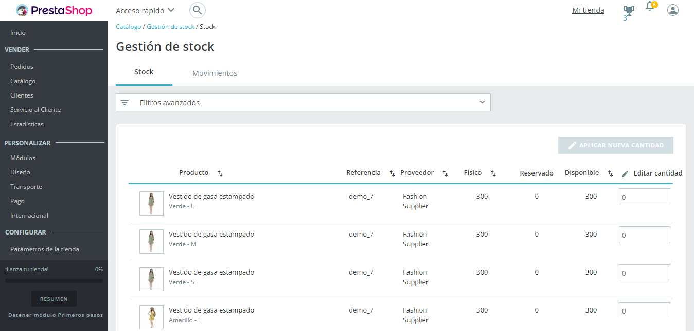
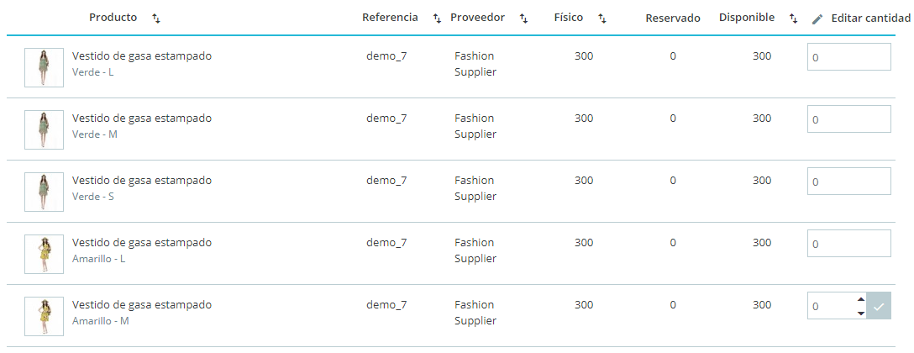
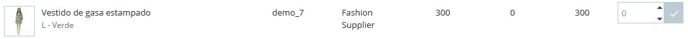
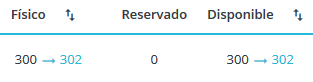
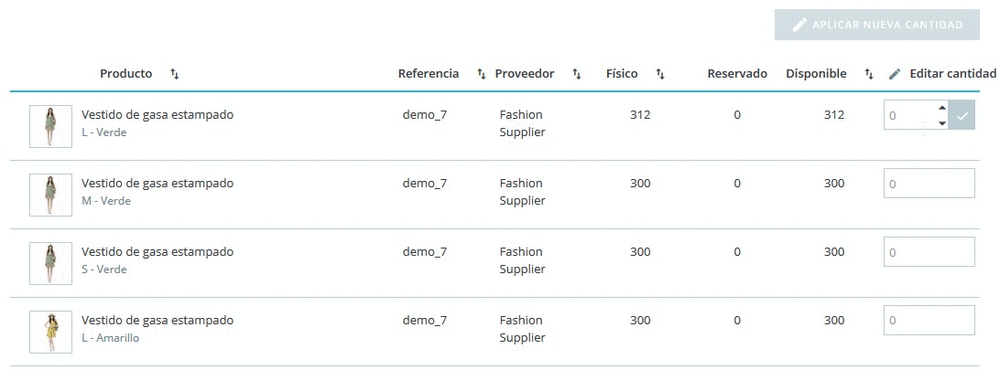
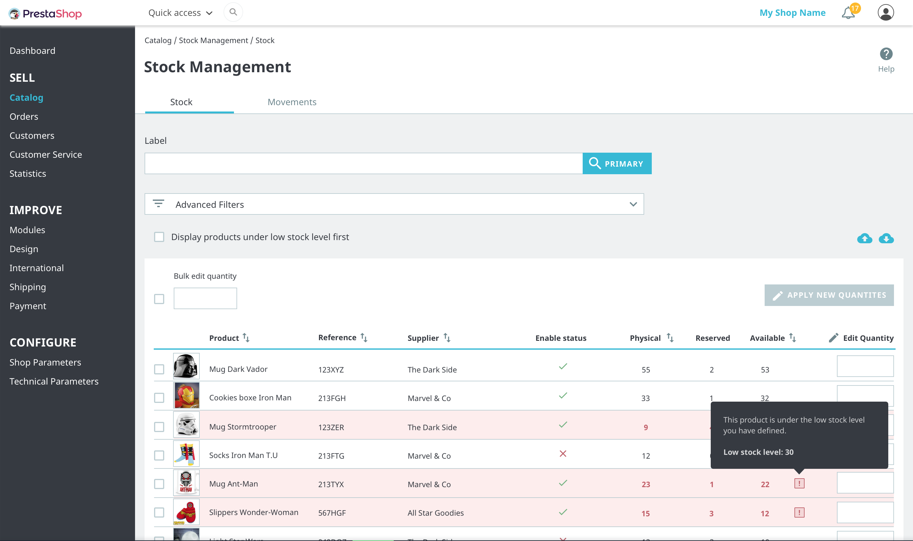
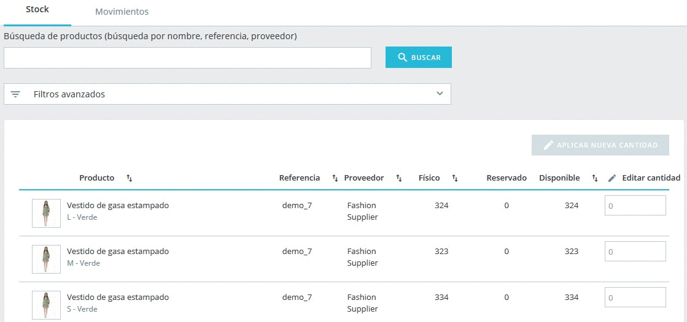
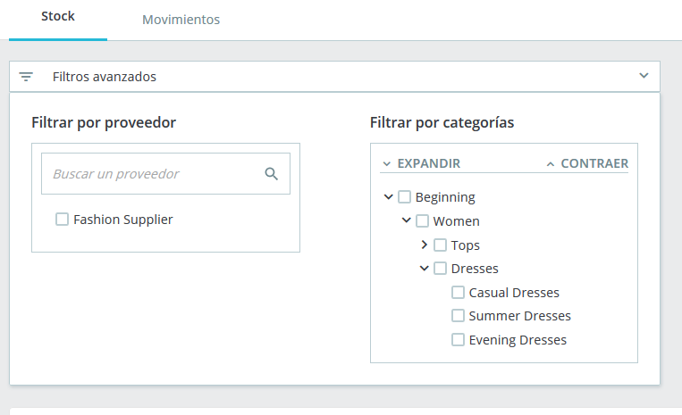
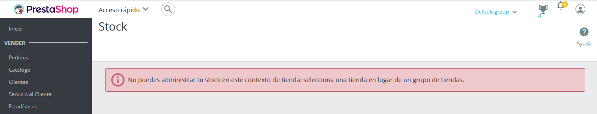
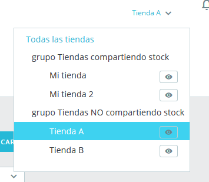

# Visión global del Stock

Esta pestaña presenta una tabla que muestra el stock de tus productos, permitiéndote realizar búsquedas de tus productos mediante diferentes opciones y filtros, y la posibilidad de editar directamente las cantidades de stock disponibles de tus productos.

Una tabla te permite tener una visión global del stock de productos de tu catálogo de un simple vistazo.

Cada línea representa un producto \(ya sea estándar, virtual o en forma de pack\) o una de sus combinaciones. La única diferencia es que los atributos de cada combinación se muestran justo debajo del nombre del producto.  

La tabla contiene las siguientes columnas:

* Imagen en miniatura, para reconocer el producto de una manera visual rápidamente.
* El nombre del producto y cuando es una combinación, los valores de sus atributos.
* Referencia del producto. En caso de que una combinación tenga su propia referencia, entonces se utilizará esta última en lugar de la referencia del padre.
* Proveedor. En caso de que varios proveedores se asignen a un producto, sólo se mostrará aquí el proveedor predeterminado.
* **Stock** **físico**, que representa la cantidad física que realmente tienes en tu almacén.
* **Stock reservado**, que representa la cantidad de productos que actualmente se encuentra en un pedido de cliente en trámite que todavía no se ha enviado.
* **Stock disponible**, que es la cantidad disponible para la venta.
* Editar cantidad. Este campo permite modificar manualmente la cantidad. Véase [más abajo](vision-global-del-stock.md#VisionglobaldelStock-qty_edition).

Comprender los conceptos de stock físico, reservado y disponibleA partir de la versión 1.7.2.0, PrestaShop introduce tres diferentes conceptos de stock, que son diferentes a los presentados en la Gestión Avanzada de Stock en las versiones 1.6.

* **Stock** **físico** representa la cantidad que realmente tienes físicamente en tu almacén. Puedes añadir o eliminar stock físico, por ejemplo, al recibir un pedido de suministro o al realizar un ajuste de inventario.
* **Stock reservado** representa la cantidad de productos que actualmente se encuentran en un pedido de cliente en trámite que todavía no se ha enviado. En otras palabras, estos productos se encuentran físicamente en su almacén, pero ya no están disponibles para su venta. No puedes cambiar directamente el stock reservado. El stock reservado solamente depende de los pedidos de los clientes.
* **Stock disponible** es la cantidad disponible para la venta. A diferencia de la Gestión Avanzada de Stock en las versiones 1.6, no puedes modificar directamente el stock disponible, a no ser que cambies el stock físico también. Esta es la cantidad mostrada en la [página "Productos"](../gestionar-productos.md).

Relación entre el stock físico, reservado y disponible

En cada momento, estos 3 conceptos de stock están relacionados entre sí mediante la siguiente ecuación:

_Stock físico - Stock reservado = Stock disponible_  

 Al modificar el stock físico afectará al stock disponible, y viceversa.

 De manera predeterminada, los productos se clasifican en orden decreciente por su product\_id, lo que significa que el producto que se haya creado más recientemente estará posicionado en la parte superior. Si existen más de 100 productos y combinaciones, entonces la tabla es paginada.  

### Edición de cantidades 

Las cantidades pueden ser modificadas directamente desde la pestaña "Stock", utilizando el campo de entrada localizado en la columna de la derecha de la tabla que muestra la visión global del stock de cada producto.

#### Edición simple 

Para editar el stock de un solo producto, simplemente introduce la cantidad que deseas cambiar en el campo de entrada. La cantidad introducida en esta entrada es una cantidad delta, lo que significa que no es el valor de stock final deseado sino la cantidad que quieres añadir o eliminar. Puedes introducir manualmente las unidades de stock que quieres añadir o eliminar \(esta última añadiendo un signo menos delante de la cifra\), o utilizando las flechas arriba y abajo para ajustar la cantidad.  
  
Para validar el nuevo stock, simplemente haz clic en el botón azul de verificación situado dentro del campo de entrada, o utiliza el botón "Aplicar nueva cantidad" que se muestra en la parte superior de la tabla de stock.

Durante la edición de la cantidad, verás una visión en conjunto del stock final resultante:Esta característica te ayuda a visualizar al mismo tiempo el punto de partida, el punto final y la diferencia entre ambos puntos antes de procesar la validación. Recuerda que dado que el stock físico y el stock disponible están siempre unidos por la ecuación mostrada anteriormente, editarás ambos valores al mismo tiempo.  

#### Edición múltiple 

Si quieres editar varias cantidades al mismo tiempo, puedes editar una a una las cantidades de varios productos, y posteriormente validar los cambios realizados utilizando el botón "Aplicar nueva cantidad".

#### Edición a granel 

Desde PrestaShop 1.7.3, la información correspondiente al stock de productos puede ser editada y actualizada a granel en lugar de tener que hacerlo producto por producto. Esta acción es muy fácil de realizar, lo único que tienes que hacer es marcar la casilla de verificación \(en la columna de la izquierda\) de todos los productos que deseas editar, ingresar la cantidad a aumentar o decrementar al stock disponible y ¡confirmar la acción!

### Alertas de bajo nivel de stock 

Adicionalmente, cuando un producto tenga bajo nivel de stock, puedes solicitarle a PrestaShop que te envíe alertas para notificartelo. Puedes configurar el umbral mínimo de stock, así como también conmutar la notificación a nivel global, desde la página "Producto" o bien realizar esta acción producto por producto. Tras realizar esta operación, en esta página destinada a la visión global del stock, los productos que se encuentran por debajo del umbral de stock configurado son ahora resaltados. Un filtro rápido ha sido también añadido, el cual te permite de manera instantánea visualizar los productos que se encuentran por debajo del umbral de stock configurado, permitiendo colocarlos en la parte superior de la lista.

### Opciones de búsqueda y filtrado 

En la parte superior de la pestaña, encontrarás dos características para buscar rápidamente cualquier producto. La barra de búsqueda está diseñado para casos en donde sabe qué producto estás buscando, ya sea porque tienes en mente su referencia, nombre o proveedor. Mientras que los filtros avanzados te permiten ajustar la búsqueda utilizando opciones de filtrado.  

#### Barra de búsqueda 

La barra de búsqueda permite realizar búsquedas por:

* el nombre del producto
* la referencia del producto
* el proveedor
* **\[en fase beta desde la versión 1.7.2.0\]** valores de atributos. Esta característica te permite buscar un valor de atributo específico como el color. Cuando introduces por ejemplo ‘verde’, visualizarás todos los productos que comparten este valor de atributo de color. Esta característica todavía se encuentra en fase en beta, y puede no funcionar con valores de atributo demasiado cortos como por ejemplo el de las tallas: 'S', 'M', 'L'.

#### Filtros avanzados 

La pestaña ‘Stock’, contiene los siguientes filtros avanzados:

* un filtro de proveedor, que te permite buscar rápidamente los proveedores disponibles y elegir uno o varios.
* un filtro de categoría con un árbol expandible.

## Multi-tienda 

Este nuevo sistema de gestión de stock es compatible con el modo multi-tienda. Por razones obvias, si tienes varias tiendas dentro de un mismo grupo donde el stock no se comparte, no puedes gestionar el stock dentro de un contexto del tipo “todas las tiendas” o “grupo”. Si intentas realizar esta acción, obtendrás el siguiente mensaje de error:  

En lugar de esto, tienes que seleccionar una tienda en la que puedas trabajar para editar el stock de la misma.

Si estás utilizando un grupo de tiendas que comparten las mismas cantidades, también tendrás que seleccionar un contexto de tienda único en lugar de un grupo de tiendas, teniendo en cuenta que cualquier cambio que realices en una tienda también afectará a las otras tiendas.  

