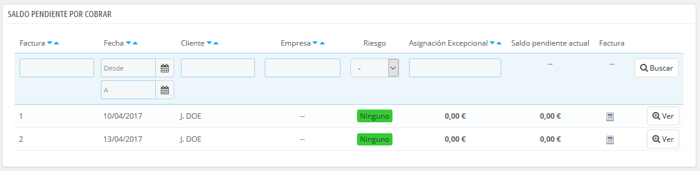

# B2B - Saldo pendiente por cobrar

Esta página sólo está disponible cuando se habilita la funcionalidad B2B. Para hacer esto, dirígete a la página "Ajustes sobre clientes" del menú "Parámetros de la tienda", y selecciona "Sí" para la opción "Activar modo B2B".

Esta página muestra el saldo pendiente actual para algunos de tus clientes, es decir, la cantidad de dinero que estás permitiéndoles gastar para que compren tus productos, antes de que ellos tengan que pagarte realmente.

## Activar la funcionalidad de Saldo pendiente por cobrar 

Cuando el modo de B2B está activado \(Parámetros de la tienda &gt; Ajustes sobre Clientes\), tres campos son añadidos al formulario de creación de cliente:

* **Cantidad máxima pendiente permitida**. La cantidad de dinero en circulación que se permite a la empresa.
* **Número máximo de días para pagar**. El número de días que se le permite a la empresa pagar el préstamo de productos.
* **índice \(Calificación\) de riesgo**. Tu calificación de riesgo para esta empresa: Ninguna, Baja, Media o Alta. Depende de ti decidir si un cliente es un benefactor arriesgado o si va a pagarte con seguridad a tiempo.

Debes rellenar estos campos para todos los clientes profesionales.

## Pantalla actual de saldos pendientes por cobrar 

Una vez que un cliente cuenta con saldo positivo para comprar en tu tienda, éste aparece en la página Clientes &gt; Saldos pendientes por cobrar. Esta página te permite obtener una visión general de tus  facturas actuales pendientes.

