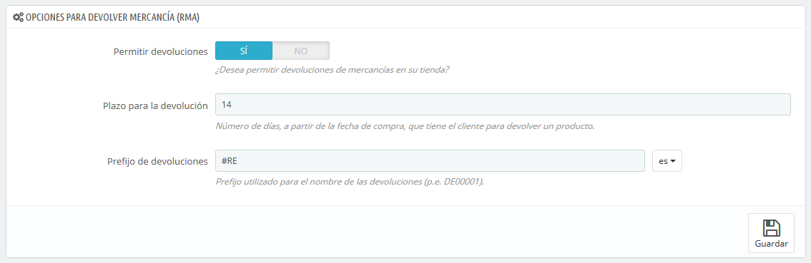
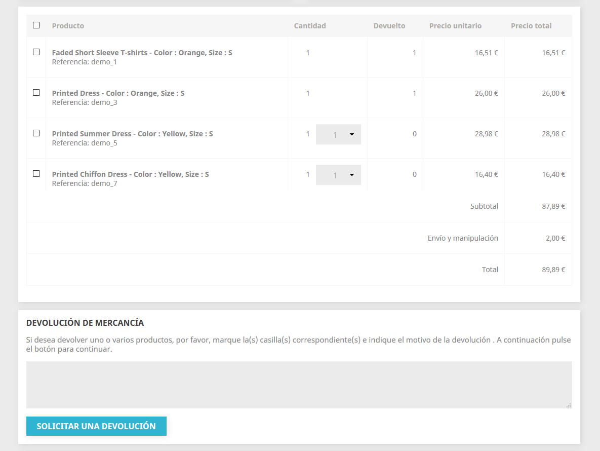
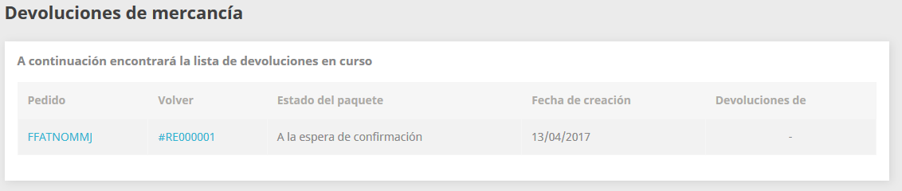

# Devoluciones de mercancía

La página "Devoluciones de mercancía" te da acceso a una lista de todos los procesos que se encuentran en proceso RMA. La sigla RMA proviene del inglés Return Merchandise Authorization \(autorización de devolución de mercancía\).

En la parte inferior de la página, tienes la posibilidad de permitir a tus clientes que te devuelvan los productos \(opción "Permitir devoluciones"\). Selecciona si deseas o no permitirlo, e indica el número de días a partir de la fecha de compra, que tiene el cliente para devolver un producto. Recuerda guardar los cambios: los clientes tendrán ahora la posibilidad de solicitar una autorización de devolución.

## Proceso de devolución: desde el punto de vista del cliente 

Una vez activada la opción RMA en el back-office de tu tienda, el cliente puede optar por devolver un artículo \(siempre que el pedido se encuentre todavía entro del periodo de validez\). Para hacer esto, el cliente debe hacer lo siguiente:

1. Acceder a la sección "Historial de pedidos" de su cuenta.
2. Seleccionar el pedido del que quiere devolver un artículo, haciendo clic en "Detalles".
3. Seleccionar el producto\(s\) que desea devolver marcando la casilla de verificación junto a su nombre\(s\).
4. Añadir la cantidad que necesita devolver \(en caso de que más de un producto necesite ser devuelto\).
5. \(opcional\) Añadir una explicación, para que el equipo de la tienda pueda entender mejor por qué el cliente desea devolver este producto.
6. Hacer clic en "Solicitar una devolución".

¿Cuándo es posible realizar la devolución de un pedido?

1. Las devoluciones tienen que estar habilitadas \(opción "Permitir devoluciones"\).
2. El pedido tiene que estar dentro del periodo de la validez \(= todavía se encuentra dentro del periodo de devolución\).
3. Los pedidos deben tener al menos los siguientes estados:

* * Al menos dos estados: uno con la condición "Establecer el pedido como pagado" activada, y el segundo con la opción "Establecer el pedido como enviado" activada. o
  * Un estado que tenga dos condiciones \("Establecer el pedido como pagado" y "Establecer el pedido como enviado"\) activadas.

Los estados se pueden editar en la pestaña "Estados" en la página "Configuración de pedidos" del menú "Parámetros de la tienda".

Una vez que el formulario sea completado, el cliente hará clic en el botón "Solicitar una devolución", y la solicitud es enviada al gerente de la tienda \(a ti\). La solicitud aparece como "A la espera de confirmación" en la página "Devoluciones de mercancía" del cliente, accesible desde la página de la cuenta del cliente.

## Proceso de devolución: desde el punto de vista del comerciante 

La solicitud de devolución aparece en la página "Devoluciones de mercancías" del back-office de tu tienda. Al principio, la solicitud de devolución tiene el estado "A la espera de confirmación".

El proceso de reembolso puede tomar varios pasos. Estos pueden ser:

* A la espera de confirmación.
* A la espera del paquete.
* Paquete recibido.
* Devolución denegada.
* Devolución completada.

Ahora te tocará a ti aceptarla o denegarla:

1. Haz clic en la ID de la solicitud de devolución para ver más detalles.
2. Cambia el estado para continuar con el proceso de devolución o detenerlo. 
   * Si deseas detener el proceso de devolución \(y denegar al cliente un reembolso\), simplemente selecciona el estado "Devolución denegada".
   * Si estás de acuerdo con que el producto sea devuelto por el cliente y sea reembolsado, sigue cada paso con precisión:
     1. Selecciona el siguiente paso en el proceso: "A la espera del paquete". Con este paso se le enviará un e-mail al cliente indicándole que el producto puede ser devuelto.
     2. Una vez que hayas recibido el paquete, cambia el estado de la solicitud a "Paquete recibido".
     3. Por último, una vez que todo el proceso haya terminado \(bien mediante el reembolsado el dinero al cliente o mediante la emisión de una factura por abono\), cambia el estado de la solicitud a "Devolución completada".
3. Guardar.

## Reembolsado del importe del pedido al cliente 

Un pedido puede ser reembolsado, ya sea parcial o totalmente. Este proceso se realiza utilizando los dos botones de acción situados en la barra superior de la propia página de pedido, y no en la página de devoluciones.

Los botones de acción cambian dependiendo del estado del pedido. Por ejemplo, una vez que el pedido está en el estado "Entregado", las opciones "Añadir producto" y "Eliminar productos" se convierten en dos nuevos botones: "Devolver productos" y "Reembolso parcial".

La devolución del producto no está activada de forma predeterminada. Para activar esta característica, dirígete a la página "Devoluciones de mercancía" bajo el menú "Servicio al cliente", y activa la opción en la sección de opciones en la parte inferior de la página. Esto se aplicará a todos los productos y a todos los pedidos.

* **Devolver productos**. Para ser utilizado sólo cuando el cliente ha devuelto productos: una vez que el paquete ha sido recibido, debes marcar los productos como retornados en el formulario de pedido. Haz clic en el botón "Devolver productos" y una nueva columna denominada "Devolver" aparecerá en la lista de productos. Marca la casilla de los productos afectados, indica la cantidad de artículos que fueron devueltos y haz clic en el botón "Devolver productos" que aparece en la parte inferior de la tabla.
* **Reembolso parcial**. Para ser utilizado cuando necesites reembolsar sólo una parte del pedido y no todo el pedido completo, ya sea porque el cliente devuelve el producto solicitado, o simplemente como una señal de buena voluntad por un producto dañado que el cliente optó por quedarse de todos modos. Indica el importe y la cantidad para cada uno de los productos afectados, selecciona una de las opciones en la parte inferior de la lista \(véase más abajo\), y haz clic en el botón "Reembolso parcial" en la parte inferior de la tabla.  

Cuando estableces un producto como devuelto o reembolsado, cuatro opciones están disponibles bajo la lista de productos:

* **Reingresar productos al inventario**. Cuando se activa, PrestaShop considerará que el producto devuelto pasará a estar disponible para la venta de nuevo, y por lo tanto incrementará el número de unidades disponibles de este producto. No se debe hacer clic en esta opción cuando el producto ha sido devuelto porque está roto o no funciona como debería hacerlo...
* **Generar una factura por abono**. Cuando se activa, una nota de crédito será creada para los elementos seleccionados. Una factura por abono es un reconocimiento de tu tienda de que la mercancía ha sido retornada y la devolución ha sido aceptada. El cliente puede utilizar esta factura de abono como cupón de descuento en su próxima compra.
* **Generar un bono de descuento**. Cuando se activa, un cupón de descuento será creado por el importe de los elementos seleccionados. Un cupón de descuento es realmente un código de descuento que el cliente puede introducir durante el proceso de compra. Puedes editar los cupones existentes visualizando la página del cliente: desde la página actual del pedido, haz clic en el enlace bajo el nombre del cliente en la sección "Información del cliente"; una vez en la página del cliente, dirígete a la sección "Cupones de descuento". Puedes editar cada uno de los cupones haciendo clic en el icono "Modificar".
* **Reembolsar gastos de envío**. También puedes optar por reembolsar al cliente los gastos de envío, lo cual es un gesto que los clientes siempre agradecen.

Si el cliente pagó el pedido utilizando una tarjeta de crédito, el sistema de pago debe reembolsar la compra automáticamente. Si el pedido fue pagado utilizando un cheque o una transferencia bancaria, tendrás que realizar el reembolso por ti mismo, a continuación, marca de forma manual que el pedido ha sido reembolsado en el back-office de tu tienda \(en la página de pedidos\).

