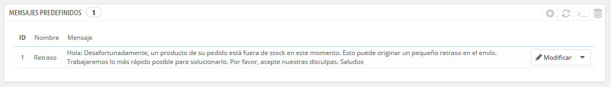
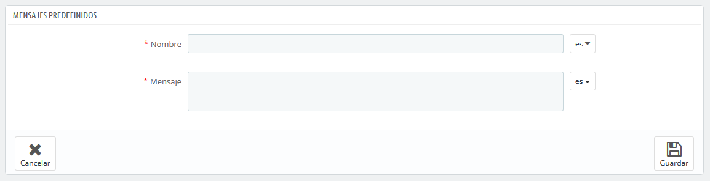
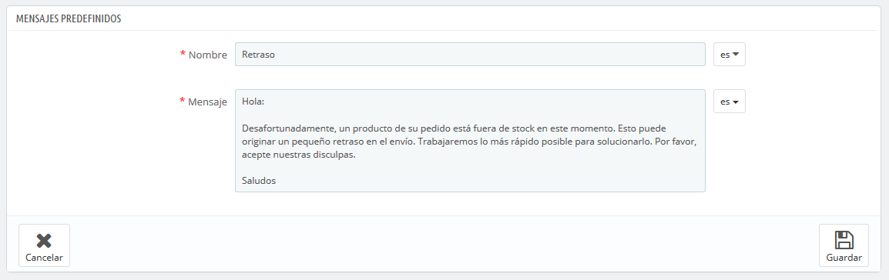

# Mensajes predefinidos

Cuando envías un mensaje a tus clientes utilizando la interfaz de administración PrestaShop, puedes optar por guardar este mensaje para poder enviarlo de nuevo a otros clientes que tengan preguntas, comentarios o inquietudes similares.

Para hacer esto, dirígete a la página "Mensajes predefinidos" bajo el menú "Servicio al cliente". Un mensaje predeterminado ya se encuentra registrado: "Retraso".

## Crear un nuevo mensaje 

Para añadir otro mensaje, haz clic en el botón "Añadir un nuevo mensaje predefinido". También puedes editar el mensaje predeterminado.

El formulario se centra en lo esencial:

* **Nombre**. Otorga a tu mensaje un nombre descriptivo para que puedas encontrarlo fácilmente más tarde.
* **Mensaje**. Escribe el contenido que deseas enviar a tus clientes.

Una vez hecho esto, haz clic en "Guardar".

Puedes crear tantos mensajes como sea necesario.

## Enviar un mensaje a un cliente 

Una vez que hayas realizado los mensajes predefinidos, podrás enviarlos directamente en los pedidos de los clientes:

1. Selecciona el mensaje predefinido.
2. Edita éste si es necesario, con el fin de adaptarlo al pedido o al cliente.
3. Activa la opción "¿Mostrar al cliente?".
4. Haz clic en el botón "Enviar mensaje".

Tu cliente recibirá el mensaje en la dirección de correo electrónico asociada a tu cuenta. Para el seguimiento de la conversión, dirígete a la página "Servicio al cliente", del menú "Clientes".

