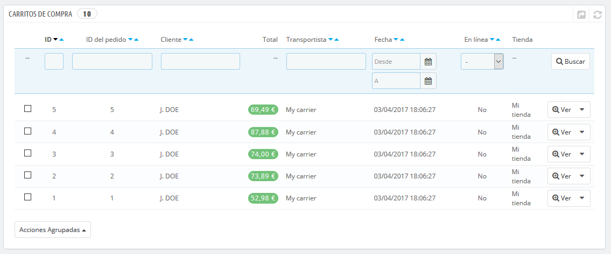
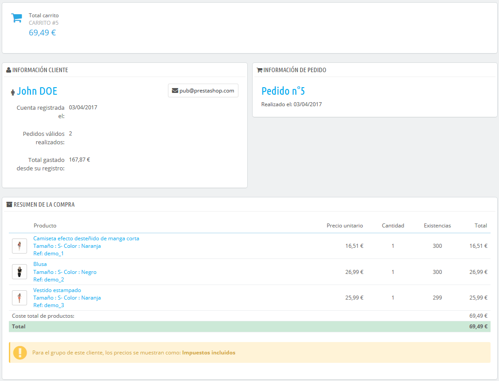

# Carritos de compra

PrestaShop contiene algunas características de marketing muy potentes como la que te permite ver los productos que los clientes están añadiendo sus carritos en tiempo real. Hay dos maneras de realizar esto:

1. Dirígete a la página "Clientes" bajo el menú "Clientes", encuentra al cliente que busca, y haz clic sobre éste para ver su perfil de cliente. Una vez dentro del perfil, desplázate a la sección "Carritos", donde puedes ver todos los carritos creados por este cliente.
2. Dirígete a la página "Carritos de compra" bajo el menú "Pedidos". Los carritos están ordenados por ID. Encuentra al cliente que buscas.

En ambos casos, puedes hacer clic en el icono "Ver" para visualizar el contenido del carrito de tu cliente, y utilizar esta información para mejorar el rendimiento comercial.

En la página del carrito, la información más importante se encuentra en la sección "Resumen del carrito", donde puedes ver los productos que el cliente seleccionó para comprar, el precio de cada artículo, la cantidad que puso en el carrito, y el importe total del carrito.

Gestionar carritos abandonados

Los carritos abandonados a menudo significan que se ha perdido una venta. La página "Carritos de compra" indica los carritos que no se han convertido finalmente en pedidos, y también le recuerda al cliente que todavía puede volver para finalizar su compra.

Los carritos abandonados \(o "carritos fantasmas"\) tienen un enlace para ser eliminados al final de cada fila, mientras que los carritos que no disponen de vínculos de borrado son carritos procesados, por ejemplo, la compra ha sido confirmada por el cliente y debes enviarle los productos.

De manera predeterminada, es tu responsabilidad la de ponerte en contacto con el cliente con respecto al carrito abandonado. Puedes instalar el módulo "Retoma el contacto con tus clientes", el cual está disponible en la instalación predeterminada y que te permite enviar vales de descuento a aquellos clientes que han abandonado sus carritos, para darles las gracias por su pedido, o para agradecerles su fidelidad a los mejores clientes... Ten en cuenta que esto puede dar lugar a abusos: algunos clientes podrían abandonar los carritos a propósito para aprovecharse de los cupones de descuento.  

También puedes comprar el módulo "Módulo Recordatorio de carritos abandonados - Pro" de PrestaShop, para disponer de una herramienta más completa que la anterior: [https://addons.prestashop.com/es/remarketing-carritos-abandonados/16535-recordatorio-de-carritos-abandonados-pro.html](https://addons.prestashop.com/es/remarketing-carritos-abandonados/16535-recordatorio-de-carritos-abandonados-pro.html).

