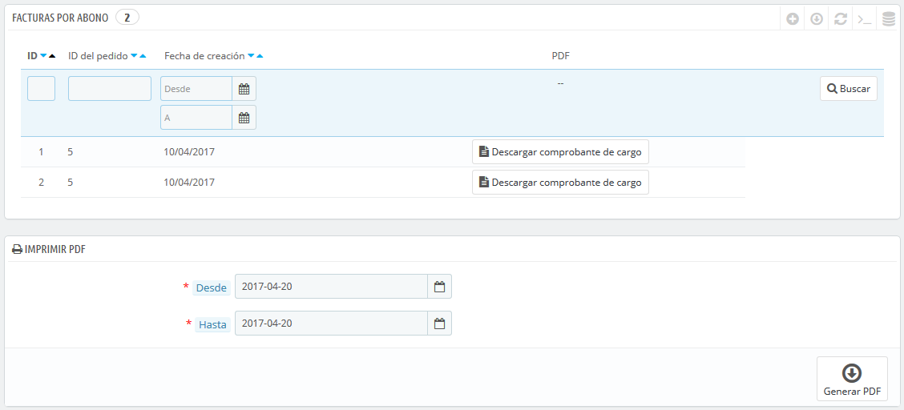
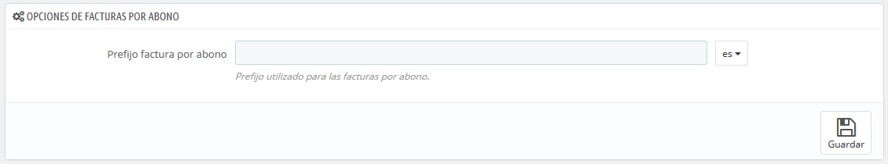
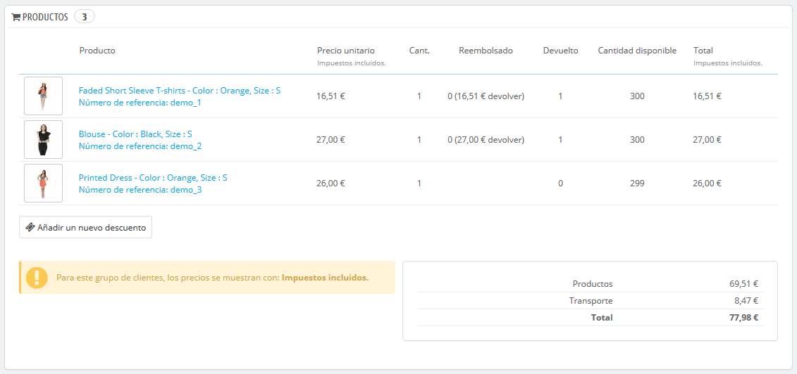
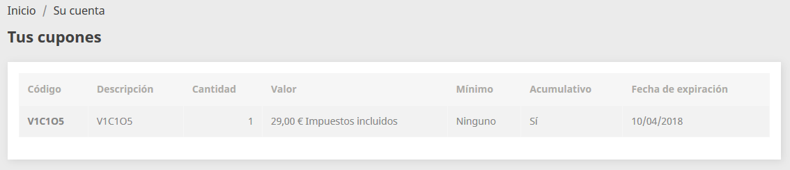

# Facturas por abono

Tras la aceptación de la devolución de un producto, debes recibir un paquete con el producto que el cliente desea devolver. Una vez hayas recibido ese paquete, **debes** crear una factura por abono a partir de la página del pedido. Ésta también puede ser llamada "nota de crédito" o "memorando de crédito".  
Las facturas por abono no se crean desde la página "Facturas por abono" del menú "Pedidos", pero sí son listadas allí. Esta página también se utiliza para generar un PDF de tus facturas emitidas por abono.

## Opciones de las Facturas por abono 

Sólo hay una opción en esta página:

* **Prefijo de la factura por abono**. Si lo deseas puedes añadir un prefijo a tus facturas por abono en los distintos idiomas soportados por tu tienda. Por supuesto, también tienes la opción de no utilizar ningún prefijo.

PrestaShop generará los números identificativos de las facturas por abono de acuerdo a tu configuración establecida.

No olvides guardar los cambios realizados.

## Crear una Factura por abono 

En el listado de pedidos de tu tienda \(página "Pedidos"\), haz clic en el pedido en el que el cliente devolvió algún producto para obtener más detalles – éste sólo funciona si ya se ha indicado que el cliente puede devolver el producto.

Bajo la tabla "Productos", haz lo siguiente:

1. Marca el artículo\(s\) devuelto.
2. Marca la casilla de verificación "Reingresar productos al inventario" si deseas establecer el producto devuelto por el cliente nuevamente como unidades en stock disponibles para la venta.
3. Marca la casilla de verificación "Crear una factura por abono".
4. Para hacer feliz a un cliente después de haber cometido un error en su pedido, considera ofrecerle un cupón de descuento marcando la casilla de verificación situada junto a la opción "Crear un cupón de descuento".
5. También puedes reembolsarle los gastos de envío, haciendo clic en la casilla de verificación "Reembolsar gastos de envío."

Una vez que hayas seleccionado todas las opciones que deseas, deberás confirmarlas haciendo clic en el botón "Devolver productos".

La factura por abono habrá sido creada y estará disponible en la página "Facturas por abono" en el menú "Pedidos".  
Desde aquí, puedes hacer clic sobre cualquiera de estas facturas por abono para descargarlas en formato PDF.  
El cliente verá las facturas por abono en la sección "Mi cuenta".

Si has creado un cupón de descuento, los clientes pueden ver éste en la sección "Mis cupones de descuento" de sus cuentas de usuario. Si ellos hacen clic sobre esta opción, deberían ver algo como esto:

El importe del artículo\(s\) devuelto es añadido al cupón de descuento. El cliente puede utilizar el código de descuento \(que aparece en el extremo izquierdo de la columna\) en su próximo pedido.

