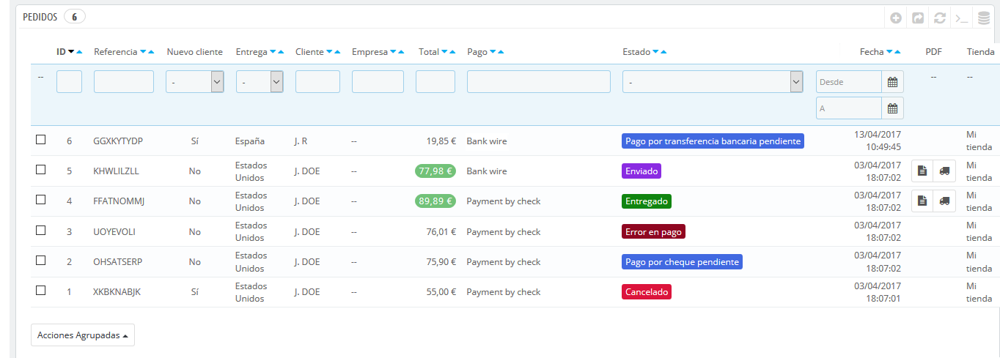

# Pedidos

La página "Pedidos" bajo el menú "Pedidos" te permite visualizar toda la información relacionada con todas las ventas de tu tienda. Todas las transacciones de tu tienda están disponibles aquí, organizadas por fecha (por defecto, se encuentran ordenadas desde la compra más reciente a la más antigua).

Puedes filtrar los resultados y encontrar fácilmente los pedidos que estés buscando utilizando los campos situados en la parte superior de esta página. Por ejemplo, para identificar los pedidos del Sr. Doe, teclea "Doe" en el campo "Cliente" y haz clic en el botón "Filtrar".

NO PUEDES ELIMINAR UN PEDIDO. En Europa está prohibido eliminar pagos o información y/o factura, almacenada por una empresa. Por lo tanto, la implementación de un botón "Eliminar" pedidos haría que PrestaShop fuera ilegal en Europa.

Puedes exportar una lista de tus pedidos haciendo clic en el botón "Exportar" disponible en el menú de la barra superior.\
No se puede importar pedidos.

## Crear un pedido 

Una de las grandes funcionalidades de PrestaShop es su capacidad de crear un pedido directamente desde el back-office. Por ejemplo, esto es tremendamente útil cuando un cliente quiere comprar un producto, pero por alguna causa es incapaz de hacerlo, por lo que necesitarás tomar el control de la situación y realizar el pedido por él mientras habláis por teléfono o durante una conversación por correo electrónico.

Al hacer clic en "Añadir nuevo pedido" se abre una nueva página con un único campo de texto, etiquetado como "Búsqueda de clientes". Al crear un nuevo pedido a través del back-office, la primera tarea consiste en asociar ese pedido con un cliente. Teclea las primeras letras del nombre, apellido o dirección de correo electrónico del cliente, y PrestaShop mostrará las coincidencias encontradas.

Si el cliente para el que tienes que crear el pedido no tiene ni siquiera una cuenta en tu tienda, puedes crear una sobre la marcha: haz clic en el botón "Añadir cliente" para abrir una ventana con los principales datos de la cuenta disponibles para rellenar. Una vez guardes la cuenta, ésta se convertirá en la cuenta seleccionada para el pedido.

Ten en cuenta que también tendrás que registrar la dirección del cliente – un botón "Añadir nueva dirección" está disponible en la parte inferior de la página, en la sección "Direcciones".

Haz clic en el botón "Elegir" para seleccionar el cliente correcto, y aparecerá el formulario para completar el pedido. En su sección principal, "Carrito", es en donde tomarás todas las decisiones necesarias para este pedido. También puedes seleccionar un pedido previo realizado por el cliente, o un carrito previamente abandonado.&#x20;

La página también permite ver los pedidos previos realizados y  los carritos abandonados con anterioridad por el cliente , si los hubiese. Si lo que ocurre es que estás tratando con un carrito que el cliente no puede validar de ninguna manera, puedes utilizar ese carrito para este pedido, haciendo clic en el botón de acción "Utilizar".

El campo "Buscar un producto" te permite de forma dinámica encontrar productos para añadirlos: teclea las primeras letras de tu nombre y PrestaShop te mostrará una lista desplegable rellenada con los productos coincidentes. Elige un producto, selecciona la cantidad y pulsa el botón "Añadir al carrito". Por supuesto, puedes elegir entre todas las combinaciones disponibles para un producto, si las hubiese, En la lista desplegable "Combinación" que aparece en ese caso.\
Ten en cuenta que PrestaShop te da una indicación del stock restante existente de un determinado producto, lo que te permitirá informar al cliente si el producto se encuentra fuera de stock desde este mismo formulario de pedido.

Si es necesario también puedes añadir un cupón de descuento/regla de carrito, e incluso crear uno de éstos sobre la marcha haciendo clic en el botón "Añadir un nuevo cupón".

Por último, tienes que especificar a qué dirección debe realizarse el envío del pedido (y posiblemente la dirección de facturación). Aquí, de nuevo, puedes crear nuevas direcciones sobre la marcha utilizando el botón "Añadir nueva dirección".

## Ver los detalles de un pedido 

Para poder procesar los pedidos que reciba, debes tener acceso a la información que éstos contienen.\
En la página Pedidos, haz clic en la línea que contiene el pedido o haz clic en el botón situado a la derecha del pedido.

La hoja de detalles del pedido es mostrada ocupando toda una página completa.

En la parte superior de la página se muestra un resumen del pedido: fecha en la que ha sido validado, el importe del pedido, números de discusiones abiertas en el servicio de atención al cliente sobre este pedido y el número de productos incluidos en el pedido.

La página de detalles del pedido te da acceso a:

* A la izquierda, la información del pedido:\

  * El estado e historial del pedido.
  * La información del envío: peso total del pedido y el transportista elegido por el cliente.
* A la derecha, la información del cliente:\

  * Nombre e historial de compra.
  * Nota privada sobre el cliente, si la hubiera.
  * Dirección de envío y dirección de facturación (con un mapa de Google Maps con la ubicación aproximada).
* El método de pago que utilizó, el costo de los productos, y los gastos de envío.
* Varios detalles de los productos solicitados.

## Modificar el pedido 

Los pedidos no son definitivos, son alterables. Hay muchas razones por las que necesitarás modificar un pedido antes de que tu pedido sea tramitado y enviado a su destinatario: uno de los productos se encuentra fuera de stock, el cliente ha cambiado de opinión, etc.

### Añadir un producto 

En la parte inferior de la lista de "Productos" comprados por el cliente en ese pedido, puedes encontrar el botón "Añadir un producto", el cual te permite añadir un nuevo producto al pedido.

Al añadir un producto, la tabla de productos crea una nueva fila añadiendo unos cuantos campos. El primer campo de texto es en realidad un pequeño motor de búsqueda: teclea las primeras letras de un producto para encontrar productos coincidentes con tu petición. Seleccione el producto que deseas añadir, y el campo color gris de la fila pasará a estar disponible.\
Si el producto tiene combinaciones, puedes seleccionarla en la lista desplegable que aparece debajo del nombre: el precio unitario se actualizará en consecuencia.\
Establece la cantidad, y a continuación haz clic en el botón "Añadir producto": el producto se añadirá al pedido.

No puedes añadir una cantidad superior de un producto de las que hay disponibles.

### Eliminar productos 

Para cancelar un producto, dirígete a la lista de productos y elimina el producto haciendo clic en la acción "Eliminar", o haz clic en la acción "Modificar" si lo que necesitas es decrementar una cantidad de producto.

Puedes modificar la cantidad de varios productos al mismo tiempo.\
Si la cantidad de un producto llega a 0, se elimina completamente del pedido.\
No puedes eliminar más cantidades de las que tiene un producto.\
Haz clic en el botón "Cancelar" para cancelar la modificación del pedido.

## Editar los detalles de un pedido 

Muchas de las secciones de la hoja de pedido pueden ser editadas, lo que te permite actualizar o corregir algunos de los datos facilitados por el cliente.

### Estado del pedido 

La primera lista desplegable que aparece en la página del pedido te permite cambiar su estado. Este es un aspecto muy importante del proceso de seguimiento de un pedido, ya que con cada cambio de estado, nuevas funcionalidades y nueva documentación estarán disponibles para el pedido.

Puedes elegir entre los siguientes estados:

* En espera de pago por transferencia bancaria.
* En espera de validación por contra reembolso.
* En espera de pago por cheque.
* En espera de pago por PayPal.
* Cancelado.
* Entregado.
* Pendiente por falta de stock (no pagado).
* Pendiente por falta de stock (pagado).
* Pago aceptado.
* Error en pago.
* Preparación en curso.
* Reembolsado.
* Pago remoto aceptado.
* Enviado.

Con el fin de obtener una mejor visión de la actividad del pedido, se registra cada cambio de estado, apareciendo este registro arriba de la lista desplegable del cambio de estado. Por lo tanto, sólo se debe cambiar el estado si se ha confirmado: no marques el pedido como "Entregado" cuando envíes el paquete, utiliza "Enviado"; no utilices "Preparación en curso" cuando en realidad sólo le has echado un rápido vistazo al pedido, etc.

Desde la versión 1.6.1.0, puedes reenviar el correo electrónico para un determinado estado del pedido al cliente. Para volver a enviar este correo electrónico, haz clic en "Reenviar email" situado junto al estado del pedido. Si has editado el pedido en algún momento, enviarás un correo electrónico actualizado.

### Botones de acción 

Los botones de acción cambian según el estado del pedido. Por ejemplo, una vez que el pedido está en el estado "Entregado", la opción "Eliminar producto" se sustituye por dos nuevos botones: "Devolver productos" y "Reembolso parcial".

La devolución del producto no está activada de forma predeterminada. Para activar esta opción, dirígete a la página "Devoluciones de mercancía" bajo el menú "Servicio al cliente", y activa la opción "Permitir devoluciones". Esto se aplicará a todos los productos y pedidos.

* **Reembolso estándar**. Disponible una vez que el pedido se encuentra en el estado "Pago aceptado". No disponible una vez que los productos han sido enviados.\
  Para ser utilizado cuando necesites reembolsar la cantidad total del pedido. Puede ser realizado siempre que los productos se encuentran todavía en tu almacén.\
  Haz clic en el botón "Reembolso estándar" y una nueva columna aparecerá en la lista de productos, titulada "Reembolso". Establece el monto y la cantidad para cada uno de los productos afectados, elige una de las opciones disponibles bajo el listado (véase más abajo), y haz clic en el botón "Reembolso de productos" situado en la parte inferior de la tabla.
* **Reembolso parcial**. Disponible una vez que el pedido se encuentra en el estado "Pago aceptado".\
  Para ser utilizado cuando necesites reembolsar sólo una parte del pedido y no todo el pedido completo, ya sea porque el cliente devuelve el producto solicitado, o simplemente como una señal de buena voluntad por un producto dañado que el cliente optó por quedarse de todos modos.\
  Haz clic en el botón "Reembolso parcial" y una nueva columna denominada "Reembolso parcial" aparecerá en la lista de productos. Indica el importe y la cantidad de unidades a devolver para cada uno de los productos afectados, selecciona una de las opciones en la parte inferior de la lista (véase más abajo), y haz clic en el botón "Reembolso parcial" en la parte inferior de la tabla.
* **Devolver productos**. Disponible una vez que el pedido se encuentra en el estado "Enviado". Debes establecer a PrestaShop para aceptar la devolución de mercancía, para ello dirígete a la página Servicio al cliente > Devoluciones de mercancía, y establece la opción "Permitir Devoluciones" a "Sí".\
  Para ser utilizado sólo cuando el cliente ha devuelto productos: una vez que el paquete ha sido recibido, debes marcar los productos como retornados en el formulario de pedido.\
  Haz clic en el botón "Devolver productos" y una nueva columna denominada "Devolver" aparecerá en la lista de productos. Marca la casilla de los productos afectados, indica la cantidad de artículos que fueron devueltos y haz clic en el botón "Devolver productos" que aparece en la parte inferior de la tabla.

Cuando establezcas un producto como devuelto o reembolsado, cuatro opciones están disponibles bajo la lista de productos

* **Reingresar productos al inventario**. Cuando se activa, PrestaShop considerará que el producto devuelto pasará a estar disponible para la venta de nuevo, y por lo tanto se incrementarán las unidades en stock disponibles para este producto. No se debe hacer clic en esta opción cuando el producto ha sido devuelto porque está roto o no funciona como debería hacerlo...
* **Generar una factura por abono**. Cuando se activa, una factura por abono será creada para los artículos seleccionados. Una factura por abono, es un reconocimiento de tu tienda de que la mercancía ha sido retornada y la devolución ha sido aceptada. Puedes crear un cupón de descuento si es necesario por el valor de la devolución, que el cliente podrá utilizar a partir de su próxima compra.
*   **Generar un cupón de descuento**. Cuando se activa, un cupón de descuento será creado por el importe de los artículos seleccionados. Un cupón de descuento es realmente un código de descuento que el cliente puede introducir durante el proceso de compra.\
    Puedes editar los cupones de descuento existentes visualizando la página del cliente: desde la página del pedido actual, haz clic en el nombre del cliente en la sección "Cliente"; una vez en la página del cliente, dirígete a la sección "Cupones". Puedes editar cada uno de los cupones haciendo clic en la acción "Editar", representada con el icono de un lápiz.

    En PrestaShop, los cupones son parte de un tipo especial de característica de descuento: las "reglas del carrito". Éstas pueden ser creadas y editadas desde la sección "Reglas del carrito", disponible en la página "Catálogo" bajo el menú "Descuentos".
* **Reembolsar gastos de envío**. También puedes optar por reembolsar al cliente los gastos de envío, lo cual es un gesto que los clientes siempre agradecen.

Si el cliente pagó el pedido utilizando una tarjeta de crédito, el sistema de pago debe reembolsar el importe de la compra automáticamente. Si el pedido fue pagado utilizando un cheque o una transferencia bancaria, tendrás que realizar el reembolso por ti mismo, a continuación, marca de forma manual que el pedido ha sido reembolsado en el back-office (en la página de pedidos).

Diferencias entre una factura por abono, un cupón de descuento y una regla de carrito

Una factura por abono es ante todo una prueba por escrito de que un producto ha sido devuelto. La mayoría de las veces, ésta puede ir acompañada de un cupón de descuento que puede emitir al cliente para que lo utilice en su próxima compra.

Un cupón es un código de descuento, que no tiene porque estar relacionado con una devolución de mercancía o reembolso, y que puede tomar más formas que la de estar emitido por una factura por abono:

* Un descuento en un pedido (porcentaje)
* Un descuento en un pedido (cantidad).
* Envío gratuito.

Puedes aplicar un cupón a todos los clientes, o a un grupo de clientes, o a un cliente único; también puedes establecer su fecha de caducidad.

Una regla de carrito es básicamente una versión avanzada de un cupón de descuento. Ésta te permite:

* Darle un nombre al descuento.
* Permitir al cliente utilizar solamente una parte del descuento.
* Asignar prioridades entre las reglas del carrito.
* Establecer la compatibilidad entre las reglas del carrito.
* Hacer que el descuento sólo funcione con algunos transportistas.
* Hacer que el descuento sólo funcione con una selección de productos y/o categorías y/o fabricantes y/o proveedores y/o atributos... ¡o todos al mismo tiempo si es necesario!.
* Hacer que el descuento sea aplicable para envíos gratuitos y/o un descuento en un pedido y/o un regalo... ¡o todos al mismo tiempo si es necesario!.

### Documentos 

Puedes obtener muchos documentos en formato PDF desde la página del pedido. Cuando estén disponibles, serán listados en la sección "Documentos" de la página.

De manera predeterminada, puedes descargar el propio pedido en formato PDF haciendo clic en el botón "Imprimir pedido" en la parte superior izquierda.

Puedes obtener una factura para el pedido haciendo clic en el botón "Generar factura" de la sección "Documentos". La factura se genera una vez has establecido el producto en el estado de "Pago aceptado".\
Una vez ésta es generada, el botón "Ver factura" aparecerá en la barra principal.

Puedes personalizar el diseño de factura con facilidad: los archivos de la plantilla PDF se encuentran en la carpeta `/pdf`. Estos archivos `.tpl` son en realidad archivos HTML con etiquetas Smarty para datos dinámicos. Puedes cambiar el diseño de la factura editando el archivo llamado `invoice.tpl`.

Es posible añadir una nota a la factura. En la sección "Documentos", haz clic en "Añadir nota": agregarás un mensaje que aparecerá en la factura, debajo de la tabla de impuestos.

Cuando establezcas el pedido en el estado de "Preparación en curso", se generará un comprobante de envío en formato PDF, que posteriormente puedes descargar desde la sección "Documentos".

### Transporte 

Los detalles del envío del pedido actual, pueden ser editados parcialmente. Más específicamente, puedes cambiar el número de seguimiento: en la sección "Transporte", haciendo clic sobre el icono "Modificar" en el campo "Número de seguimiento", introduciendo el nuevo número.

### Dirección de envío 

La sección "Dirección de envío" te permite editar la dirección de destino del paquete que tu equipo está a punto de enviar. Puedes utilizar la lista desplegable para seleccionar otra de las direcciones que los clientes hayan registrado en tu tienda, o bien puedes utilizar el icono "Modificar" para editar la dirección actualmente seleccionada.

Si tienes que enviar el paquete a una dirección que no está registrada en PrestaShop, primero debes crearla. Para hacer esto, dirígete al menú "Clientes", abre la página "Direcciones", y haz clic en el botón "Añadir nueva dirección". No te olvides de rellenar el campo de la dirección de correo electrónico del cliente, ¡de esta forma PrestaShop sabrá asociar esa nueva dirección con tu cliente existente!. Una vez hecho esto, regresa a la página del pedido, y cambia la dirección utilizando la lista desplegable.

Ten en cuenta que un mapa pequeño te permite visualizar el destino del paquete en Google Maps.

### Dirección de facturación 

La sección "Dirección de facturación" te permite editar la dirección de pago del pedido. Al igual que como con la dirección de envío, puedes utilizar la lista desplegable para seleccionar otra de las direcciones que los clientes hayan registrado en tu tienda, o bien puedes utilizar el icono "Modificar" para editar la dirección actualmente seleccionada.

Si tienes que enviar la factura a una dirección que no está registrada en PrestaShop, primero debes crearla. Para hacer esto, dirígete al menú "Clientes", abre la página "Direcciones", y haz clic en el botón "Añadir nuevo". No te olvides de rellenar el campo de la dirección de correo electrónico del cliente, ¡de esta forma PrestaShop sabrá asociar esa nueva dirección con tu cliente existente! Una vez hecho esto, regresa a la página del pedido, y cambia la dirección utilizando la lista desplegable.

### Descuento 

En la sección "Productos", en la parte inferior de la lista de productos, puedes encontrar una tabla vacía con un botón denominado "Añadir un nuevo descuento". Este crea un simple descuento, no tan avanzado como los cupones /reglas de carrito, pero que te será útil.

Al hacer clic sobre este botón se abrirá un nuevo formulario, con los siguientes elementos:

* **Nombre**. Proporciona un nombre corto para el descuento. Este nombre será público para el cliente.
* **Tipo**. Selecciona el tipo de descuento: "porcentaje", "cantidad" o "envío gratuito".
* **Valor**. Para los tipos "porcentaje" o "cantidad", establece el valor del descuento.
* **Factura**. Selecciona para qué factura de este pedido se debe aplicar este descuento. Cuando hay más de una factura, puedes marcar la casilla "Aplicar para todas las facturas" para aplicar el descuento a todas las facturas.

El descuento se aplicará al total antes de aplicar los gastos de envío.

## Adjuntar un mensaje al pedido 

En la sección "Mensajes", situada en la parte derecha de la página, puedes añadir un comentario del pedido para tu equipo de trabajo.

También puedes enviar este comentario al cliente, con el fin de ofrecerle información concerniente al pedido, un retraso, una sorpresa, o mantenerle informado sobre ofertas y promociones especiales. Este es un punto clave de la relación con el cliente.

**Selecciona un mensaje estándar**. En caso de que envíes un mensaje al cliente, puedes seleccionar un mensaje previamente escrito. Los mensajes preescritos se pueden guardar y utilizar múltiples veces, ahorrándote la molestia de escribirlos una y otra vez. Si deseas enviar uno de estos mensajes, selecciónalo desde la lista desplegable. A continuación, puedes añadir más información al mensaje prescrito si es necesario.

Puedes crear más mensajes preescritos utilizando la herramienta en la página "Mensajes predefinidos", en el menú "Servicio al cliente".

**¿Mostrar al** cliente**?** Esto determinará si el mensaje solamente es visible por tu equipo o también se envía al cliente.

**Mensaje**. En caso de que estés utilizando un mensaje predefinido, se mostrará en este campo. De lo contrario, simplemente puedes escribir tu mensaje aquí.

El mensaje se almacenará en el perfil del cliente en la base de datos del Servicio al cliente, a la que puedes acceder ya sea desde la página del cliente o en la página de servicio al cliente. El mensaje también se enviará a la dirección de correo electrónico del cliente si así lo decides.

**Enviar mensaje**. Haz clic en este botón para enviar tu mensaje al cliente o guardarlo para su equipo.

**Mostrar todos los mensajes**. Este enlace te llevará a la página "Servicio al cliente". Esta página se explica detalladamente en el capítulo "Gestión del servicio de atención al cliente" de esta guía.
