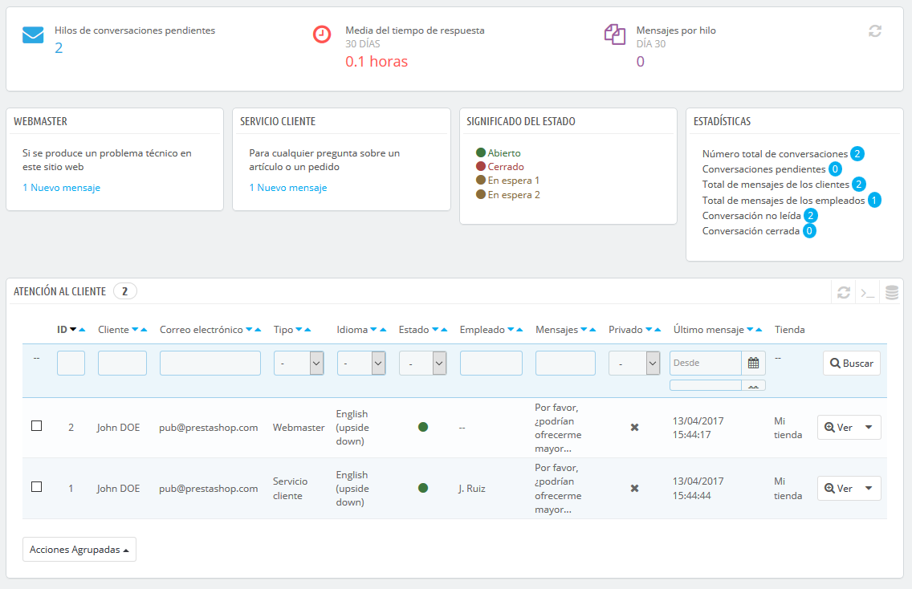
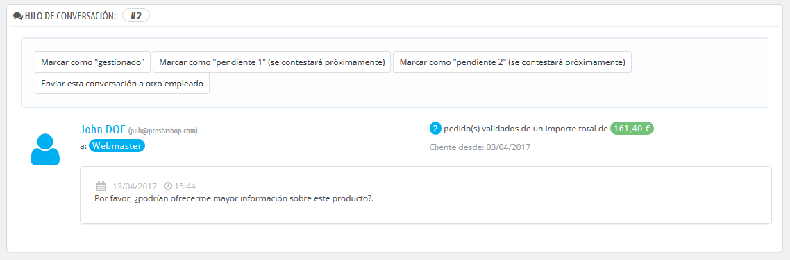

# Servicio de atención al cliente

PrestaShop te permite centralizar todas las solicitudes de los clientes dentro de sus confines. Esto te ayuda a mantener un seguimiento de los temas de discusión que necesitas responder, en lugar de tener que consultar todas las bandejas de salida de tus cuentas de correo para ver si has respondido a ellas, o lo ha hecho ya algún otro miembro de tu equipo.

En la práctica, el formulario de contacto de tu tienda, disponible bajo el enlace "Contáctenos" en el pie de página, en la parte inferior del front-office, presenta al cliente dos contactos por defecto: "Webmaster" y "Servicio de Atención al cliente". El cliente sólo tiene que elegir con quién contactar, y a continuación rellenar el resto de campos. El mensaje enviado es guardado posteriormente, en la herramienta de servicio al cliente de PrestaShop.

Los hilos de discusión sólo son almacenados en la herramienta de servicio al cliente, si ésta tiene la opción "¿Guardar mensaje en Servicio al cliente?" activada. Puedes cambiar esta configuración, o añadir más contactos, dirigiéndote a la página "Contacto", bajo el menú "Parámetros de la tienda". Encontrarás la opción cuando modifiques los contactos existentes.

Si la opción está desactivada para el contacto que elija el cliente, el mensaje será simplemente enviado a la dirección de correo electrónico del contacto, y no será almacenado en PrestaShop.

También es necesario configurar correctamente tu configuración IMAP, para que así PrestaShop pueda recibir respuestas de los clientes de los emails que fueron enviados desde la herramienta de servicio al cliente. Esto se realiza en la sección "Opciones de servicio al cliente", en la parte inferior de la pantalla.

En esta página, cada contacto tiene su propio cuadro, donde pueden ver rápidamente si hay mensajes nuevos (es decir, aquellos que aún no han sido leídos). De manera predeterminada, hay dos, y si añadimos más contactos las cajas "Significado del estado" y "Estadísticas" se moverán más a la izquierda y hacía abajo.

Estos dos últimos cuadros son muy útiles cuando necesites gestionar los nuevos mensajes recibidos en el día:

* **Significado del estado**. Un simple recordatorio de los códigos de color que tu equipo puede aplicar a un hilo de discusión.
* **Estadísticas**. Una visión general de la actividad global de tu servicio de atención al cliente desde la apertura de tu tienda.

Más abajo se encuentra el listado de los mensajes recibidos, tanto antiguos como nuevos.

Puedes editar un par de opciones en la parte inferior de la página, que se aplicarán a todos los contactos:

* **Autorizar el envío de archivos**. Donde el cliente puede adjuntar un archivo al mensaje. Esto puede ser útil en caso de problemas gráficos en tu tienda, ya que el cliente puede enviarte capturas de pantalla.
* **Mensaje predefinido**. La plantilla predeterminada para la respuesta de tus empleados. Debes componer un mensaje simple, de modo que pueda adaptarse a muchas situaciones, realizando las mínimas modificaciones.\
  \

Puedes ponerte en contacto con tus clientes desde la página de cada pedido, desde donde puedes enviar mensajes predefinidos. Estos mensajes se gestionan en la página "Mensajes predefinidos", bajo el menú "Servicio al cliente".

Finalmente, en la parte inferior de la página se presenta la sección "Opciones de servicio al cliente", donde puedes configurar muchas opciones relacionadas con tu servidor de correo (IMAP).

## Gestionar los mensajes del Servicio de atención al cliente 

Cada conversación con un cliente puede ser gestionada enteramente a través de la completa interfaz de PrestaShop, sin tener que utilizar un cliente de correo electrónico como Outlook o Thunderbird.

En la lista de conversación, haz clic sobre una fila para visualizar los detalles de la conversación:

* Puedes aplicar un puñado de acciones a una discusión, con el fin de ordenarlas y así gestionarlas más rápidamente. Hay 4 estados disponibles:\

  * **Marcar como "gestionado"** o **"Reabrir"**. Cambia el estado de la discusión de "Cerrado" o "Abierto".
  * **Marcar como "pendiente 1"** y **Marcar como "pendiente 2"**. Estos dos estados son internos: sus significados dependen de tu equipo. Puedes incluso optar por no utilizarlos, y dejarlo todo en manos de los estados "Abierto" y "Cerrado".
  * **Enviar esta discusión a otro empleado**. Desde el instante en que un empleado comienza a responder a un mensaje del cliente, se convierte en el responsable de la solicitud del cliente. Si durante la discusión resulta que es otro empleado el que debe gestionar la situación en lugar del actual, puedes utilizar este botón para atribuir éste a través de una lista desplegable. Ese otro empleado recibirá una notificación al respecto. Si la persona que deseas que continúe la presente discusión no está disponible en la lista, selecciona "Otra persona" en la lista desplegable y dos opciones más aparecerán, permitiéndote indicar la dirección de correo electrónico del destinatario y un comentario acerca de su mensaje.
* **Responder al siguiente mensaje sin respuesta en este hilo**. Te lleva al siguiente mensaje sin respuesta en el hilo para que puedas responderlo directamente.\

El equipo de la tienda también tiene acceso a los detalles esenciales:

* Nombre del cliente y correo electrónico, en los que puedes hacer clic para acceder a la información del cliente (cuando se trata de un cliente registrado).
* Número de pedidos, monto total gastado y la fecha de registro del cliente (cuando se trata de un cliente registrado).
* Fecha y hora del mensaje.
* Finalmente, el propio mensaje.

Para responder a este hilo, sólo tienes que utilizar el formulario con tu mensaje predeterminado (que se establece en la sección "Opciones de contacto" de la página "Servicio al cliente"), y hacer clic en "Enviar".

En la parte inferior de la página, la sección "Pedidos e históricos de mensajes" te ofrece una clara vista cronológica de los acontecimientos pertenecientes a este hilo de discusión.

## Opciones del Servicio de atención al cliente 

Básicamente, esta sección te permite configurar con precisión el acceso de PrestaShop a tu servidor de correo electrónico a través de su interfaz IMAP. Deberías asegurarte de rellenar todos los campos necesarios con el fin de que la herramienta de servicio al cliente funcione correctamente. La mayor parte de esta información debería ser proporcionada por tu proveedor de hosting.

* **Enlace IMAP, Puerto IMAP, Usuario IMAP** y **Contraseña IMAP**. Los detalles esenciales para acceder al servidor de correo electrónico utilizando el protocolo IMAP.
* **Eliminar mensajes**. Si se activa, los mensajes en el servidor serán eliminados tan pronto como PrestaShop los reciba. Utiliza esta opción con precaución: esto haría que tus mensajes no se encuentren disponibles para otros clientes de correo electrónico.
* **Crear nuevos hilos**. Esto creará nuevos hilos para los mensajes de correo electrónico no reconocidos.\

* **/pop3**. Si está activado, utiliza POP3 en lugar de IMAP.\

* **/norsh**. Si se activa, la conexión con el servidor de correo electrónico no será preautenticada. No se recomienda.
* **/ssl**. Si se activa, la conexión al servidor de correo electrónico no será cifrada. No se recomienda
* **/validate-cert**. Si se activa, PrestaShop obligará a validar el certificado TLS/SSL del servidor.
* **/novalidate-cert**. Si se activa, PrestaShop nunca tratará de validar el certificado TLS/SSL del servidor. Esencial para servidores con certificados de firma.
* **/tls**. Si se activa, PrestaShop forzará el uso de StartTLS para cifrar la conexión. Los servidores que no soporten StartTLS serán rechazados.
* **/notls**. Si se activa, PrestaShop no utilizará StartTLS para cifrar la sesión, incluso con los servidores que la soportan.
